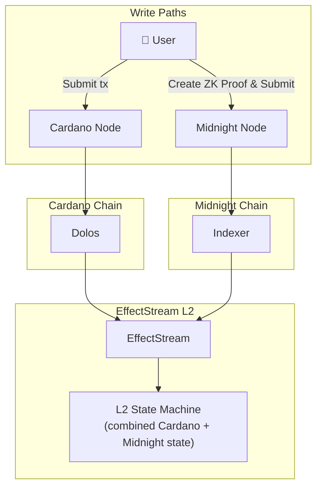

Cardano provides strong settlement guarantees, but all state is public. For applications that need private computation (secret ballots, hidden hands, confidential business logic), that's a real limitation. By integrating Midnight's ZK-native design with Cardano, EffectStream applications can have public settlement on Cardano with private state via Midnight's zero-knowledge proofs.

<!-- truncate -->

## The privacy gap on Cardano

Cardano's UTxO model is transparent by design: every transaction, every datum, every output is visible on the public ledger. That's great for financial transparency, but it's a problem for applications that need private state:

- **Voting**: ballots should stay private until the vote closes
- **Games**: hidden hands, fog-of-war, and secret strategies need private state
- **Business logic**: competitive information shouldn't be visible to rivals

[Midnight](https://midnight.network/) is a privacy-focused blockchain with native zero-knowledge proof support. Combining Cardano's settlement with Midnight's private computation gives applications the best of both worlds.

## Private Delegation Voting template

To show this cross-chain privacy pattern in practice, we built a **Private Delegation Voting** template that combines Cardano stake pool delegation data with Midnight's ZK proofs for private ballot casting.

Here's the concept: a governance vote where voting power comes from your Cardano stake pool delegation, but your actual vote stays private. The system proves via zero-knowledge that:

1. The voter has a valid Cardano delegation (verified on-chain)
2. The vote was cast correctly (the ballot is well-formed)
3. The voter hasn't voted twice (nullifier prevents double-voting)

...without revealing which pool the voter delegates to or how they voted. The delegation data comes from Cardano via EffectStream's PoolDelegation primitive, and the privacy layer runs on Midnight.

The full [ZK-Cardano template](https://github.com/effectstream/effectstream/tree/v-next-bun-start/templates/zk-cardano) is available in the monorepo alongside five new [Cardano primitives](/docs/home/chains/cardano#primitives).

<iframe src="https://drive.google.com/file/d/1qeFPXN3cjsd66aFn-kgu2q8fqTr8SA-A/preview" width="100%" height="480" allow="autoplay"></iframe>

## How it works

EffectStream uses a "funnel" abstraction to read data from multiple blockchains through a unified interface. Adding a new chain means implementing a new funnel; the developer's state machine receives events from all configured chains without needing to know each chain's data format.

For the Midnight + Cardano integration:

1. **Cardano funnel** reads delegation state via Dolos/UTxORPC (who delegates to which pool, how much stake)
2. **Midnight funnel** reads ZK proof submissions and private state transitions
3. **EffectStream state machine** combines both data sources, verifying delegation eligibility from Cardano while preserving vote privacy from Midnight

The batcher system supports Midnight wallets via [`@effectstream/wallets`](https://www.npmjs.com/package/@effectstream/wallets), which provides unified wallet support across EVM, Cardano, Midnight, Polkadot, Algorand, and Mina. Users can sign transactions with Midnight wallets, making it a first-class chain in the framework.

## Beyond voting: the privacy pattern

Private Delegation Voting is one application of the Cardano + ZK pattern, but the architecture generalizes. Any scenario where public chain data needs private processing fits:

- **Private governance** - vote with your Cardano stake without revealing your position
- **Hidden-hand games** - use Cardano NFTs as game pieces with hidden state on Midnight
- **Confidential analytics** - prove facts about on-chain data without revealing the underlying data
- **Anonymous credentials** - prove you meet criteria (delegation amount, token holdings) without identifying yourself

Each follows the same template: read public state from Cardano, process it privately on Midnight, publish only the ZK proof.

## Local ZK proof generation

Beyond chain-integrated ZK, EffectStream also supports computing zero-knowledge proofs locally, without settling to any ZK chain. This removes the network dependency while keeping the privacy guarantees:

- Lower latency (no network round-trip)
- Lower cost (no on-chain fees for proof verification)
- Offline capability (proofs can be generated without network access)

The trade-off is in verification: chain-verified proofs inherit the chain's security guarantees, while locally-verified proofs need the application to validate them. For many use cases (anti-cheat in games, client-side validation), local proofs are sufficient and quite a bit faster.

- [ZK-Cardano template code](https://github.com/effectstream/effectstream/tree/v-next-bun-start/templates/zk-cardano)
- [Cardano Primitives documentation](/docs/home/chains/cardano#primitives)
- [Midnight Network](https://midnight.network/)
- [UTxORPC Watch Module](https://utxorpc.org/watch/intro/) - streaming protocol for Cardano data
