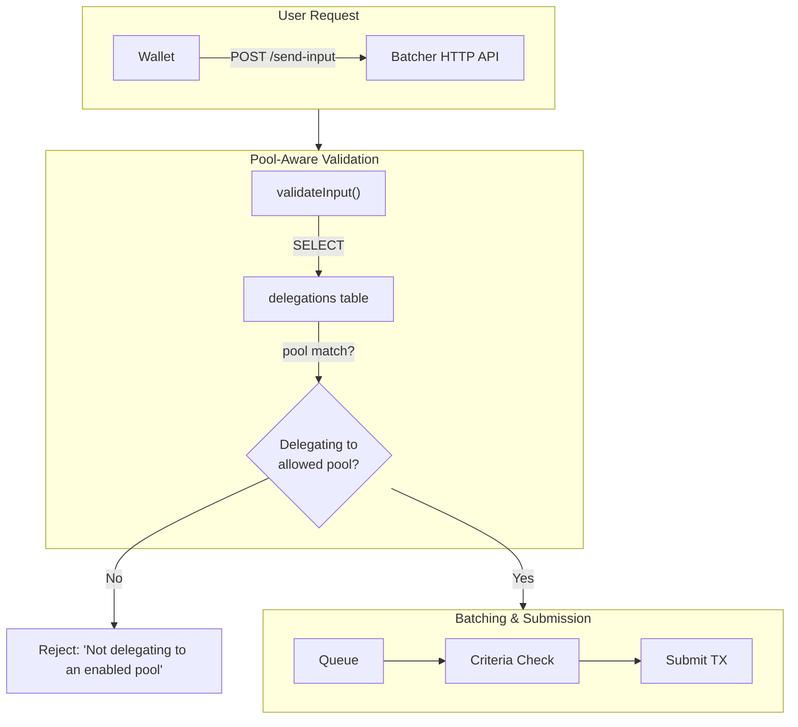

In [Part 1](/docs/blog/stakepool-delegation) we covered how EffectStream indexes delegation changes. In [Part 2](/docs/blog/stakepool-delegation-technical) we walked through the state machine that writes delegation events to PostgreSQL. Now we'll build on that foundation: a custom Batcher that reads delegation state from the database and decides whether to accept or reject user transactions based on which pool they're delegating to.

This is the key use case for stake pool operators: **free transactions for your delegators**. The SPO runs a batcher that covers gas fees, but only for users delegating to their pool.

<!-- truncate -->

## What the Batcher does

The EffectStream Batcher is a standalone service that:

1. Receives user inputs via HTTP (`POST /send-input`)
2. Validates each input using a chain-specific adapter
3. Queues valid inputs in persistent storage
4. Batches them into a single on-chain transaction when criteria are met
5. Submits the batch and waits for confirmation

The adapter is the extension point. By implementing a custom `BlockchainAdapter`, you control validation, serialization, and submission. For the delegation use case, we add a `validateInput()` method that queries the `delegations` table before accepting the input.

See the full [Batcher documentation](/docs/home/components/batcher/overview) for the complete API.

## Architecture



## 1. The delegation-aware adapter

The core idea: extend the default EVM adapter with a `validateInput()` method that checks the user's delegation status before accepting their input. The batcher reads from the same `delegations` table that the sync node writes to (from [Part 2](/docs/blog/stakepool-delegation-technical)).

```typescript
import {
  type BlockchainAdapter,
  type DefaultBatcherInput,
  type ValidationResult,
  EffectStreamL2DefaultAdapter,
} from "@effectstream/batcher";
import { getDelegationsByAddress } from "@cardano-delegation/database";
import type { Pool } from "pg";

export class DelegationAwareBatcherAdapter
  extends EffectStreamL2DefaultAdapter
{
  private readonly dbConn: Pool;
  private readonly enabledPools: Set<string>;

  constructor(
    contractAddress: string,
    privateKey: string,
    fee: bigint,
    syncProtocolName: string,
    dbConn: Pool,
    enabledPools: string[],
  ) {
    super(contractAddress, privateKey, fee, syncProtocolName);
    this.dbConn = dbConn;
    this.enabledPools = new Set(
      enabledPools.map((p) => p.toLowerCase()),
    );
  }

  async validateInput(
    input: DefaultBatcherInput,
  ): Promise<ValidationResult> {
    // Look up the user's current delegation
    const delegations = await getDelegationsByAddress.run(
      { address: input.address },
      this.dbConn,
    );

    if (delegations.length === 0) {
      return {
        valid: false,
        error: "No delegation found for this address",
      };
    }

    // Check if the most recent delegation is to an enabled pool
    const latestDelegation = delegations[0];
    if (!this.enabledPools.has(latestDelegation.pool.toLowerCase())) {
      return {
        valid: false,
        error: `Not delegating to an enabled pool. ` +
          `Current pool: ${latestDelegation.pool}`,
      };
    }

    return { valid: true };
  }
}
```

The `getDelegationsByAddress` query is the same pgtyped query from Part 2 — it returns delegations ordered by `id DESC`, so `delegations[0]` is the most recent one.

## 2. Configuring the batcher

Wire the adapter into a batcher instance with the pool hashes you want to subsidize:

```typescript
import { main, suspend } from "effection";
import {
  createNewBatcher,
  FileStorage,
  type BatcherConfig,
} from "@effectstream/batcher";
import { getConnection } from "@effectstream/db";
import { DelegationAwareBatcherAdapter } from "./delegation-adapter.ts";

const ENABLED_POOLS = [
  "7301761068762f5900bde9eb7c1c15b09840285130f5b0f53606cc57",
  "82ec502f8c0a51e7c0db410e6722dd42df3b8e11f48e833f9fdf2941",
];

const dbConn = getConnection();

const adapter = new DelegationAwareBatcherAdapter(
  process.env.L2_CONTRACT_ADDRESS!,
  process.env.BATCHER_PRIVATE_KEY!,
  0n,                        // Free for delegators
  "mainEvmRPC",
  dbConn,
  ENABLED_POOLS,
);

const config: BatcherConfig = {
  pollingIntervalMs: 1000,
  adapters: { evm: adapter },
  defaultTarget: "evm",
  batchingCriteria: {
    evm: {
      criteriaType: "hybrid",
      timeWindowMs: 5000,      // Batch every 5 seconds
      maxBatchSize: 50,        // Or when 50 inputs queue up
    },
  },
  confirmationLevel: "wait-receipt",
  enableHttpServer: true,
  port: 3334,
  enableEventSystem: true,
};

const batcher = createNewBatcher(config, new FileStorage("./batcher-data"));

main(function* () {
  batcher.addStateTransition("startup", ({ publicConfig }) => {
    console.log(
      `Pool-aware batcher started on port ${publicConfig.port}`,
    );
    console.log(
      `Enabled pools: ${ENABLED_POOLS.length}`,
    );
  });

  batcher.addStateTransition("batch:submit", ({ txHash }) => {
    console.log(`Batch submitted: ${txHash}`);
  });

  yield* batcher.runBatcher();
  yield* suspend();
});
```

The `fee: 0n` means the SPO covers the cost. Users delegating to the enabled pools get free transactions. Users delegating elsewhere get rejected at the `validateInput()` step before their input even enters the queue.

## 3. The validation flow

When a user submits an input, the batcher pipeline processes it in order:

1. **Targeting** — route to the correct adapter based on `input.target`
2. **Signature verification** — verify the user's wallet signature (inherited from `EffectStreamL2DefaultAdapter`)
3. **Input validation** — our custom `validateInput()` runs:
   - Query `delegations` table by `input.address`
   - Check if the latest delegation pool is in `enabledPools`
   - Return `{ valid: true }` or `{ valid: false, error: "..." }`
4. **Storage** — if valid, the input is persisted to disk
5. **Batching** — when criteria are met, inputs are serialized and submitted

A rejected input returns immediately with an error:

```bash
curl -X POST http://localhost:3334/send-input \
  -H "Content-Type: application/json" \
  -d '{
    "data": {
      "address": "0x742d35Cc...",
      "addressType": 0,
      "input": "gameMove|x10y20",
      "signature": "0x...",
      "timestamp": "1234567890"
    }
  }'

# If not delegating to an enabled pool:
# { "success": false, "error": "Not delegating to an enabled pool. Current pool: abc123..." }

# If delegating to an enabled pool:
# { "success": true, "hash": "0x..." }
```

The walkthrough below shows the full flow end-to-end: the batcher is started with two enabled pools, a delegator of one of those pools submits a transaction and is accepted, and a non-delegator submits the same transaction and is rejected — both responses visible at the HTTP layer.

<iframe src="https://drive.google.com/file/d/1EI3hvbpCP8QzSTyyzcr2pHFQHeH9D2A_/preview" width="100%" height="480" allow="autoplay"></iframe>

## 4. Batching criteria options

The batcher supports multiple strategies for when to submit batches. Choose based on your game's requirements:

```typescript
// Time-based: submit every N milliseconds
{ criteriaType: "time", timeWindowMs: 5000 }

// Size-based: submit when N inputs are queued
{ criteriaType: "size", maxBatchSize: 50 }

// Hybrid: whichever comes first
{ criteriaType: "hybrid", timeWindowMs: 5000, maxBatchSize: 50 }

// Value-based: submit when accumulated value reaches threshold
{
  criteriaType: "value",
  valueAccumulatorFn: (input) => parseFloat(input.input.split("|")[1]),
  targetValue: 1000,
}

// Custom: any logic you want
{
  criteriaType: "custom",
  isBatchReadyFn: (inputs, lastProcessTime) => {
    // Process immediately if any high-priority input exists
    return inputs.some((i) => i.input.startsWith("urgent|"));
  },
}
```

## 5. Adding event monitoring

The batcher emits lifecycle events you can use for monitoring and observability:

```typescript
batcher.addStateTransition("startup", ({ publicConfig }) => {
  console.log(`Batcher ready on port ${publicConfig.port}`);
});

batcher.addStateTransition("batch:submit", ({ txHash }) => {
  console.log(`Batch submitted: ${txHash}`);
});

batcher.addStateTransition("batch:confirmed", ({ receipt }) => {
  console.log(`Confirmed in block ${receipt.blockNumber}`);
});

batcher.addStateTransition("input:rejected", ({ error }) => {
  console.warn(`Input rejected: ${error}`);
});
```

## What SPOs can build with this

With the delegation-aware batcher, stake pool operators can offer tangible benefits to their delegators:

- **Free game transactions** — delegators play without paying gas fees, the SPO covers the cost
- **Priority batching** — delegators of partner pools get their inputs processed first
- **Tiered access** — different pools unlock different game features or areas
- **Dynamic pricing** — charge non-delegators, subsidize delegators

The configuration is straightforward: add your pool hash to `ENABLED_POOLS`, fund the batcher wallet, and point your game's frontend at the batcher endpoint. The delegation check happens automatically on every input.

## Running the full stack

The complete delegation + batcher stack runs as two pieces: the cardano-delegation template (sync node + indexing) and the pool-aware batcher adapter from [PR #691](https://github.com/effectstream/effectstream/pull/691). Both share the same PostgreSQL database — the sync node writes delegation events, the batcher reads them during validation.

```bash
# Terminal 1: Start the delegation sync node
git clone https://github.com/effectstream/effectstream.git \
  --branch v-next-bun-start
cd effectstream/templates/cardano-delegation
bun install
bun run dev
# Sync node indexes delegations → http://localhost:10599

# Terminal 2: Start the pool-aware batcher
# Code lives in PR #691: https://github.com/effectstream/effectstream/pull/691
# Check out that PR branch and run its batcher entrypoint.
```

---

- [Pool-aware batcher code example (PR #691)](https://github.com/effectstream/effectstream/pull/691) — the `DelegationAwareBatcherAdapter` source
- [Batcher documentation](/docs/home/components/batcher/overview)
- [Custom Adapters guide](/docs/home/components/batcher/adapter)
- [Part 1: Connecting Cardano SPOs](/docs/blog/stakepool-delegation)
- [Part 2: Building the State Machine](/docs/blog/stakepool-delegation-technical)
- [Cardano delegation template source code](https://github.com/effectstream/effectstream/tree/v-next-bun-start/templates/cardano-delegation)
