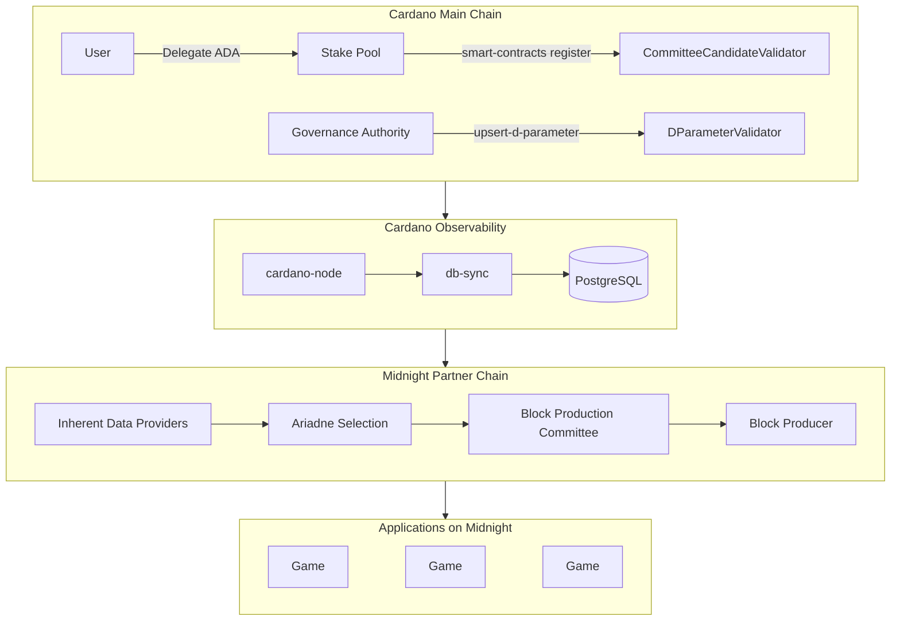

In [Part 1](/docs/blog/stakepool-delegation) through [Part 3](/docs/blog/stakepool-delegation-batcher) we built a stack that **observes** Cardano delegation — index the certificates, persist them, gate user inputs on pool membership. The application reads delegation; delegation does not read the application. There is a more ambitious place to put stake pools, though: at the consensus layer of a chain itself. That is where Midnight lives. Once you go there, "react to delegation" stops being a feature flag inside a game and starts being block production for an entire ecosystem of games.

<!-- truncate -->

## From event consumer to consensus input

The progression across this series goes like this:

| Part | Role of delegation | Surface area |
|------|--------------------|--------------|
| 1 | Indexed event | A PostgreSQL row |
| 2 | State machine input | An `addStateTransition` handler |
| 3 | Batcher validation | An accept/reject decision per input |
| 4 | **Consensus weight** | **Block production share on Midnight** |

By Part 3 a stake pool delegation could already decide whether your transaction gets free batching. Part 4 raises the stakes: delegating to a registered SPO contributes to that pool's share of blocks produced on Midnight. The same delegation certificate now does two things at once — it routes ADA rewards on Cardano, and it weights consensus participation on a partner chain.

## What a Partner Chain is

Midnight is a [Partner Chain](https://github.com/input-output-hk/partner-chains). Partner Chains are blockchains that run in parallel to Cardano and inherit Cardano's security model by reusing its set of Stake Pool Operators as block producers. The Partner Chains Toolkit — built by IOG, the same engineering team behind Cardano itself — provides the off-chain CLI, on-chain Plutus scripts, and Substrate runtime pallets that turn a generic Substrate chain into a Cardano-anchored partner chain.

The toolkit pulls three things from Cardano:

1. **SPO registrations** — a Cardano transaction in which an SPO signs a message declaring they want to produce blocks on the partner chain.
2. **Delegation stake** — read off Cardano's ledger via `db-sync`, used to weight how many blocks a registered SPO produces.
3. **Governance parameters** — the *D-Parameter* and the permissioned validator whitelist, written to a Cardano script address and observed by the partner chain runtime.



The arrows are not metaphorical. Every Midnight epoch, the runtime re-reads Cardano state — registrations from the `CommitteeCandidateValidator` address, the D-Parameter from `DParameterValidator`, the permissioned candidates list — and feeds them into [Ariadne](https://github.com/input-output-hk/partner-chains), the committee selection algorithm. Ariadne outputs the validator set for the next epoch. That set is what Aura (Substrate's slot-based consensus) uses to produce Midnight blocks.

## How Cardano SPOs become Midnight validators

The registration flow is intentionally permissionless. An SPO who wants to produce Midnight blocks runs three CLI commands from the Partner Chains Toolkit. The exact commands live in the toolkit documentation; the shape of the flow is:

```bash
# 1. Generate the registration signatures on an offline machine
#    (cold keys never touch the internet)
pc-node registration-signatures \
  --genesis-utxo $GENESIS_UTXO \
  --mainchain-signing-key cold.skey \
  --sidechain-signing-key partner-chain.skey \
  --registration-utxo $REGISTRATION_UTXO

# 2. Submit the registration as a Cardano transaction
pc-node smart-contracts register \
  --genesis-utxo $GENESIS_UTXO \
  --registration-utxo $REGISTRATION_UTXO \
  --payment-key-file payment.skey \
  --partner-chain-public-keys $PC_PUB:$AURA_PUB:$GRANDPA_PUB \
  --partner-chain-signature $PC_SIG \
  --spo-public-key $SPO_PUB \
  --spo-signature $SPO_SIG

# 3. Confirm activation — registrations made in epoch N
#    become active in epoch N+2
pc-node registration-status \
  --stake-pool-pub-key $SPO_PUB \
  --mc-epoch-number $EPOCH
```

What lands on Cardano after step 2 is a UTXO at the `CommitteeCandidateValidator` script address, with a datum that carries the SPO's main-chain public key, their partner-chain public key, their Aura and Grandpa session keys, and the cross-signature proving the same operator controls both sides. Midnight's runtime reads that datum every epoch and treats it as a vote: "I, this SPO, with my Cardano delegators behind me, want to produce blocks on this chain."

The crucial property is that **the stake weight comes from Cardano's ledger, not from a token on Midnight**. There is no separate "Midnight validator stake" to bond. The delegators who already delegated their ADA to that SPO on Cardano are — without any extra action — backing the SPO's block production on Midnight.

## The D-Parameter: governance over the registered/permissioned ratio

Block producers on a partner chain come from two pools:

- **Registered validators** — Cardano SPOs who completed the registration flow above.
- **Permissioned validators** — a whitelist maintained by the chain's governance authority, intended to bootstrap the network when SPO registrations are still rolling in.

The split between them is governed by a single on-chain value, the **D-Parameter**, written to Cardano via:

```bash
pc-node smart-contracts upsert-d-parameter \
  --permissioned-candidates-count 3 \
  --registered-candidates-count 7 \
  --payment-key-file governance.skey \
  --genesis-utxo $GENESIS_UTXO
```

This particular setting reserves 3 of the 10 committee seats per epoch for permissioned validators and lets the remaining 7 be filled by registered SPOs proportional to delegation stake. The two-epoch delay before changes take effect gives the network a stable window to observe new parameters before they apply.

A chain typically launches near `permissioned=N, registered=0` and ramps toward `permissioned=0, registered=N` as SPO registrations stabilise. This is the same decentralisation curve Cardano itself walked from Byron through Shelley, but governed transparently on-chain instead of by a hard fork.

## Querying partner chain state from EffectStream

Everything above is observable, which means application code can read it. The Partner Chains Toolkit exposes the relevant state via CLI commands and JSON-RPC. For an EffectStream app running on top of (or alongside) a partner chain, the two queries that matter for delegation-aware logic are:

- **`ariadne-parameters --mc-epoch-number N`** — returns the registered candidates, the permissioned candidates, the D-Parameter, and the delegation stakes effective at epoch *N*. Use this to find out which SPOs are actually producing blocks right now.
- **`registration-status --stake-pool-pub-key K --mc-epoch-number N`** — returns whether SPO `K` is registered and active at epoch *N*. Use this to gate features on whether a specific pool has joined the partner chain.

Wired into a state machine transition, these become first-class inputs alongside the `delegations` table from Part 2:

```typescript
import { World } from "@effectstream/runtime";
import {
  getDelegationsByAddress,
  getActivePartnerChainSPOs,
} from "@cardano-delegation/database";
import {
  fetchAriadneParameters,
  type AriadneParameters,
} from "@effectstream/partner-chains";

stm.addStateTransition("delegation-bonus", function* (data) {
  const { address } = data.parsedInput as { address: string };

  // 1. Cardano side: where is this address currently delegating?
  const delegations = yield* World.resolve(
    getDelegationsByAddress, { address },
  );
  if (delegations.length === 0) return;
  const userPool = delegations[0].pool.toLowerCase();

  // 2. Partner-chain side: which SPOs are in the active committee
  //    for the current Cardano epoch?
  const epoch = slotToEpoch(data.blockHeight);
  const params: AriadneParameters = yield* fetchAriadneParameters({
    mcEpochNumber: epoch,
  });
  const activeProducers = new Set(
    params.registeredCandidates.map((c) =>
      c.stakePoolPubKey.toLowerCase()
    ),
  );

  // 3. Game-side: if the user's delegated SPO is actively producing
  //    blocks on the partner chain this epoch, grant a bonus.
  if (activeProducers.has(userPool)) {
    yield* World.resolve(grantBonus, {
      address,
      pool: userPool,
      epoch,
      multiplier: 2.0,
      reason: "active-validator-delegator",
    });
  }
});
```

What this handler captures is the full loop:

1. The user delegated ADA to an SPO on Cardano (Part 1 indexed it).
2. The state machine wrote that delegation to PostgreSQL (Part 2).
3. The SPO registered on the partner chain and is now in the block-production committee.
4. The application reads both sides and rewards the user proportional to consensus participation, not just delegation existence.

A user who switches to a non-registered pool keeps earning Cardano staking rewards but loses the application-side bonus. A user who switches to a pool that just got into the committee for next epoch picks it up automatically two epochs later — the same cadence Cardano itself uses for stake-distribution snapshots.

## Cross-chain identity: associating Cardano and partner-chain addresses

One more piece of the Partner Chains Toolkit is worth pointing at because it makes everything above clean to use: address association. A user with a Cardano stake address and a partner-chain address can sign a message linking the two, then submit the signature to the partner-chain ledger:

```bash
pc-node sign-address-association \
  --genesis-utxo $GENESIS_UTXO \
  --partnerchain-address $PC_ADDRESS \
  --signing-key cardano-stake.skey
```

Once associated, application code on the partner chain can resolve `partner-chain address → Cardano stake address → current delegation` without the user re-signing anything per session. For games this matters more than it sounds: it removes a per-transaction wallet prompt from the loop, and combined with the auto-sign work from [the wallets release](/docs/blog/auto-sign), it gives delegators a friction-free path from "I stake to this pool on Cardano" to "I have the right state inside this game on Midnight."

## What runs on this today

The applications already deployed on Midnight are the proof that this is not a thought experiment. Four games — Safe Solver, Kachina Kolosseum, Block Kart Legends, and Dust-2-Dust — run on a chain whose validator set is selected from registered Cardano SPOs by Ariadne, and whose epoch boundaries are tied to Cardano's. We covered the games themselves in the [game templates post](/docs/blog/game-templates); the point here is that the consensus underneath them is *the same delegation system we spent Parts 1–3 indexing from inside an application*. The difference in Part 4 is that the chain itself does the reading.

For SPOs the practical consequence is a second product line:

- Each new partner chain is another network where their existing delegators carry over.
- Each application on those chains is another place where their delegators can collect benefits.
- Registration is permissionless and observable; deregistration is symmetric.
- Block participation rewards (covered in the Partner Chains Toolkit's `block-participation-rewards` module) flow back to delegators in the partner chain's native token.

The outreach mechanic is the registration mechanic. SPOs don't need a marketing pitch from us to participate — they need a Cardano transaction and two epochs of patience.

## Wrap-up

Four parts in, the story has gone from "watch a UTXO change" to "weight a consensus committee." The same `pool` field that started as a string in a `delegations` row in Part 1 ends up, in Part 4, as a vote that decides who produces the next block on a chain that hosts production games. The indexing layer, the state machine, and the batcher we built in Parts 1–3 still apply on top — they just now sit on a chain that already shares their assumption that stake pool delegation is a first-class signal.

---

- [Part 1: Connecting Cardano SPOs](/docs/blog/stakepool-delegation)
- [Part 2: Building the State Machine](/docs/blog/stakepool-delegation-technical)
- [Part 3: Building a Pool-Aware Batcher](/docs/blog/stakepool-delegation-batcher)
- [Partner Chains Toolkit](https://github.com/input-output-hk/partner-chains)
- [Partner Chains Rust docs](https://input-output-hk.github.io/partner-chains/)
- [Game templates running on Midnight](/docs/blog/game-templates)
