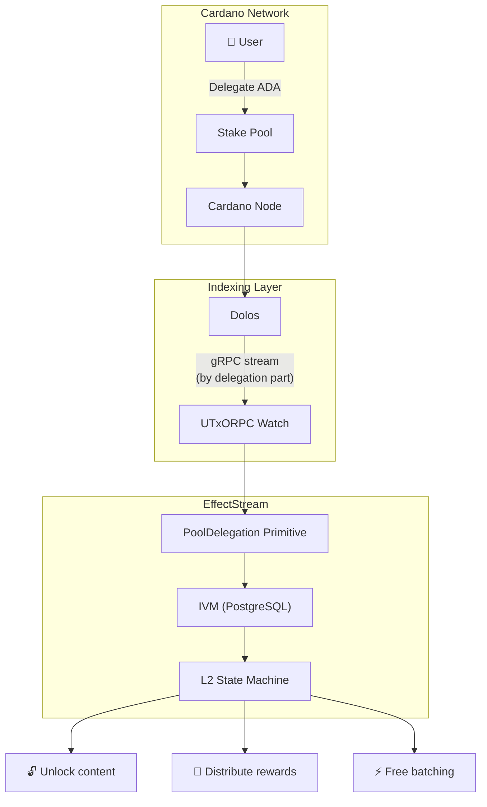

Cardano's stake pool ecosystem has millions of ADA delegated across hundreds of pools, but delegation has always been a one-way relationship: delegators earn rewards, and that's it. What if games and apps could react to where you delegate? What if stake pool operators could offer in-game benefits to their delegators? EffectStream now makes this possible with a new PoolDelegation primitive that streams delegation changes in real-time.

<!-- truncate -->

## The challenge: indexing delegation state

Delegation changes on Cardano are ledger state transitions, not traditional transactions. When a user delegates to a new pool, there's no explicit "delegation event" in the transaction log; the change shows up in the ledger state at epoch boundaries. That makes delegation harder to index than token transfers or smart contract interactions.

The original approach used [Carp](https://dcspark.github.io/carp/) as the indexer, but Carp requires syncing the full Cardano chain history. That takes days on testnet and even longer on mainnet. For local development and rapid iteration, it was a non-starter.

## The solution: Dolos + UTxORPC Watch

We replaced Carp with [Dolos](https://github.com/txpipe/dolos), a lightweight Cardano node that exposes chain data via the UTxORPC gRPC protocol. The key part is the [UTxORPC Watch module](https://utxorpc.org/watch/intro/), which provides real-time transaction streaming with filtering:

- **By address** - watch all transactions involving a specific address
- **By delegation part** - watch transactions by stake credential, finding all UTxOs delegated to a specific stake key
- **By asset policy** - watch transactions involving tokens from a specific policy

For stake pool delegation, the "by delegation part" filter is the important one. It lets EffectStream detect when any address changes its delegation to or from a monitored pool, without scanning the entire chain.

## The PoolDelegation primitive

The **PoolDelegation** primitive is one of [five Cardano primitives](https://github.com/effectstream/effectstream/tree/v-next-bun/packages/node-sdk/sm/primitives/src) in EffectStream. It reads delegation events from Dolos via UTxORPC and materializes them into PostgreSQL using EffectStream's IVM (Indexed View Materializer). See the [Cardano Primitives documentation](/docs/home/chains/cardano#primitives) for the full reference.

The primitive tracks:
- **Stake registrations** - new stake addresses entering the system
- **Delegation changes** - an address moving from one pool to another
- **Deregistrations** - stake addresses leaving the system

All state is kept in PostgreSQL materialized views, giving applications fast query access to current delegation state without re-scanning the chain. When a delegation change occurs, the event flows through EffectStream's funnel system into the application's state machine as a first-class event, just like a smart contract interaction or token transfer.

Here's the Cardano Stake Pool Delegation Explorer dApp, where you can look up delegation info, register stake keys, and trigger delegations:

And this is the terminal output showing EffectStream detecting delegation changes as they happen, with the state machine reacting to each one:

<iframe src="https://drive.google.com/file/d/1DvNhISjGyhZW93bcKLKl8akLl9iJfLc3/preview" width="100%" height="480" allow="autoplay"></iframe>

## What developers can build

With delegation data flowing into the state machine, developers can build game logic that reacts to where players delegate:

- "This area is accessible only to delegators of Pool X" (unlock content)
- "All delegators of Pool Y receive a bonus item at epoch boundary" (distribute rewards)
- Adjust game parameters based on which pools your players support (dynamic difficulty)
- Delegators of partner pools get free transaction batching via the `BATCHER_CARDANO_ENABLED_POOLS` config (the SPO covers the cost)

## End-to-end testing

The PoolDelegation primitive is covered by EffectStream's [E2E test suite](https://github.com/effectstream/effectstream/tree/v-next-bun/e2e), which verifies the full Cardano primitive lifecycle. The delegation tests cover stake address registration, initial delegation to a pool, delegation change detection, and state verification in PostgreSQL materialized views. All tests run against a local Dolos instance with YACI DevKit, so CI runs fast with no mainnet or testnet dependencies.

## The bigger picture

Stake pool delegation becomes a game mechanic. SPOs offer in-game benefits, players choose pools based on gameplay advantages, and a new economic layer sits on top of Cardano's existing delegation system. Delegation goes from a passive yield-earning activity to an active strategic decision: you delegate to a pool not just for staking rewards, but for the games and apps that pool supports.

- [PoolDelegation primitive source](https://github.com/effectstream/effectstream/tree/v-next-bun/packages/node-sdk/sm/primitives/src/cardano-pool-delegation) - implementation
- [Cardano delegation template](https://github.com/effectstream/effectstream/tree/v-next-bun/templates/cardano-delegation) - starter project
- [Cardano Primitives documentation](/docs/home/chains/cardano#primitives) - full reference for all five Cardano primitives
- [UTxORPC Watch Module](https://utxorpc.org/watch/intro/) - streaming transaction protocol
- [Dolos](https://github.com/txpipe/dolos) - lightweight Cardano node
