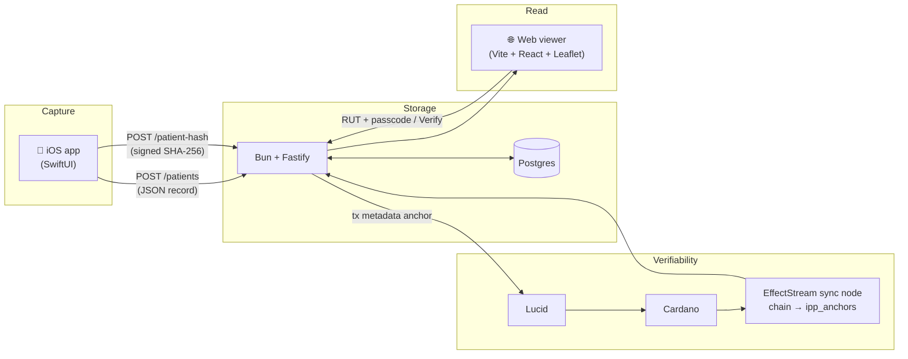

Medical records are an area that can gain from blockchain, but it hasn't been
done at scale yet - so we wanted to start with small wins. The data itself - a
patient's history, diagnoses, contact details - must stay private. But everyone
who relies on it - the clinician next month, an auditor, the researcher who wants
to publish from it - needs to know it hasn't been silently rewritten. Privacy
*and* verifiability, with neither one cancelling the other out.

**IPP** is a working application that puts that combination on Cardano,
end-to-end: an iOS app for Chilean doctors and clinical staff to capture
women's-health intake forms, a Bun backend, a public web viewer, and a Cardano
anchor that records a hash of each chart on chain. It's built on Cardano with
tooling from EffectStream for local development, and is open-source at
[`effectstream/ipp-app`](https://github.com/effectstream/ipp-app).

It is also the first *native-mobile, location-based* template in the
EffectStream series. This one is a field tool clinicians carry in their
pocket, and also a social game, with leaderboard scoring.

<!-- truncate -->

## The problem

Behind the cryptography is a concrete clinical bottleneck. In Chile:

- **2,000+ (known) people are on the waiting list** for pelvic-floor care.
- **There are not enough specialists** to see them.
- **Triage is expensive** - scarce specialist time is spent sorting who needs what
  before anyone is treated.
- **The data never becomes research.** Cases are seen and forgotten; there is no
  dataset a clinician could publish from.

And the tools that exist do not close the gap:

- **Today's systems only store.** They are filing cabinets - they hold a record,
  but they do not help you trust it, act on it, or learn from it.
- **No geo-location.** Nothing shows *where* the need concentrates, so scarce
  specialists cannot be sent where they would help most.
- **No way to explore augmented data.** A clinician filling a form sees a blank
  field, never how this patient compares to their locality, country, or the world.

IPP attacks exactly these gaps, and each maps to a feature:

- **Cheaper triage, by more hands.** A structured, guided intake turns an
  expensive specialist task into a quick form - in the pilot, doctors even
  delegated logins to office staff to capture cases by phone.
- **Location is first-class (GPS).** Every record geocodes, so the map shows where
  need clusters and lets you plan interventions: "send a specialist to this zone."
- **Augmented data (AR for data).** At capture, each field shows the local / country /
  world context; on the map, notes and areas turn patterns into plans.
- **Capture becomes verifiable research.** A filtered cohort is anchored to Cardano
  as a study whose dataset anyone can validate - the data finally has somewhere to
  go.
- **Gamified so it grows.** Points and a leaderboard make contribution visible and
  reward the clinicians who feed the dataset (and who write the papers).

The rest of this post is how that is built - and what happened when real doctors
used it.



## Gamification

Games come in many shapes, medias and types. We are introducing a real world op-in work into a gameified leaderboard. For example, a clinician earn points for each record they capture, and the leaderboard tracks the top contributors. This is has multiple benefits:
* It creates a sense of ownership and pride in the work they are doing.
* Social proof that their work is valued and contributing to a larger cause.
* Showcase the community and collaboration.
* You can see the data is clean, as top contributors will probably be well known and trusted.
* Helps showing the app is alive.
* Keeps it fun!


*The built-in leaderboard: points per contributor - in the pilot, the signal of
who the research-minded (and willing-to-pay) clinicians are.*

## The trust gap

A clinical intake form has roughly seventy questions across four sections -
demographic data, general medical history, gynecological history, and
pelvic-floor assessment, in this case. Each filled-out form lives in more than
one place at once:

- **On the doctor's phone**, where it's captured.
- **In a shared database**, where clinicians look it up later.
- **In a published dataset**, when the cohort becomes research.

(Patients can request their own record too - that's available, just not the focus
here.)

The challenge isn't storage - Postgres is perfectly happy to hold a JSONB column.
The challenge is *trust*. If a record changes between visits, nobody downstream
can tell. If a doctor needs to prove to an auditor - or a journal - that the
record they're reading today is the one they saved in March, there's no built-in
mechanism; the row is just bytes controlled by whoever holds the connection
string.

The anchor pattern fixes that without putting any private data on chain.

## The anchor pattern

On Cardano you don't need a smart contract to anchor a hash - you attach it to
**transaction metadata**. IPP submits a tiny self-payment transaction carrying a
metadata label (`8327`) with three fields:

```jsonc
// tx metadata, label 8327
{
  "t": "ipp",                                  // kind: "ipp" record | "ipp-study" Merkle root
  "k": "<SHA-256(rut)>",                       // who, hashed - never identifiable data
  "v": "<SHA-256(canonical patient JSON)>"     // the record, hashed
}
```

Nothing about the patient's identity or medical content is recoverable from the
chain entry - both `k` and `v` are 32-byte hashes. But given the plaintext
record, anyone can recompute `SHA-256(canonical JSON)`, find the latest anchor
for `SHA-256(rut)`, and check the two match. If they don't, the record changed
since it was anchored. This is Cardano's own
[CIP-100](https://cips.cardano.org/cip/CIP-0100) "anchor" convention - a
rootHash written on chain to attest off-chain data - applied to clinical charts.

The same shape scales up: a *study* anchors one Merkle root over a whole cohort
of record hashes (`t: "ipp-study"`), so a published dataset can be validated
against a single on-chain value without ever putting the records on chain.

On a recent end-to-end run:

| Stage | Result |
|---|---|
| `CardanoAdapter.submit` → Lucid builds tx + metadata | submitted to the Cardano node |
| Cardano | tx confirmed in seconds |
| chain sync → `CardanoTransfer` primitive → state machine | row written to `ipp_anchors` |
| `CardanoAdapter.read` / `GET /api/v1/onchain/:key` | returns the on-chain value - matches the submitted hash |

A metadata transaction costs a fraction of an ada.


*Saving a record in the app returns an access code and anchors the record's
SHA-256 hash to Cardano - the transaction id is shown right there.*


*Exported studies, each a cohort: the on-chain column links every study to its
Cardano anchor, so anyone can verify a downloaded dataset against the chain.*

## How EffectStream made the rest disappear

The interesting part isn't submitting a transaction - it's *reading chain state
back as application state*. EffectStream does that with one command and a few
lines of glue:

- **Local dev is one command.** `cd cardano && bun run dev` brings up a local
  Cardano node + faucet, an indexer, a local database, and the sync node -
  everything runs on a single machine for development.
- **A primitive turns chain data into rows.** EffectStream's `CardanoTransfer`
  primitive streams each transaction's metadata; a ~15-line state-machine
  transition filters for label `8327` and writes `{ tx, kind, k, v, block }`
  into an `ipp_anchors` table.
- **The app reads a table, not the chain.** Verification - `GET /verify/:rut` and
  the map's "Verify on chain" popup - just queries `ipp_anchors`. The chain
  is the source of truth; the synced table is the always-available read model.

The backend's `CardanoAdapter`
([`backend/src/adapters/cardano.ts`](https://github.com/effectstream/ipp-app/blob/main/backend/src/adapters/cardano.ts))
is under 120 lines and only knows two things: how to build a metadata
transaction with [Lucid](https://github.com/Anastasia-Labs/lucid-evolution), and
how to read `ipp_anchors`. Flip `CHAIN=cardano` in `backend/.env` and the same
endpoints that ran against a no-op `local` adapter now anchor and verify on a
real chain - no endpoint changes.

## What New Use-Cases Does the GPS and AR Integration Enable

Putting location and augmentation at the centre of clinical capture unlocks
things a filing-cabinet records system simply cannot:

- **Route scarce specialists to where the need is.** Because every record
  geocodes (GPS), the map shows where pelvic-floor need *clusters* - not just
  that it exists. A health service can look at a region and decide "send a
  specialist to this zone." That planning was impossible when cases lived on
  paper in separate clinics.
- **Context at the point of care (augmented data - "AR for data").** As a
  clinician fills a field, the app shows how this patient compares to their
  *local* area, their *country*, and the *world* - so a blank field becomes a
  field with meaning. On the map, clinicians draw notes and areas, turning raw
  points into an intervention plan.
- **Capture that becomes verifiable research.** A filtered cohort is anchored
  to Cardano as a study (one Merkle root), so the data a clinician gathers can
  finally go somewhere - a dataset a journal or co-author can validate without
  ever seeing a private record.
- **Cheaper triage, by more hands.** A guided, location-aware intake turns an
  expensive specialist task into a quick structured form, so non-specialist
  staff can capture cases and scarce specialist time goes to treatment.


*The web viewer's map: records as a geographic density layer over the region,
with clinician-drawn notes and areas - so you can see where need concentrates.*


*Augmented data at capture: under each field, the app shows the average value
for the patient's locality, country, and the world. It is subtle but powerful -
the clinician instantly sees how this patient compares to local norms, and
weighing each value against its context makes data-entry errors far less likely.*

## Why We Prioritized GPS and AR Integration for iOS

Three deliberate choices, each driven by the clinic, not the spec:

- **Why GPS.** Pelvic-floor need is unevenly distributed and the specialists
  who treat it are scarce. Without location you can only count cases; with it
  you can *route care*. Geo-location is the difference between a list and a
  plan.
- **Why augmented data ("AR for data").** The hard part of an intake form is
  not storing the answer - it is knowing whether the answer is unusual. Showing
  the local / country / world average beneath each field does two things at
  once: it gives the clinician an instant sense of the norm for that location,
  and it cuts data-entry errors, because a value that is off compared to its
  context makes you stop and check. The paper form could never do that.
- **Why iOS.** Every clinician and non-medical professional in the pilot already
  carried an iPhone, so iOS was the fastest path to real hands-on use and the
  only platform we needed to target. The app ships signed requests, an embedded
  web dashboard, and a deterministic per-account wallet.

## From the field: a closed testnet in Chile

The testnet existed to answer one question: **would clinicians actually use this,
or is it just a nice demo?** The answer was a clear yes - and that yes is the
result that mattered most.

The form, the fields, and the priorities did not come from a spec - they came
from doctors. We ran a closed pilot in three neighbouring cities in Chile with
practising clinicians who needed exactly this tool and who gave us the
requirements and hints that shaped it. The women's-health and pelvic-floor
instruments in the app are theirs. We deployed it the simplest way possible - by
hand, installing the app on each doctor's own iPhone. Every one of them already
carried one, so iOS was the right (and only) target.

After a few weeks of real use, the pilot worked: the app helped **triage
patients**, and it was used actively because the data it gathered was genuinely
useful day to day - not a demo, a working instrument.

<iframe width="100%" height="415" src="https://www.youtube.com/embed/xXFLuPrNzjc" title="IPP app walkthrough" frameBorder="0" allow="accelerometer; autoplay; clipboard-write; encrypted-media; gyroscope; picture-in-picture; web-share" allowFullScreen></iframe>

*A walkthrough of the IPP app - capturing a record, anchoring its hash to Cardano, and exploring the geographic density map.*

### What the clinicians said

<!-- Summarized clinician feedback, translated from Spanish. -->

These summarize the feedback clinicians commonly gave us:

- "It has helped me skip reviewing documents just to triage."
- "I needed to add a question, and I could add it myself."
- "I could delegate the first quick review to other non-medical professionals."
- "We midwives are usually the first to see these patients, and having validated questions helps."
- "For the first time, we are seeing the data add up without manual labor."

A few things we learned that no amount of planning would have surfaced:

- **Doctors asked to add other people.** Doctors wanted to sign up non-medical
  staff so they could phone patients and fill the form on their behalf. The
  single-doctor login model didn't match how a clinic actually runs - a clear
  signal for delegated / role-based access next. Also an open registry.
- **Almost all the feedback was about fields** - which questions to add, drop, or
  reword. We need to make them resolve this, as we are not medical experts. That is exactly the case the **schema-driven form** was built for: we
  changed the questionnaire live from the web "Configure" tab, with no App Store
  release, and the change reached every device on next launch.
- **They were happy and proactive.** Adoption wasn't a push - clinicians kept
  asking for changes because they wanted to keep using it.
- **The open question is who pays.** They liked it; pushing it top-down into
  hospitals is hard. When we asked about willingness to pay, the clinicians who
  wanted to do research and publish papers were comfortable with a subscription -
  the same people the gamified leaderboard already rewards. That points the
  business model at the researchers, not the hospital procurement office.

One deliberate constraint: we anchored to a **private Cardano testnet**,
not a public network. Chile's rules for what health-derived data may be committed
to a public blockchain are something we are still working through with local law,
so we kept the anchors on a network we control while that review continues. The
architecture makes this a non-event - only **hashes** ever reach the chain (never
a RUT or a record), and the swappable `ChainAdapter` means moving from the private
testnet to a public Cardano network is a configuration change, not a rewrite, the
day the legal picture is clear.

The bigger takeaway outlived the pilot: there is a large, underserved space for
**low-cost tools in medicine**, and where one actually shows up, the demand is
real. The hard part was never the app - it is the **compliance surface** around
health data. What makes that tractable is the shape of the legislation in
countries like Chile, where a small team can ship something genuinely compliant
and useful without the cost structure that keeps this kind of tool out of reach
elsewhere. The privacy-preserving anchor - hashes on chain, records never - is
part of how a low-cost tool stays on the right side of that line.

## What's next

The pilot pointed at clear next moves:

- **Delegated, role-based access.** Different users need different views, so the
  next version makes that first-class: a clinic account with per-person roles, so
  whoever phones the patient isn't borrowing the doctor's identity.
- **From a private testnet to a public chain.** The anchor design already keeps
  only hashes on chain, so going public is a configuration flip - gated on
  finishing the review of what Chilean law allows on a public ledger.
- **Publishable proof bundles.** Turn a filtered cohort into a downloadable
  proof - a Merkle root plus per-record inclusion proofs - so a journal or
  co-author can verify a dataset against the chain without trusting us or seeing
  a single private record.
- **A subscription for the people who publish.** Willingness to pay was clearest
  among the research-minded clinicians, so the business model follows them, with
  the leaderboard doubling as the signal of who those power users are.
- **Wider rollout, more instruments.** More cities and clinics, and beyond
  pelvic-floor into other intake forms - the schema-driven form makes a new
  questionnaire a configuration change, not a new app.

## How to use it yourself

IPP is intentionally thin - clone it (see [Try it](#try-it)) and most of the
surface generalizes. The pieces worth lifting:

- **The iOS app.** A SwiftUI app whose form is *schema-driven*: four tabs and
  ~70 questions rendered from a server-side JSON schema, so you add / reorder /
  relabel questions with no App Store release. Signed requests, an embedded web
  dashboard, and a deterministic per-account wallet come with it.
- **GPS + augmented data (AR for data).** CoreLocation geocoding feeds a Leaflet
  population map with stat filters and a distance radius; at capture each field
  shows local / country / world context, and on the map you draw notes and areas to
  plan interventions. The whole location-plus-augmentation layer drops into any
  field-data app.
- **Gamification.** Points and a leaderboard as a social-regulation and incentive
  layer - reusable anywhere you need contributors to keep feeding a dataset (and,
  as the pilot showed, to surface who your paying users are).
- **The metadata-anchor pattern.** A label plus `{ t, k, v }` is the smallest
  useful Cardano anchor for any "I have private data, I want to prove it hasn't
  changed" application. No contract required.
- **The primitive → table sync.** The `CardanoTransfer` primitive + a tiny state
  transition is a clean template for *any* "watch chain metadata, project it into
  an app table" use case.
- **The schema-driven form.** The questionnaire is a JSON schema stored in
  Postgres, fetched and cached by both clients; any vertical that needs a
  configurable intake form - surveys, audits, field inspections - can drop it in.
- **The mock-wallet derivation.** Each demo account derives a deterministic
  Cardano-style address from username + password, identical byte-for-byte between
  Swift and TypeScript. A teaching aid, not a security primitive.

The code is open-source; PRs against the [demo repo](https://github.com/effectstream/ipp-app)
are welcome.

## Why this matters

Privacy-preserving verifiability is one of those phrases that sounds abstract
until a real record is in front of you. Health data is one of the cleanest
examples - the data itself must stay private, but the guarantee that it hasn't
been silently edited is the difference between a record and a story.

EffectStream's job here is to make that combination cheap to assemble. The
interesting work in IPP is the SwiftUI form, the Chilean clinical instruments,
and the schema editor - the parts specific to *this* application. The Cardano
stack underneath is a metadata transaction, one sync primitive, and an
orchestrator command. That ratio is the point.

## Try it

```bash
git clone https://github.com/effectstream/ipp-app
cd ipp-app
# Cardano - local node + indexer + sync node, all on one machine
cd cardano && bun install && bun run dev
# Backend (separate terminal)
cd ../backend && cp .env.example .env   # set DATABASE_URL; CHAIN=cardano
bun install && bun run dev               # http://localhost:3334
# Web viewer (separate terminal)
cd ../web && bun install && bun run dev   # http://localhost:5174
# iOS app
cd ../ios && xcodegen generate && open IPP.xcodeproj
```

Anchored records show up in `ipp_anchors` with a real Cardano `tx_id`. The
patient's RUT and record stay off-chain; only their hashes ever touch the chain.

> NOTE: All data is shown in videos and images are synthetic. Real patient, or physician names are non-public due to legal requirements.