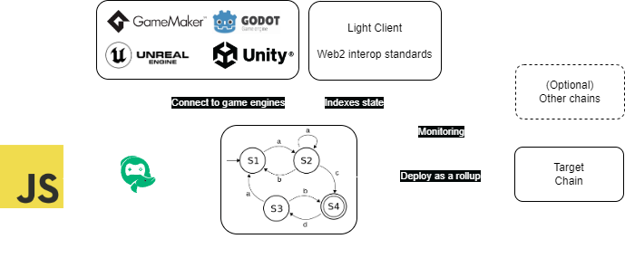

# What is EffectStream?

EffectStream is a Web3 Engine optimized for games, gamification and autonomous worlds that allows building web3 applications in just days.

Notably, its key features are that it
1. Enables you to deploy your game to leverage multiple chains and modular stacks at once in a single unified user and developer experience
2. Allows building onchain games with web2 skills
3. Protects users even in the case of hacks, allowing brands to build web3 applications without worrying
4. Speeds you up to make weekly releases a reality instead of most web3 games which are release-and-pray

EffectStream supports multiple chains out of the box, making it a fully modular rollup framework.

# Key technologies that enable this

If you prefer explanations in video form, we have [a high-level summary video](https://www.youtube.com/watch?v=HtvemijxF-0) that explains some of the core benefits of EffectStream. For a hands-on tour of what you can build with the engine, see the [Game Templates blog post](https://effectstream.github.io/docs/blog/game-templates).

## State machines as Sovereign Rollup L2s

Rollups come in many forms, each converting execution costs to storage costs in their own way:
- Optimistic rollups: run the calculation offchain, then store all the data required to execute the function (just data, no execution) along with your locally computed value for the result. Only actually run the execution if somebody believes the result you posted is incorrect ("fraud proof"). 
    *Popular examples: Arbitrum, Optimism*
- ZK rollups: run the calculation offchain, then store all the data required to execute the function (just data, no execution) along with your locally computed ZK proof of the result. 
    *Popular examples: ZK Sync, Starknet, Polygon zkEVM*
- Sovereign rollup: run the calculation offchain, then store all the data required to execute the function (just data, no execution). 
    *Popular examples: Rollkit, most infra for Bitcoin*

EffectStream is a framework for creating app-specific layer 2s (L2s) as sovereign rollups. That is to say: apps publish transactions to a blockchain for ordering and data availability, but use their own code to determine the correct app state.

Another way to describe this is first to note that every mathematical function has 3 key properties:
1. Function inputs
2. Function definition
3. Function outputs

For EffectStream, the inputs are stored on-chain (which guarantees determinism), the function definition is packaged as an executable for running the app, and the function output is the resulting state machine after applying the state transition (with the result queryable through an indexer that is part of the game node).

You may sometimes hear this referred to as a "pessimistic rollup" because nodes need to re-execute transactions to check the validity of the chain instead of optimistically being able to assume correctness. This mirrors many ideas of [replicated state machines](https://en.wikipedia.org/wiki/State_machine_replication).

## Data Projections (co-processing)

These state machines can evolve based on L1 updates such as
- New blocks/transactions
- Contracts on the L1 being updated
- Accessing historical on-chain state
- Reading updates from other L2s/rollups deployed on the blockchain
- Passive time and timers (game ticks) \
Or even more complex transition rules.

In other words, it allows building event-driven (or sometimes called loop-driven) architectures.

A great example of this is using the L1 blockchain as the source of randomness, which avoids every game having to re-implement a randomness oracle from scratch. Note that the data you can access through projections is actually more data than can natively be accessed by a smart contract (in fact, smart contract platforms usually very strictly limit the kind of data contracts can access). Co-processors are a growing field in web3 trying to enable applications to bypass these restrictions to access more data, and so in that way EffectStream is a gaming-focused co-processor.

This is possible as sovereign rollups can project L1 state to the L2. A deep dive into data projections and the full modular gaming rollup stack [can be found in this video.](https://www.youtube.com/watch?v=t9En_PR3NCA)

## Sharded rollups as a multichain co-processor

EffectStream allows you to do computation in your state machine over an aggregate view of multiple chains. This allows you to, in a sense, shard the state of your application in multiple locations such as deploying your game to a cheaper chain yet still leverage NFT marketplace / DeFi liquidity from larger networks without requiring a bridge (since you are natively monitoring both chains). Note that this is done without giving up any sovereignty of your game logic. This is powered by having *data projections* from different networks aggregated into the same state machine. This allows your games to scale like DEX aggregators in the sense that they can leverage and aggregate features from multiple ecosystems to provide the best experience for their users.

## Stateful NFTs and NFT compression

Thanks to projections, we can access the state of L1 NFTs from EffectStream. We can then interpret the output of the state machine as extra information associated to these NFTs allowing them to evolve over time based on user actions on the L2.

In a sense, you can think of this as an NFT compression protocol. Instead of having to mint a lot of static NFTs on the L1, you can instead mint a minimal set of NFTs on the L1 and then evolve them based off the state of the L2.

## Parallelization (asynchronous compute)

EffectStream state machine L2s are not only significantly more efficient than the EVM, they also support optionally running state machine updates in parallel (not natively available in the EVM), allowing games and apps to massively scale by, for example, having different PVP matches or different maps in an MMO run in parallel.

## Built-in Blockchain Sync and Primitives

EffectStream ships a sync service that reads from every supported chain and feeds events into a single unified state machine. You declare which chains and which on-chain shapes you care about; the sync service handles polling, finality, dynamic table generation, and per-block transaction boundaries - and your state-transition functions see a uniform interface regardless of which chain the event came from.

The library of **primitives** is what makes this easy. A primitive is a typed event watcher you compose into your config: it filters on-chain events at the source, parses them, and exposes payload fields plus (for many primitives) a materialized SQL view that you can query directly from your state machine. Examples that ship today:

- **EVM**: `PrimitiveTypeEVMERC20`, `PrimitiveTypeEVMERC721`, `PrimitiveTypeEVMERC1155`, and `PrimitiveTypeEVMGeneric` for arbitrary ABI events
- **Cardano**: `PrimitiveTypeCardanoDelayedAsset`, `PrimitiveTypeCardanoMintBurn`, `PrimitiveTypeCardanoPoolDelegation`, `PrimitiveTypeCardanoProjectedNFT`, `PrimitiveTypeCardanoTransfer`
- **Bitcoin**: `PrimitiveTypeBitcoinAddress`
- **Avail / Celestia**: `PrimitiveTypeAvailGeneric`, `PrimitiveTypeCelestiaGeneric`
- **Midnight**: `PrimitiveTypeMidnightGeneric` for ZK contract events
- **NEAR**: `PrimitiveTypeNEARNEP141`, `PrimitiveTypeNEARNEP171`, `PrimitiveTypeNEARNEP245`, `PrimitiveTypeNEARIntent`, `PrimitiveTypeNEARGeneric`, `PrimitiveTypeNEARAccountWatch`

You can also write a [custom primitive](./../100-components/118-primitives.md) when none of the built-ins match your contract. See each [chain page](./../200-chains/200-chains.md) for the configuration shape, payload fields, and IVM views that the primitive produces.

### L2-level Account Abstraction

Currently there is a large focus on account abstraction which powers smart contract wallets to create systems more flexible than the default public-key wallets created by most cryptocurrencies.

EffectStream can enable much more flexible account abstraction by providing this functionality at the L2 level when needed, which allows easily validating cryptographic primitives that would not otherwise be available at the L1.

### Based rollup & Sequencer SDKs

L2s created with EffectStream run as a [based rollup](https://ethresear.ch/t/based-rollups-superpowers-from-l1-sequencing/15016) - that is to say its sequencing is simply done by the DA layer (which is generally the underlying L1) and so it fully inherits its finality. This means that EffectStream L2s can be run without a sequencer (sometimes referred to as "self sequencing") and fully inherit the decentralization and security of the L1, and do this without the downsides traditionally associated with based rollups thanks to EffectStream's support for parallelization.

Although apps may not always need sequencers, they can still improve scalability and also help user onboarding. Notably, they can
- Batch transactions together to amortize transaction fees
- Cover the transaction fees for specified users through meta-transactions (ex: free txs for users who hold a specific NFT, who delegate to a stake pool, or who paid on a separate chain).

Thanks to the flexibility of the batcher system, EffectStream can even support games built without an enshrined sequencer - that is to say environments with multiple sequencers where anybody can choose to run their own decentralized sequencer for the game and monetize it how they want. This gives the benefit of sequencing without the centralization or censorship concerns.

### Cross-chain NFTs

Projects may want to allow users to play games with NFTs hosted on chains separate from where the app was deployed. For example, the game is deployed on a DA layer, but is playable from NFTs living on a separate L1.

EffectStream addresses this through multi-layer monitoring (the sharded-rollups model described above) combined with the **inverse projection** standards: [PRC-3](../400-paima-standards/prc3.md) (ERC-721) and [PRC-5](../400-paima-standards/prc5.md) (ERC-1155) define how L2 game state is represented as tradeable L1 NFTs whose `tokenURI` is served dynamically by the game's RPC. For Cardano, [PRC-2](../400-paima-standards/prc2.md) (the Hololocker pattern) covers the analogous flow for native assets.

## Non-custodial L2s

Most blockchain apps and L2s are custodial in nature. That is to say, to use them you first have to deposit your funds into the app/L2. This is dangerous because it means that user funds are at risk if the contract that is custodying user funds gets hacked, or if the L2 goes offline (sometimes called a "proposer failure" if nobody can bridge L2 funds back to the L1, or "sequencer failure" / "liveness failure" if the L2 state itself can no longer be advanced).

EffectStream however, thanks to its projective rollup support, can allow users to keep full custody of their assets while using games & apps written using EffectStream. That is to say, even if your app gets hacked or all batchers for a game go offline, user L1 assets are not at risk. This makes EffectStream a very safe way for brands to deploy onchain applications and brand reputation risk in the case of a hack is minimal. Technically speaking, it means liveness is ensured thanks to self sequencing and proposer failures are simply not possible as there is no need for proposers in the first place.

Additionally, this also helps a lot with user acquisition as empirically most users are not comfortable bridging their NFTs from L1→L2 due to bridge security concerns.

Lastly, it also helps with liquidity & composability, as it means you don't have to fracture assets between L1 and L2.

## Data availability (DA) layer support

EffectStream supports the following as DA layers:
- [EVM (default)](../200-chains/201-evm.md)
- [Avail](../200-chains/204-avail.md)
- [Celestia](../200-chains/209-celestia.md)

We provide the choice, because using a DA layer makes resync of rollup state significantly cheaper & faster.
- **EVM**: syncing rollup state requires running an EVM fullnode (expensive & heavy)
- **DA**: syncing rollup state, thanks to *data availability sampling*, just requires running a light-client (still gives fullnode-like security), and it only downloads the subset of information required for your rollup state!

More technically speaking, we support not just typical rollups, but also building both volition and validiums.

## ZK (Zero-Knowledge Cryptography)

ZK cryptography is often used in Web3 for two different properties:
- Its ability to succinctly prove the state of a system (kind of like a very efficient compression system)
- Its ability to handle functions with private inputs

Both these use-cases are of interest in games, as being able to prove world state helps with composability of worlds, and private inputs allow games with private state (ex: fog of war), commit-reveal schemes that don't require every participant to be online for the reveal phase, and compliance flows (proving you know information without revealing the sensitive information publicly).

EffectStream supports [Midnight](../200-chains/202-midnight.md) as a first-class ZK chain - full L1 sync, batcher writes, and ZK contract event capture via `PrimitiveTypeMidnightGeneric`. The [`evm-midnight-v2`](https://github.com/effectstream/effectstream/tree/main/templates/evm-midnight-v2) template is an end-to-end working example of an app that combines an EVM L1 with a Midnight ZK chain.

# Why Sovereign rollups?

There are a few ways of powering scalable applications on-chain. EffectStream is built using Sovereign Rollups instead of two other common techniques: Optimistic Rollups and ZK Rollups.

## Optimistic Rollup disadvantages

This section is written assuming an EVM-based optimistic rollup.

1. Apps have to be written in Solidity (if deploying to an existing optimistic rollup like Arbitrum) or be written to be compatible with the fraud-proof system (if an app-chain) which limits flexibility and generally means it's not composable with standard game development tools
1. App performance is bottlenecked by EVM performance. Even implementing parallelization (very common for games) requires a complex sharding system, greatly increasing ecosystem complexity.
1. Limited to EVM's data model (reads and writes are slow)
1. No support for passive time, as you cannot fraud-proof the passage of time. However, passive time is hugely important for games (ex: timers)
1. Requires Solidity boilerplate (not accessible to most game developers)
1. Limited projection and stateful NFT support (optimistic rollups have limited projective rollup support). This limits the user base as many users will not want to bridge their NFTs from L1→L2 to use the app and also hurts liquidity & composability
1. Apps have very long finality as they may get rolled back due to fraud proofs

## ZK Rollup disadvantages

ZK Rollups are primarily a computation solution. Although handling computation is important, a lot of apps (especially games) are more data management platforms (user accounts, encoding how the accounts update over time, etc.). Therefore it often makes more sense to have a sovereign rollup as the base for the game, and only use ZK when required on specific parts of your app (such as associating ZK proofs to stateful NFTs that may represent things like results of a match).

If ZK is enforced or if the whole application needs to be written as one giant ZK circuit, you will run into the following issues:

1. ZK performance is generally slow for large circuits, making it very hard to build complex games
1. ZK platforms typically enforce a global maximum on circuit sizes for zkApps deployed to their platform, which complex games will exceed
1. ZK circuits are currently still hard to write. There are some languages and efforts to simplify this, but they generally still require manual fine-tuning to try and minimize circuit size as much as possible
1. No support for passive time. This may be, depending on the use-case, replaceable by a Verifiable Delay Function, but this is much more complicated and not as powerful

## Sovereign Rollup disadvantages

Unfortunately there is no "free lunch", and so usage of sovereign rollups comes with some disadvantages as well. Keep in mind while reading this that EffectStream overcomes these deficiencies by combining its sovereign rollup layer with its native support for L1 smart contracts and its ZK layer.

### Extra work for trading L2 assets on the L1

Although assets that stay on the L1 are supported, if assets are stored on the L2, extra work is required to make these assets from the L2 available on the L1 (that is to say, supporting the ability to put \$5 into the L2, make some money, then take \$10 out requires extra work). EffectStream supports this through its concept of *inverse projections* - see [PRC-3](../400-paima-standards/prc3.md) for ERC-721 NFTs and [PRC-5](../400-paima-standards/prc5.md) for ERC-1155 (semi-fungible) tokens.

### Optional compatibility with other L1 dApps

EffectStream gains a lot of its strength from shifting game state management into the L2. This state can be accessed on the L1 depending on how you create your game (ex: by using the ZK layer), but isn't required.

This gives developers using EffectStream a choice: do they want to focus on compatibility with other L1 apps (requires extra work/cost even though they do not have a product-market fit yet), or focus on building their decentralized game and improve composability after.

### Custom indexing for rollup state

Games in EffectStream do not necessarily run a single stack, so depending on how an app is built, leveraging a single L1's tooling may not be sufficient to get proper insight into the rollup state.

To tackle this, EffectStream comes with many standards and its own indexer system to allow you to easily visualize and explore your rollup's state.
