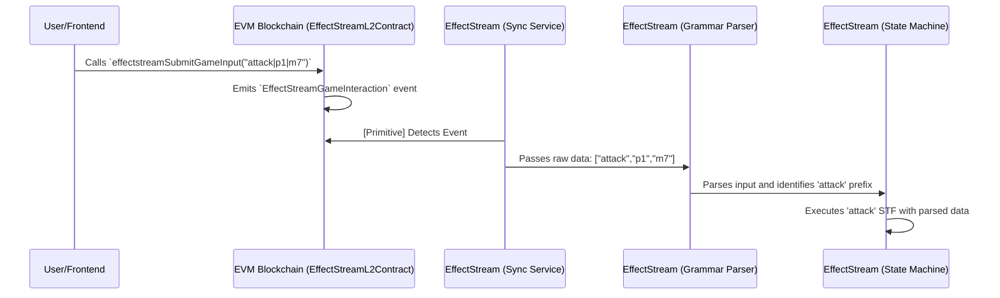

# EffectStream L2 Contract

The `EffectStreamL2Contract` is a specialized, gas-efficient smart contract that serves as the primary "mailbox" or data entry point for your EffectStream application. While EffectStream can monitor any contract, the `EffectStreamL2Contract` is optimized for submitting user actions and game moves directly to your state machine.

Its design is intentionally simple: its main job is to accept arbitrary data from a user, wrap it in an event, and securely log that event on the blockchain for the EffectStream to process.

```solidity
// SPDX-License-Identifier: MIT
pragma solidity ^0.8.20;

import "@openzeppelin/contracts/utils/Address.sol";

/// @dev The main L2 contract for an EffectStream L2.
contract EffectStreamL2Contract {
    // ... (events and state variables)

    /// @dev Emits the `EffectStreamGameInteraction` event, logging the `msg.sender`, `data`, and `msg.value`.
    /// Revert if `msg.value` is less than set `fee`.
    function effectstreamSubmitGameInput(bytes calldata data) public payable {
        require(msg.value >= fee, "Sufficient funds required to submit game input");
        emit EffectStreamGameInteraction(msg.sender, data, msg.value);
    }

    // ... (owner-only administrative functions)
}
```

### Core Functionality

The contract's logic centers around a single function and a single event.

*   **`effectstreamSubmitGameInput(bytes calldata data)`**: This is the function your frontend will call. It accepts a single `bytes` argument, which allows you to send any kind of data, but it's designed to carry a concise grammar formatted according to your application's [Grammar](./111-grammar.md) (e.g., `["attack","player1","monster7"]`).

*   **`EffectStreamGameInteraction` Event**: When `effectstreamSubmitGameInput` is called, the contract does not perform any complex logic. It simply emits the `EffectStreamGameInteraction` event, logging three crucial pieces of information onto the blockchain:
    *   `userAddress`: The wallet address of the user who called the function (`msg.sender`).
    *   `data`: The raw `bytes` payload that was submitted.
    *   `value`: The amount of cryptocurrency sent with the transaction (`msg.value`), used for the optional fee.

### How it Connects to the Grammar and State Machine

The `EffectStreamL2Contract` is the critical on-chain starting point that triggers your off-chain logic. The connection happens through a precise sequence of steps orchestrated by the EffectStream:

1.  **User Action**: A user on your frontend initiates an action, which calls `effectstreamSubmitGameInput` on the deployed `EffectStreamL2Contract` with a formatted string (e.g., `["attack","player1","monster7"]`).
2.  **Event Emission**: The contract executes and emits the `EffectStreamGameInteraction` event onto the blockchain.
3.  **Sync Service Detection**: The EffectStream's **Sync Service**, which is constantly monitoring the blockchain, has a **Primitive** configured to listen specifically for the `EffectStreamGameInteraction` event from your contract's address.
4.  **Grammar Parsing**: When the Sync Service detects a new event, it takes the `data` payload and passes it to the **Grammar Parser**. The parser checks the prefix (`["attack",...`) to identify which rule to apply. It then validates and parses the rest of the string into a structured, type-safe object.
5.  **STF Execution**: The engine uses the parsed prefix to identify and execute the corresponding **State Transition Function (STF)** in your state machine (e.g., the function registered for `"attack"`). The parsed data object is passed as an argument to your STF, where your game logic runs.

This flow creates a secure and deterministic bridge from an on-chain event to your application's state.



### Ownership and Monetization

The `EffectStreamL2Contract` also includes administrative functions that allow the contract owner to manage it and optionally generate revenue.

*   **`setOwner(address newOwner)`**: Transfers ownership of the contract to a new address.
*   **`setFee(uint256 newFee)`**: Sets a fee (in wei) that users must pay to call `effectstreamSubmitGameInput`. This is a simple way to monetize your dApp, as every action can contribute to a fee pool.
*   **`withdrawFunds()`**: Allows the owner to withdraw the accumulated fees from the contract.


### Built-in Grammar Commands (`&`)

> These are low level internal commands.
> Normally you will not be directly using these mechanisms.

While most of your application's grammar is custom-defined to handle your specific game logic, EffectStream reserves a special prefix, `&`, for a set of powerful, built-in system commands. These commands provide core functionalities common to most decentralized applications, including input batching and a flexible account management system.

These commands are processed directly by the EffectStream before your custom State Transition Functions (STFs) are run.

#### Batched Inputs: `&B`

Submitting one on-chain transaction for every single user action can be slow and expensive, leading to a poor user experience. To solve this, EffectStream provides a batching mechanism, primarily used by the [Batcher service](../100-components/108-batcher/1200-overview.md).

The `&B` command allows multiple individual user inputs to be bundled together and submitted in a single on-chain transaction, significantly reducing costs and improving throughput.

**Grammar:**
```
["&B","[input1,input2,input3,...]]
```

*   **`input`**: A JSON-formatted array of strings. Each string in the array is a complete, individual user input (e.g., `"["attack","p1","m7"]`) that will be processed sequentially by the engine.

**Example Payload:**
```json
[
    "&B",
        "[\"signature\", \"wallet\", \"attack\",\"p1\",\"m7\"]",
        "[\"signature\", \"wallet\", \"use_item\",\"p1\",\"potion\"]",
        "[\"signature\", \"wallet\", \"move\",\"p1\",\"c3\"]"
]
```

A key feature of this system is its robustness & security features. Each input within the batch is a string. If one of the inputs is malformed or invalid according to your grammar, the EffectStream will simply skip that single input and continue processing the rest of the batch. This prevents a single bad actor or a frontend bug from causing an entire batch of valid transactions to fail.

Typically, you will not construct this `&B` string manually. The Batcher service and the EffectStream frontend SDKs handle the creation and submission of batched inputs automatically.

#### Account Management Commands

EffectStream includes a flexible, L2-native account system that goes beyond simple wallet addresses. A single "EffectStream Account" can be controlled by multiple wallets (e.g., a hot wallet on a mobile device and a hardware wallet for security), and the primary controlling wallet can be changed. This provides a form of L2 Account Abstraction.

These commands allow users to manage their EffectStream Account directly through the `EffectStreamL2Contract`.

*   **`&createAccount`**
    *   **Description**: Creates a new, empty EffectStream Account. The wallet that sends this transaction (`msg.sender`) automatically becomes the first and primary address for this new account.

*   **`&linkAddress`**
    *   **Description**: Links a new wallet address to an existing EffectStream Account. This process is secured by requiring signatures from both the current primary wallet (proving control over the account) and the new wallet being linked (proving its ownership).

*   **`&unlinkAddress`**
    *   **Description**: Removes a wallet address from a EffectStream Account. This can be initiated either by the user themselves to leave an account, or by the primary wallet holder to remove another linked address.
  
 
More in [accounts](../100-components/116-accounts.md)