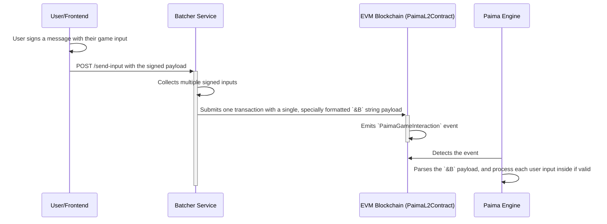

# Batcher

> NOTE THIS IS A PREVIEW DOCUMENTATION. NYI.

The Batcher is a server-side application that acts as a powerful intermediary between your users and the blockchain. Its primary purpose is to solve several major user experience challenges in Web3: gas fees, transaction speed, and cross-chain friction.

Instead of requiring every user to submit an on-chain transaction for every action, the Batcher allows them to simply **sign a message** with their wallet. The Batcher then collects these signed messages, bundles them into a single payload, and submits that payload to the `PaimaL2Contract` in a single, efficient on-chain transaction.

### Why Use a Batcher?

Integrating a Batcher offers significant advantages for your dApp:

*   **Gas Abstraction**: The Batcher pays the gas fees for all submitted transactions, allowing you to offer a "gasless" experience to your users.
*   **Chain Abstraction**: Since users only need to sign a message, they can use a wallet from **any supported chain** (like Cardano or Mina) to interact with your dApp, even if it's deployed on an EVM chain.
*   **Improved User Experience**: Users are not constantly interrupted by wallet pop-ups to approve transactions, leading to a much smoother experience.
*   **Increased Throughput**: Bundling many actions into a single transaction significantly increases the number of user inputs processed per block.

### How It Works: The Batching Flow

The process from user action to state change is a secure, multi-step flow where signature verification happens **inside the Paima Engine**, not on-chain.



### The On-Chain Batch Format (`&B`)

When the Batcher submits a transaction, it doesn't use a standard JSON array. Instead, it constructs a **single, specially formatted string** that starts with the built-in `&B` prefix. This string contains multiple "subunits," each representing a single user's signed input.

The structure of the string payload is conceptually:
`&B<subunit1><subunit2><subunit3>...`

Each subunit contains all the information needed for the Paima Engine to verify and process an individual action:
*   The user's wallet address.
*   The timestamp of the signature.
*   The user's cryptographic signature.
*   The actual game input (as a stringified JSON array, e.g., `"[\"attack\",1,42]"`).

### Engine-Side Signature Verification

This is the most critical part of the Batcher's security model. The `PaimaL2Contract` does not validate signatures; that would be incredibly gas-intensive. Instead, the Paima Engine performs this verification off-chain.

When the engine's Sync Service detects a `PaimaGameInteraction` event with a payload starting with `&B`, it triggers a special process:
1.  **Parse Batch**: The engine parses the single `&B` string into its individual subunits.
2.  **Iterate and Verify**: It loops through each subunit and performs the following steps:
    a. **Reconstruct Message**: It uses the `userAddress`, `millisecondTimestamp`, and `gameInput` from the subunit to reconstruct the exact, deterministic message that the user's wallet was supposed to have signed.
    b. **Verify Signature**: It then attempts to verify the provided `userSignature` against the reconstructed message. Crucially, it intelligently tries multiple signature schemes (EVM, Cardano, Mina, etc.) to determine the user's wallet type and validate accordingly.
3.  **Process Valid Inputs**: If the signature is valid, the engine processes the `gameInput` through the standard Grammar and State Machine. If the signature is invalid, the subunit is safely discarded, and the engine moves to the next one. This prevents a single invalid signature from halting the entire batch.

### The Default Batcher Implementation

Paima Engine provides a robust, ready-to-use Batcher implementation out of the box. This default implementation handles all the core logic:
*   Running an HTTP server with a `/send-input` endpoint.
*   Verifying cryptographic signatures for multiple wallet types.
*   Storing pending inputs securely.
*   Periodically bundling inputs into a valid on-chain batch.
*   Submitting the transaction to the `PaimaL2Contract` and handling retries.

### Running the Batcher in Development

You can enable the default Batcher in your local development environment with a single flag in your orchestrator `start.ts` file.

```ts
const config = Value.Parse(OrchestratorConfig, {
  processes: {
    // Set this flag to true to launch the default Batcher service.
    [ComponentNames.PAIMA_BATCHER]: true,
  },
  // You must also provide the batcher configuration
  batcher: {
    paimaL2Address: "0x...",
    batcherPrivateKey: "0x...", // A dev wallet private key
    chainName: "hardhat",
  },
  // ...
});
```
The [Process Orchestrator](./106-processes.md) will automatically start and configure the Batcher service for you.

### Customizing the Batcher for Production

The default Batcher allows anyone to submit inputs. For a production environment, **you are responsible for deploying and customizing your own Batcher instance.**

This is a critical step, as it allows you to implement your dApp's specific business logic and monetization strategy.

#### 1. Funding the Batcher
The Batcher's EVM wallet must be funded with the native currency of the target chain (e.g., ETH on Arbitrum) to pay for gas fees. You are responsible for keeping this wallet topped up.

#### 2. Implementing Custom Logic
The most important reason to customize the Batcher is to add your own validation rules. Before verifying a signature and adding an input to the queue, your Batcher can (and should) query the **Paima Engine's API** to check if the user is authorized to submit a "free" transaction.

This allows you to implement rules such as:
*   Allowing 10 free moves per day for any user.
*   Granting unlimited free moves to users who own a specific NFT.
*   Allowing users who have paid a subscription fee to submit inputs.

**Conceptual Example (in your custom batcher's `/send-input` handler):**
```ts
async function handleSendInput(request) {
  const userInput = request.body;

  // Custom Logic: Query the Paima Engine API
  const paimaApiUrl = `http://paima-engine:3333/api/check-nft-ownership/${userInput.userAddress}`;
  const response = await fetch(paimaApiUrl);
  const { isNftHolder } = await response.json();

  if (isNftHolder) {
    // User is authorized, proceed with signature verification and add to queue.
    await defaultBatcherLogic.addUserInput(userInput);
  } else {
    // User is not authorized, reject the request.
    reply.status(403).send({ error: "User is not an NFT holder." });
  }
}
```
### Frontend Integration: Sending an Input to the Batcher

Your frontend application is responsible for creating the correctly formatted signed message and sending it to the Batcher's `/send-input` endpoint. The `@paima/concise` and `@paima/wallet` packages provide the necessary tools for this.

The process involves three main steps:

#### 1. Construct the Game Input
First, create the game move as a standard JavaScript array, following the rules defined in your [Grammar](./111-grammar.md).

```ts
// The user's intended action, as a structured array.
const gameInput = ["attack", 1, 42];
```

#### 2. Create and Sign the Batcher Message
This is the most critical step. The user does not sign the `gameInput` directly. Instead, you must use the `createMessageForBatcher` helper function. This function combines the game input with other essential data (a timestamp, the user's address, and a security namespace) into a single, deterministic string. This is the string the user's wallet will sign.

It is crucial to use this specific function because the Paima Engine uses the exact same function internally to reconstruct the message for signature verification. Any deviation will result in an invalid signature.

```ts
import { createMessageForBatcher } from '@paima/concise';

const timestamp = Date.now();
const userAddress = wallet.getAddress(); // e.g., "0x123..."

// Create the precise message string that will be signed.
const messageToSign = createMessageForBatcher(
  "my-security-namespace", // A unique string for your dApp to prevent cross-game replay attacks.
  timestamp,
  userAddress,
  JSON.stringify(gameInput) // The game input must be stringified.
);

// Use the wallet client to sign the message.
const signature = await walletClient.signMessage({
  message: messageToSign,
});
```

#### 3. Submit to the Batcher Endpoint
Finally, send all the components to the Batcher's `/send-input` endpoint in a POST request.

```ts
// The body of the POST request.
const payload = {
  addressType: AddressType.EVM, // The type of wallet the user signed with.
  userAddress: userAddress,
  userSignature: signature,
  gameInput: JSON.stringify(gameInput),
  millisecondTimestamp: timestamp,
};

// Send the request to your Batcher's URL.
await fetch(`${ENV.BATCHER_URL}/send-input`, {
  method: "POST",
  headers: { "Content-Type": "application/json" },
  body: JSON.stringify(payload),
});
```

### Security Considerations for Production

When deploying a custom Batcher, you are running a critical piece of infrastructure. Securing it is paramount.

*   **Batcher Wallet Security**: The Batcher's private key controls a wallet that must be funded to pay for gas. Treat this like any production hot wallet. Use a secure key management system and never expose the private key directly in your code or environment variables in an insecure manner.
*   **Timestamp Validity Window**: To prevent **replay attacks** (where an attacker captures a valid signed message and resubmits it later), your Batcher should enforce a strict validity window for timestamps. It should reject any incoming request where `millisecondTimestamp` is too old (e.g., more than 30 seconds in the past) or in the future. The Paima Engine also performs a similar check, but rejecting invalid inputs early at the Batcher saves resources.
*   **DoS Protection and Rate Limiting**: Your Batcher's `/send-input` endpoint is publicly exposed. You must protect it from denial-of-service (DoS) attacks and spam. Implement standard web security practices like:
    *   **Rate Limiting**: Limit the number of requests a single IP address can make per minute.
    *   **CAPTCHA**: For anonymous users, you can integrate a service like Google's reCAPTCHA.
    *   **API Keys**: If your Batcher is being used by other backend services, require an API key.
*   **Input Validation**: Before even checking a signature, your custom Batcher can perform basic validation on the `gameInput` string. For example, you can check if it's valid JSON and if its size is within a reasonable limit to reject obvious junk requests immediately.

### When to Bypass the Batcher

While the Batcher is the recommended approach for most user actions, there may be specific, high-stakes operations where a direct on-chain transaction is more appropriate.

Consider a direct `PaimaL2Contract` interaction for:
*   **High-Value Actions**: For actions that involve significant value (e.g., finalizing a tournament prize, claiming a rare asset), the friction of a direct wallet confirmation can be a desirable security feature.
*   **No Need for Abstraction**: If your dApp only runs on a single, low-cost chain and your target users are already familiar with paying gas fees, a Batcher might be an unnecessary architectural component.

For most dApps, a hybrid approach works best: use the Batcher for frequent, low-stakes actions (the game loop) and direct transactions for infrequent, high-stakes administrative tasks.
