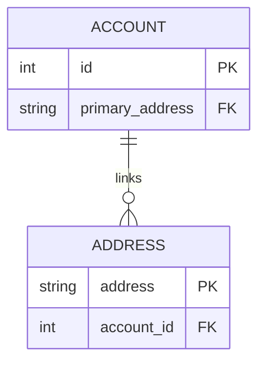

# Accounts

Beyond simple wallet addresses, Effectstream provides a flexible, L2-native **Account System**. This system acts as a form of L2 Account Abstraction, allowing you to create a persistent user identity that is more robust and user-friendly than a single private key.

The primary goal of the Account System is to decouple a user's in-game identity from a single wallet. This enables powerful features like:
*   **Multi-Wallet Control**: A single Effectstream Account can be controlled by multiple addresses. For example, a user could link a secure hardware wallet (a "cold wallet") and a more convenient browser extension (a "hot wallet") to the same game account.
*   **Account Recovery**: If a user loses access to their primary wallet, they can use a previously linked secondary wallet to regain control of their account by assigning a new primary address.
*   **Seamless Wallet Migration**: Users can switch their primary wallet without losing their in-game progress, assets, or identity.

### Core Concepts

The system is built on two simple but powerful concepts, which are reflected in the underlying database tables.

*   **Account**: This is the central identity, represented by a unique, auto-incrementing `account_id`.
*   **Address**: This is a standard blockchain wallet address (e.g., an EVM or Cardano address).
*   **Primary Address**: Each Account has one designated **Primary Address**. This address acts as the "owner" or "administrator" of the account and is the only one authorized to perform sensitive actions, such as linking new addresses or removing existing ones.



### Managing Accounts via Built-in Commands

You do not need to write any custom STFs to manage accounts. Effectstream provides a suite of built-in [Grammar](./111-grammar.md) commands that you can call directly through the `EffectstreamL2Contract`. All administrative actions are secured by cryptographic signatures.

#### `&createAccount`
This is the entry point for creating a new Effectstream Account.

*   **Purpose**: Creates a new, empty account.
*   **Logic**: When a wallet sends this command, the engine creates a new `account` row. The sender's address is automatically set as the first linked address and the **Primary Address** for the new account.
*   **Grammar**: `["&createAccount"]`

#### `&linkAddress`
This command links a new wallet address to an existing account.

*   **Purpose**: To add a new controlling wallet to an account.
*   **Security Model**: This is a sensitive operation and is secured by a **two-signature requirement**:
    1.  A signature from the **current Primary Address** is required to prove that the sender has the authority to modify the account.
    2.  A signature from the **new Address being linked** is required to prove that its owner consents to being added to the account.
*   **Grammar**: `["&linkAddress", account_id, signature_from_primary, primary_address_type, new_address, signature_from_new_address, secondary_address_type, is_new_primary]`
*   **Parameters**:
    *   `account_id` (number): The ID of the account to modify.
    *   `signature_from_primary` (string): The signature from the current primary wallet.
    *   `primary_address_type`: (AddressType) Numeric type of address.
    *   `new_address` (string): The new wallet address to link.
    *   `signature_from_new_address` (string): The signature from the new wallet.
    *   `secondary_address_type`: (AddressType): Numeric type of address
    *   `is_new_primary` (boolean): If `true`, the `new_address` will become the new Primary Address for the account.

#### `&unlinkAddress`
This command removes a wallet address from an account. The logic for this command is contextual, depending on who initiates it.

*   **Purpose**: To remove a wallet's control over an account.
*   **Grammar**: `["&unlinkAddress", account_id, signature_from_primary,  primary_address_type, target_address, new_primary]`

There are two ways this command can be used:

1.  **Administrative Unlink (by Primary Address)**
    *   **Logic**: The Primary Address can remove any other linked address from the account.
    *   **Requirements**: This requires a valid `signature_from_primary`.
    *   **`new_primary`**: If the address being unlinked is the current Primary Address, the `new_primary` parameter *must* be provided to designate one of the remaining linked addresses as the new owner.

2.  **Self Unlink (by a linked Address)**
    *   **Logic**: Any linked address can remove itself from an account.
    *   **Requirements**: The `signature_from_primary` parameter is left as an empty string. The sender's address must match the `target_address` being unlinked.
    *   **Safety Precaution**: A user **cannot** unlink themselves if they are the Primary Address and other addresses are still linked to the account. This prevents the account from being "orphaned" without an administrator. To change the primary, they must first use `&linkAddress` to set a new primary or use the administrative unlink flow.

Check the [AddressTypes in the Wallets Section](./112-wallets.md)

### Querying Account Data

The Effectstream automatically creates and populates the necessary database tables. You can query this data from your custom API endpoints or within your STFs using the provided `pgtyped` functions.

**Database Schema:**
```sql
CREATE TABLE effectstream.accounts (
  id SERIAL PRIMARY KEY,
  primary_address TEXT
);

CREATE TABLE effectstream.addresses (
  address TEXT NOT NULL UNIQUE,
  account_id INTEGER REFERENCES effectstream.accounts(id)
);
```

**Common Queries (`@effectstream/db`):**
*   `getAddressByAddress`: Fetches account information for a specific wallet address.
*   `getAddressByAccountId`: Fetches all addresses linked to a specific account ID.
*   `getAccountById`: Fetches the details of a specific account, including its primary address.