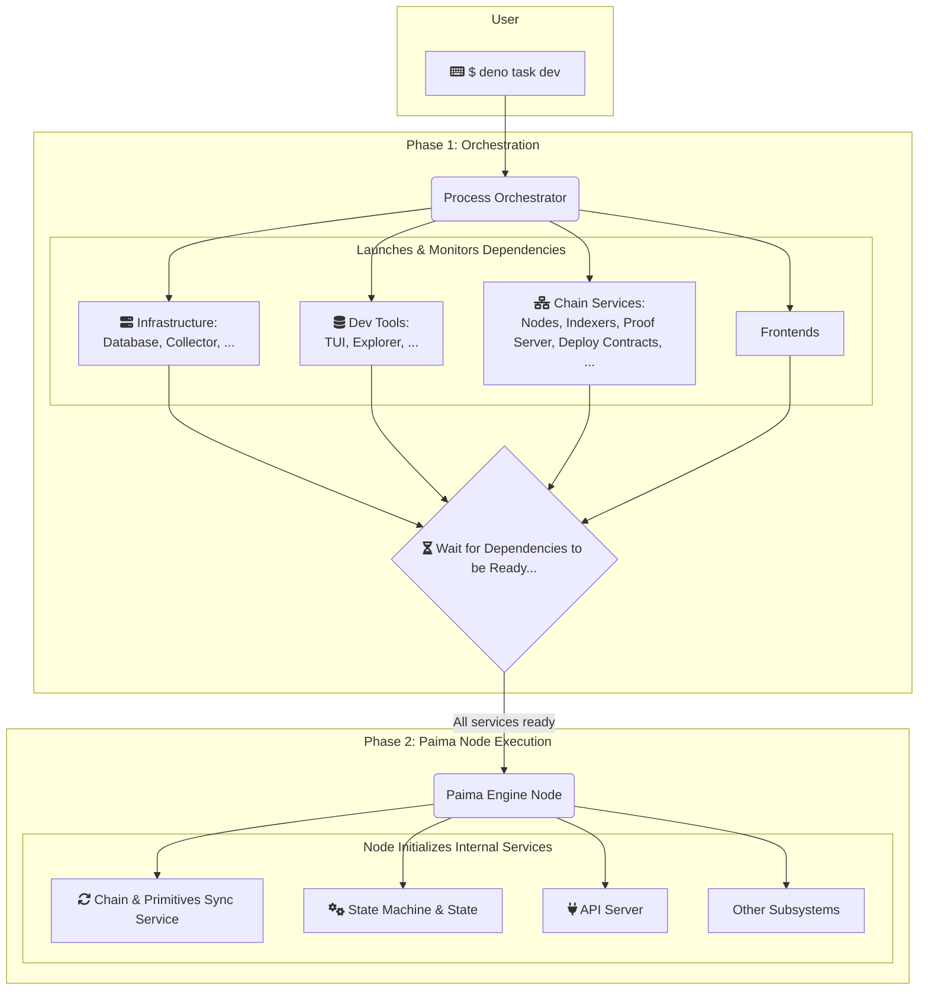

# Node Startup

Once configured your [chains](./101-sync-service.md), defined your [grammar](./111-grammar.md), and written your [state machine](./102-state-machine.md) logic. The final step is to bring all these pieces together and hand them off to the Paima Engine to be executed.

> We will be using the /templates/evm-midnight as example

`start(...)` Is the main entry point, located at `/packages/client/node/src/main.ts` in the template project. This file acts as the central launch system of your Paima Engine Node, importing all the different components of your application and passing them to the Paima Engine Runtime.

### Paima Engine `start(...)`

The entry point file is concise but powerful. It uses the `effection` library for structured concurrency to manage the node's lifecycle and the `@paima/runtime` package to start the engine.

Let's break down a typical `main.ts` file:

```ts
import { main, suspend } from "effection";
import { init, start } from "@paima/runtime";
import { toSyncProtocolWithNetwork, withPaimaStaticConfig } from "@paima/config";

// 1. Import all the core pieces of your application
// Project Defined Components
import { localhostConfig } from "@example-evm-midnight/data-types/localhostConfig";
import { migrationTable } from "@example-evm-midnight/database";
import { grammar } from "@example-evm-midnight/data-types/grammar";
import { gameStateTransitions } from "./state-machine.ts";
import { apiRouter } from "./api.ts";

const appName = "evm-midnight-example";
const appVersion = "0.3.21";

// 2. Define the main() execution block
main(function* () {
  // Initialize the Paima runtime environment
  yield* init();
  console.log("Starting Paima Engine Node");

  // 3. Load your static configuration into the runtime's context
  yield* withPaimaStaticConfig(localhostConfig, function* () {

    // 4. Start the Paima Engine with all your application's components
    yield* start({
      appName,
      appVersion,
      syncInfo: toSyncProtocolWithNetwork(localhostConfig),
      gameStateTransitions,
      migrations: migrationTable,
      apiRouter,
      grammar,
    });
  });

  // Keep the process alive indefinitely
  yield* suspend();
});
```

### The `start()` Configuration Object

The `start()` function is the most important call. It accepts a single configuration object that tells the Paima Runtime exactly how to build and run your dApp.

| Property | Description | Related Documentation |
| :--- | :--- | :--- |
| `appName`, `appVersion` | Basic metadata for your application, used for logging and identification. | |
| **`syncInfo`** | The chain and primitive configuration you defined in your `config.ts` file. This tells the Sync Service which chains to connect to and what events to monitor. | [Sync Service & Chain Config](./101-sync-service.md) |
| **`gameStateTransitions`** | The collection of your State Transition Functions (STFs) from your `state-machine.ts` file. This is the core logic of your dApp. | [State Machine](./102-state-machine.md) |
| **`migrations`** | The database migration configuration from your `migration-order.ts` file. This tells the engine how to set up and evolve your database schema. | [Database](./109-database.md) |
| **`apiRouter`** | The custom API router function from your `api.ts` file. This is how you add your own custom endpoints to the node's API. | [API](./103-api.md) |
| **`grammar`** | The grammar definition from your `grammar.ts` file. This is used to parse and validate all incoming on-chain data. | [Grammar](./111-grammar.md) |

### The Big Picture: From Orchestrator to Running Node

This `main.ts` file is the final link in the chain of command for starting your dApp.



1.  The [Process Orchestrator](./106-processes.md) first sets up the entire external environment (local chains, etc.).
2.  Its final step is to execute your node's `start(...)`.
3.  Your `main.ts` gathers all your application-specific configurations and logic.
4.  It passes this complete "blueprint" to the Paima Runtime's `start()` function.
5.  The Paima Runtime then uses this blueprint to initialize and run all of its internal services, creating a fully operational Paima Engine node tailored to your dApp.