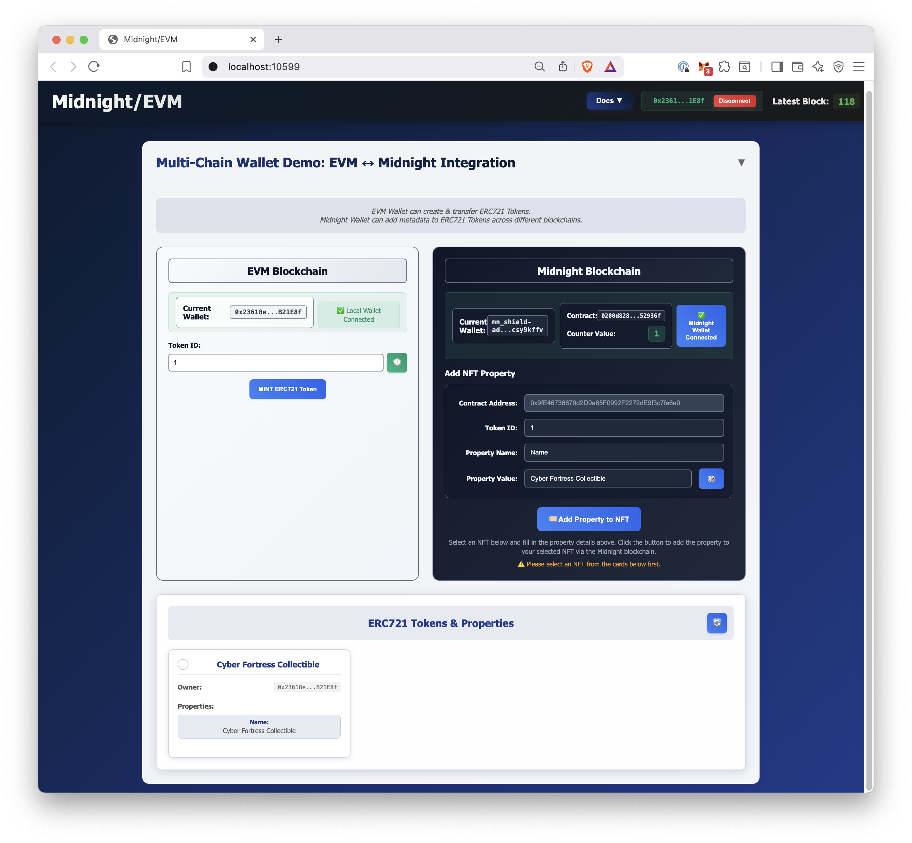

#  EVM-Midnight Token Metadata

-   **Location**: `/templates/evm-midnight`
-   **Highlights**: EVM & Midnight Interoperability. Web Application to create ERC721 Tokens and add metadata through a Midnight Contract.

The `evm-midnight` template is a powerful starting point that demonstrates one of EffectStream's core strengths: **multi-chain interoperability**. It showcases a complete, end-to-end dApp that seamlessly combines a public, asset-focused EVM chain with a private, computation-focused ZK chain (Midnight).



## Core Concept: Extending ERC721 Tokens with Private Metadata

The goal of this template is to create a dApp where users can own a standard **ERC721 Token** on an EVM chain, but then use the privacy features of **Midnight** to add or update metadata associated with that NFT.

*   The ownership of the Token is public and managed by the EVM contract.
*   The special properties or "enchantments" of the NFT are managed on Midnight. Only the owner can execute the ZK transaction to add a property, but the *result* (the new property) is made public on Midnight's ledger for the EffectStream to see.

This pattern is a blueprint for many real-world applications, such as:
*   **Private Stats**: An Token character's stats (e.g., strength, intelligence) could be private until a battle.
*   **Sealed-Bid Auctions**: Bids for an NFT could be kept private until the auction ends.
*   **Verifiable Randomness**: An NFT could be associated with a random attribute that is generated privately and then revealed.

## Quick Start

```sh
# Check for external dependencies
./../check.sh

# Install packages
deno install --allow-scripts && ./patch.sh

# Compile contracts
deno task build:evm
deno task build:midnight

# Launch EffectStream Node
deno task dev
```

Now you should see the dApp running in your browser!

### Terminal
<iframe src="https://drive.google.com/file/d/1vLHmm9HrPrKiIHJlnnX3aopeX0J-A9Oz/preview" width="640" height="480" allow="autoplay"></iframe>

### Browser
<iframe src="https://drive.google.com/file/d/1hDh5PkKQdDx8UXnBsS1clypvXF14Msvm/preview" width="640" height="480" allow="autoplay"></iframe>

## The Components in Action

When you run `deno task dev` for this template, the [Process Orchestrator](../100-components/106-processes.md) sets up a complete local environment:
*   **Hardhat EVM Node**: A local EVM blockchain.
*   **Midnight Stack**: The full local Midnight environment, including the node, indexer, and proof server.
*   **EffectStream Services**: The development database, log collector, TUI, and the EffectStream Explorer.
*   **EffectStream**: Node to sync the chains.
*   **Frontend**: A simple web interface to interact with the contracts.

## On-Chain Logic

### 1. The EVM Contract (`Erc721Dev.sol`)
The EVM side is a standard, minimal `Erc721Dev` contract. Its only job is to manage the minting and transferring of Tokens. EffectStream will monitor its `Transfer` event to track ownership.

```solidity
// In packages/shared/contracts/evm/src/contracts/ERC721Dev.sol
pragma solidity ^0.8.20;

import {ERC721} from "@openzeppelin/contracts/token/ERC721/ERC721.sol";

contract Erc721Dev is ERC721 {
    constructor() ERC721("Mock ERC721", "MERC") {}

    function mint(address _to, uint256 _tokenId) external {
        _mint(_to, _tokenId);
    }
}
```

### 2. The Midnight Contract (`counter.compact`)

The Midnight contract is where the logic for updating metadata lives. Its `addPropertyToTokenID` circuit accepts four private inputs, which in this template are repurposed to represent the EVM contract address, the Token's token ID, and a key-value pair for the new property.

When a user executes this circuit, the transaction updates the contract's public `ledger`, revealing the new property without disclosing the private inputs used in the computation.

```rust
// In packages/shared/contracts/midnight/contract-round-value/src/counter.compact
pragma language_version >= 0.17;

import CompactStandardLibrary;

// These are the public state variables EffectStream will monitor.
export ledger round: Counter;
export ledger contract_address: Bytes<64>;
export ledger token_id: Bytes<64>;
export ledger property_name: Bytes<32>;
export ledger value: Bytes<32>;

// This is the private state transition.
export circuit addPropertyToTokenID(
  contract_address_: Bytes<64>, 
  token_id_: Bytes<64>, 
  property_name_: Bytes<32>,
  value_: Bytes<32>,
): [] {
  round.addPropertyToTokenID(1);
  // The 'disclose' keyword makes the private input public
  // by writing it to the corresponding ledger variable.
  contract_address = disclose(contract_address_);
  token_id = disclose(token_id_);
  property_name = disclose(property_name_);
  value = disclose(value_);
}
```

## The State Machine (`state-machine.ts`)

The State Machine has two key State Transition Functions (STFs) that listen for events from these two chains.

### 1. `transfer-assets` STF (Listening to EVM)
This STF is triggered whenever an ERC721 `Transfer` event occurs on the EVM chain. Its job is to keep track of existing Tokens and the current owner.

```ts
// In packages/client/node/src/state-machine.ts
stm.addStateTransition(
  "transfer-assets",
  function* (data) {
    console.log("🎉 [TRANSFER-ASSETS] Transaction receipt:");
    console.log(JSON.stringify(data.parsedInput, null, 2));
    const { to, tokenId }: any = data.parsedInput;
    const contract_address = `0x1111...`
    
    // Update the database to record the new owner of the Token.
    yield* World.resolve(insertEvmMidnight, {
      contract_address,
      token_id: tokenId,
      owner: to,
      block_height: data.blockHeight,
    });
    return;
  },
);
```

And the SQL Query takes care of the database updates, and keeping track of all the Tokens and owner.
```sql
/** @name insertEvmMidnight */
INSERT INTO evm_midnight 
    (contract_address, token_id, owner, block_height) 
VALUES 
    (:contract_address!, :token_id!, :owner!, :block_height!) 
ON CONFLICT (contract_address, token_id) 
DO UPDATE SET 
    owner = EXCLUDED.owner,
    block_height = EXCLUDED.block_height
```


### 2. `midnightContractState` STF (Listening to Midnight)
This STF is triggered whenever the public `ledger` of the Midnight contract changes. Its job is to take the new metadata revealed by the ZK transaction and link it to the corresponding Token in the database.

```ts
// In packages/client/node/src/state-machine.ts
stm.addStateTransition(
  "midnightContractState",
  function* (data) {
    // 1. Decode the public ledger state from the raw Midnight payload.
    const payload: { /* ... */ } = data.parsedInput.payload;
    const decodeString = (x: { [key: string]: number }): string => 
      // ... decoding logic ...

    const contract_address = decodeString(payload.contract_address);
    const token_id = decodeString(payload.token_id);
    const property_name = decodeString(payload.property_name);
    const value = decodeString(payload.value);

    // 2. Check if we already know about this Token from the EVM.
    //    If not, create a record for it.
    const [evmMidnight] = yield* World.resolve(getEvmMidnightByTokenId, {
      contract_address,
      token_id,
    });
    if (!evmMidnight) {
      yield* World.resolve(insertEvmMidnight, {
        contract_address,
        token_id,
        owner: "",
        block_height: data.blockHeight,
      });
    }

    // 3. Insert the new metadata property into the database,
    //    linking it to the Token.
    yield* World.resolve(insertEvmMidnightProperty, {
      contract_address,
      token_id,
      property_name,
      value,
      block_height: data.blockHeight,
    });
  },
);
```

The property consistency is maintained by the database query:
```sql
/* @name insertEvmMidnightProperty */
INSERT INTO evm_midnight_properties 
    (contract_address, token_id, property_name, value, block_height) 
VALUES 
    (:contract_address!, :token_id!, :property_name!, :value!, :block_height!) 
ON CONFLICT (contract_address, token_id, property_name) 
DO UPDATE SET 
    value = EXCLUDED.value,
    block_height = EXCLUDED.block_height
```


By combining these two STFs, the EffectStream builds a unified view of the dApp's state, merging public ownership data from EVM with privately-added metadata from Midnight.