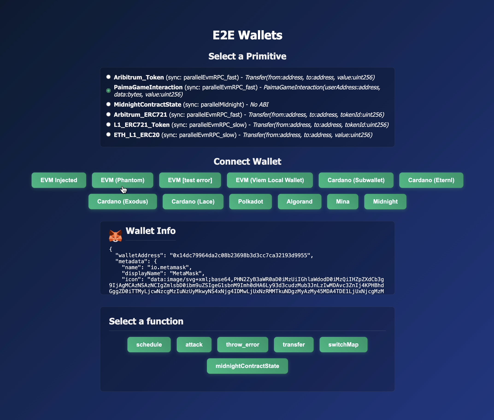

# Wallets Demo

*   Location: `/e2e/e2e-wallets/`
*   Highlights: A comprehensive example frontend to use the `@paima/wallets` library, demonstrating multi-chain wallet connections and different transaction submission methods.

The Wallets Demo is a developer tool and an interactive example that showcases how to integrate various blockchain wallets into a Statestream dApp. It provides a clear, hands-on demonstration of connecting to different chains, signing messages, and submitting transactions, serving as a practical guide for developers.



## Core Concept: A Unified Wallet Experience

The primary goal of this demo is to illustrate the power and flexibility of the `@paima/wallets` library. It answers the question: "How can my dApp seamlessly handle wallets from different ecosystems like EVM, Cardano, Polkadot, and more?"

The application demonstrates three key user flows:
1.  **Connecting Wallets**: Shows how to initiate connections with a wide variety of wallets, from browser extensions like MetaMask to local, programmatic wallets for testing.
2.  **Signing Messages**: A standard way to verify ownership of an address without submitting an on-chain transaction.
3.  **Submitting Transactions**: Illustrates the different ways a user can send data to your Statestream application:
    *   **Direct On-Chain**: A standard transaction sent to a specific Paima L2 contract.
    *   **Via the Batcher**: A gasless, user-friendly alternative where transactions are submitted through a Paima service.

This demo is an essential resource for any developer looking to build a multi-chain dApp on Statestream.

## How to Run

(TODO move to own template)
```
deno install --allow-scripts && ./patch.sh
deno task -f @e2e/evm-contracts build
deno task -f @e2e/evm-contracts deploy:standalone
deno task -f @e2e/midnight-contracts midnight-contract:compile
# If running on linux set env DISABLE_LINUX_YACI=true
deno task -f @e2e/node dev
```
In another terminal, run the demo:
```
deno task -f @e2e/wallets-ui dev
```

## The Components in Action

The demo is a standalone React + Vite application. Its interface is divided into three main sections:

1.  **Select a Primitive**: A "primitive" is a pre-configured listener for on-chain events. In this demo, you select which on-chain contract or event you want to interact with. The list is dynamically loaded from the engine's configuration.
2.  **Connect Wallet**: Based on the selected primitive, a list of compatible wallets is displayed. For example, selecting an EVM-based primitive will show EVM wallets like MetaMask and Phantom. This section allows you to connect and disconnect from your chosen wallet.
3.  **Perform an Action**: Once connected, you can interact with the application. For primitives linked to a **Paima L2 contract**, a form is dynamically generated based on the contract's `grammar`, allowing you to send valid inputs.

## Code Deep Dive: `App.tsx`

The entire logic is contained within `/e2e/e2e-wallets/client/src/App.tsx`. Let's break down the key parts.

### 1. Configuration

The application first sets up the necessary configuration to communicate with Statestream and its related services.

*   **`paimaEngineConfig`**: This object tells the wallet library where to find key services, such as the Batcher and the Paima L2 contract. This normally is declared once per application globally.

    ```tsx
    import { hardhat } from "viem/chains";
    import { PaimaEngineConfig } from "@paima/wallets";

    const paimaEngineConfig = new PaimaEngineConfig(
      "my-app-name",
      "parallelEvmRPC_fast", // paima l2 sync protocol name
      "0xe7f1725E7734CE288F8367e1Bb143E90bb3F0512", // paima l2 contract address
      hardhat, // paima l2 chain
      undefined, // use default paima l2 abi
      "http://localhost:3334", // batcher url
    );
    ```

### 2. Wallet Connection

The core of the wallet connection logic revolves around the `walletLogin` function from `@paima/wallets`. The demo pre-defines a list of connection options, each with a specific `WalletMode`.

```tsx
// Example for an injected EVM wallet (MetaMask)
{
  name: "EVM Injected",
  mode: WalletMode.EvmInjected,
  login: () =>
    handleLogin(() =>
      walletLogin({
        mode: WalletMode.EvmInjected,
        preference: { name: "io.metamask" },
      })
    ),
  types: ["evm"],
},

// Example for a programmatic local wallet for testing
{
  name: "EVM (Viem Local Wallet)",
  mode: WalletMode.EvmEthers,
  login: () =>
    handleLogin(() =>
      walletLogin({
        mode: WalletMode.EvmEthers,
        connection: { /* ... custom ethers.js signer ... */ },
        preferBatchedMode: false,
      })
    ),
  types: ["evm"],
},
```
The `handleLogin` wrapper function simply processes the result of the `walletLogin` call, updating the React state with the connected wallet's information or displaying an error.

### 3. Submitting a Concise Input to a Statestream L2 Contract

When a user connects and selects a primitive corresponding to a Statestream L2 contract, the application needs to show a form for the available functions. It does this by reading a `grammar` object, which defines the inputs for each state transition function.

This is a specific example on how to obtain the fields for a `concise` input for this template, but it's a general approach for any Statestream L2 contract.
```tsx
// A simplified view of the form rendering logic
const args = grammar[selectedFunction as keyof typeof grammar];

return (
  <div>
    <h3>{selectedFunction}</h3>
    {args.map(([name, schema]) => (
      <div key={name} className="form-field">
        <label>{name}:</label>
        {renderInput(name, schema, name)}
      </div>
    ))}
    {/* ... submit buttons ... */}
  </div>
);
```

The `handleSubmit` function takes the user's input and uses the `@paima/wallets` library to send it to the blockchain. It showcases the three main interaction patterns you will normally use

* Signing a message
* Sending a direct transaction to the Statestream L2 contract
* Sending a transaction via the Batcher
* Automatic Selection of the appropriate submission method based on the `preferBatchedMode` flag

```tsx
const handleSubmit = async () => {
  const conciseData = [selectedFunction, ...Object.values(formValues)];
  // Build message as ["action-name", "input-A", 100, ...]
  switch (selectedAction) {
    // Sign message
    case "signMessage": {
      // Verifies ownership without a transaction
      const signedMessage = await signMessage(wallet, JSON.stringify(formValues));
      setActionResult(JSON.stringify(signedMessage, null, 2));
      break;
    }
    // Automatically selects the appropriate submission method based on the paimaEngineConfig
    case "automatic": {
      const result = await sendTransaction(
        wallet,
        conciseData,
        paimaEngineConfig,
      );
      const str = JSON.stringify(result, null, 2);
      setActionResult(`Transaction sent. Result: ${str}`);
      break;
    }
    // Send Self Sequenced Transaction
    case "sendSelfSequencedTransaction": {
      // Submits a direct transaction to the Statestream L2 contract
      const result = await sendSelfSequencedTransaction(
        wallet,
        conciseData,
        paimaEngineConfig,
      );
      const str = JSON.stringify(result, null, 2);
      setActionResult(`Transaction sent. Result: ${str}`);
      break;
    }
    // Submits the transaction via the gasless Batcher service
    case "sendBatcherTransaction": {
      const result = await sendBatcherTransaction(
        wallet,
        conciseData,
        paimaEngineConfig,
      );
      const str = JSON.stringify(result, null, 2);
      setActionResult(`Batcher transaction sent. Result: ${str}`);
      break;
    }
  }
};
```
This demonstrates how a single wallet object, regardless of its underlying chain or type, can be used with a unified API (`signMessage`, `sendTransaction`, `sendSelfSequencedTransaction`, `sendBatcherTransaction`) to interact with the Statestream ecosystem.
