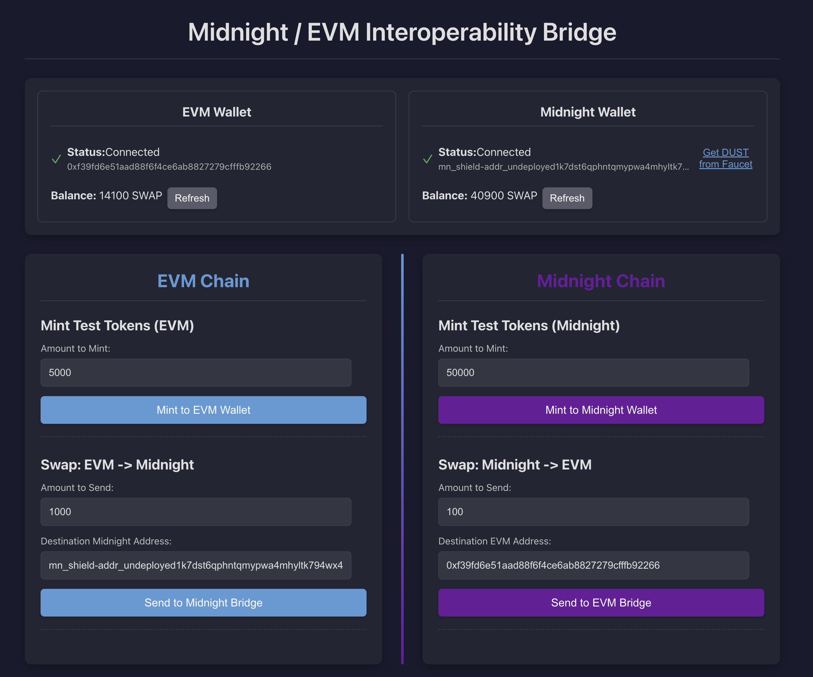
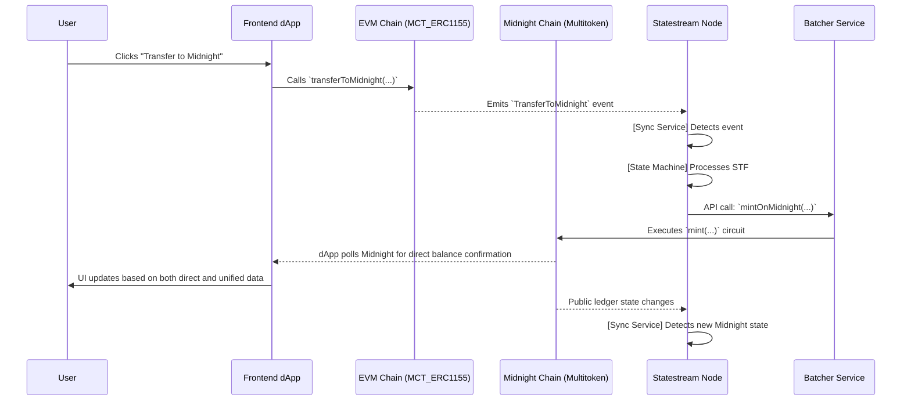
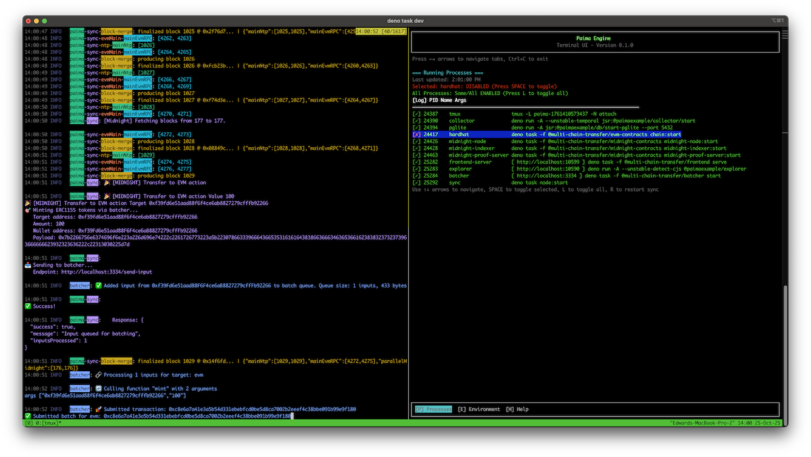
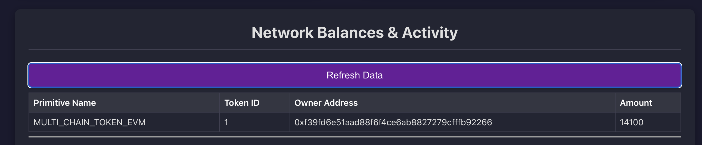

# Multi-Chain Token Swap

-   **Location**: `/templates/multi-chain-token-swap`
-   **Highlights**: A dApp that showcases interoperability between EVM and Midnight, allowing users to swap ERC1155 tokens between the two chains.

The `multi-chain-token-swap` template is a sophisticated example demonstrating how Statestream can create a seamless multi-chain experience. It builds a dApp where a user's token balance is unified across an EVM chain and a Midnight ZK chain. When a user initiates a cross-chain transfer by triggering an event on one chain, the Statestream detects this and uses a Batcher service to automatically mint a corresponding token on the other chain.


## Core Concept: A Unified Multi-Chain Balance

This template addresses a common challenge in Web3: asset fragmentation across different ecosystems. The goal is to create a system where users can interact with tokens on either EVM or Midnight, and the backend logic, powered by Statestream, ensures the total supply and ownership remain consistent across both.

*   **EVM Chain**: Manages an `ERC1155` token contract.
*   **Midnight Chain**: Manages a `MultiToken` ZK contract based on OpenZeppelin's EIP-1155 implementation.
*   **Statestream**: Monitors both chains. When a `transferTo<OtherChain>` event is detected, the State Machine instructs a Batcher to mint the token on the destination chain.
*   **Batcher**: An automated service that holds the authority to call the `mint` functions on both contracts, executing the commands issued by the State Machine.
*   **Frontend**: A unified interface for users to view their total balance and initiate cross-chain transfers. It reads balances from both the individual chains (for quick updates) and the Statestream API (for the canonical, unified state).

### Multi-Chain Token Swap in action
<iframe src="https://drive.google.com/file/d/1VLlwMyEECt1bpMjtlXG36L3ZqETuSJwv/preview" width="640" height="480" allow="autoplay"></iframe>

### Launching the template from scratch
<iframe src="https://drive.google.com/file/d/1aUbQ41sbCeg-rjGfEJK2LFEiAFeAwRLY/preview" width="640" height="480" allow="autoplay"></iframe>

### How to run this template

```sh
# Clone the repository
git clone git@github.com:PaimaStudios/paima-engine.git --branch v-next paima-engine-demo
cd paima-engine-demo/templates/multi-chain-token-transfer

## Please install missing dependencies.
## This will be automatically done in the future.
./../check.sh

# Install packages
deno install --allow-scripts && ./patch.sh

# Compile contracts
deno task build:evm
deno task build:midnight

# Launch Statestream Node
deno task dev

# You will need the Midnight Lace Wallet to interact with the dApp.
# Wait until the Statestream Node is Syncing Blocks
open http://localhost:10599
# For EVM wallet you can use this Private Key:
# 0x7c852118294e51e653712a81e05800f419141751be58f605c371e15141b007a6.
# It has funds for testing in the local EVM chain.
#
# For Midnight you need to use the Faucet in the dApp to get funds.
```

## Architecture Overview

The following diagram illustrates the complete flow of a cross-chain swap. It shows how the frontend can receive updates from two sources: a direct query to the destination chain for immediate feedback, and the Statestream's API for the aggregated, canonical state.



## The Components in Action



### 1. On-Chain Contracts

The on-chain logic is split between two specialized contracts, one for each ecosystem.

#### Solidity Contract (`MCT_ERC1155.sol`)

This is a standard OpenZeppelin `ERC1155` contract with an added function, `transferToMidnight`, which burns tokens on the EVM side and emits an event that the Statestream can detect to initiate the mint on Midnight.

```solidity
// In packages/shared/contracts/evm/src/contracts/ERC1155.sol
contract MCT_ERC1155 is ERC1155, Ownable {
    // ... constructor and mint function ...

    event TransferToMidnight(address indexed from, string midnight_address, uint256 amount, uint256 token_id, string tx_hash);

    function transferToMidnight(uint256 _amount, string calldata _target_account, string calldata tx_hash) external {
        address from = msg.sender;
        _burn(from, TOKEN_ID, _amount);
        emit TransferToMidnight(from, _target_account, _amount, TOKEN_ID, tx_hash);
    }
}
```

#### Compact (Midnight) Contract (`multichain_multitoken.compact`)

This ZK contract, based on OpenZeppelin's `MultiToken` library, manages the token on the Midnight network. The `transferToEvm` circuit burns tokens and publicly discloses the transfer details on the ledger for Statestream to process.

```rust
// In packages/shared/contracts/midnight/contract-eip-1155/src/multichain_multitoken.compact
export ledger actionName: Uint<128>;
export ledger actionTargetAddress: Opaque<'string'>;
export ledger actionValue: Uint<128>;

// ... other circuits ...

export circuit transferToEvm(
  target_address: Opaque<'string'>,
  amount: Uint<128>,
  txHash: Bytes<16>,
): [] {
  const caller = ownPublicKey();
  const callerEither = left<ZswapCoinPublicKey, ContractAddress>(caller);
  const callerTokenBalance = MultiToken_balanceOf(callerEither, 0);
  assert(!txHashes.member(disclose(txHash)), "Transaction already processed");
  assert(callerTokenBalance >= amount, "Insufficient balance");
  burnFrom(callerEither, amount);
  txHashes.insert(disclose(txHash));

  actionName = 1007; // Corresponds to TRANSFER_TO_EVM action
  actionTargetAddress = disclose(target_address);
  actionValue = disclose(amount);
}
```

### 2. Chain Configuration (`localhostConfig.ts`)

The first step in any Statestream project is defining the networks it will connect to. This is done in `localhostConfig.ts` using the `ConfigBuilder`. This template connects to a local Hardhat EVM node and a local Midnight node.

```ts
// In packages/shared/data-types/src/localhostConfig.ts
export const localhostConfig = new ConfigBuilder()
  // ...
  .buildNetworks((builder) =>
    builder
      .addNetwork({
        name: "ntp",
        type: ConfigNetworkType.NTP,
        // ... config for the main clock
      })
      .addViemNetwork({
        ...hardhat,
        name: "evmMain",
      })
      .addNetwork({
        name: "midnight",
        type: ConfigNetworkType.MIDNIGHT,
        // ... midnight specific configuration
      })
  )
  // ...
```

### 3. Monitor Contracts (`localhostConfig.ts`)

Once the networks are defined, you must configure **Primitives** to tell the Sync Service what specific contracts and events to monitor. This template defines three key primitives:

```ts
// In packages/shared/data-types/src/localhostConfig.ts
.buildPrimitives((builder) =>
    builder

      // Primitive for standard ERC1155 transfers on EVM
      // This keeps track of the standard ERC1155 transfers on the EVM chain
      .addPrimitive(
        (syncProtocols) => syncProtocols.mainEvmRPC,
        (network, deployments, syncProtocol) => ({
          name: "MULTI_CHAIN_TOKEN_EVM",
          type: PrimitiveTypeEVMERC1155,
          startBlockHeight: 0,
          contractAddress: contractAddressesEvmMain()
            .chain31337["Erc1155DevModule#MCT_ERC1155"],
          stateMachinePrefix: "evm-transfer-erc1155",
        })
      )

      // Custom primitive for the EVM -> Midnight transfer event
      .addPrimitive(
        (syncProtocols) => syncProtocols.mainEvmRPC,
        (network, deployments, syncProtocol) => ({
          name: "TRANSFER_TO_MIDNIGHT",
          type: "EVM:MCT_ERC1155", // This is a user-defined custom primitive type
          startBlockHeight: 0,
          contractAddress: contractAddressesEvmMain()
            .chain31337["Erc1155DevModule#MCT_ERC1155"],
          stateMachinePrefix: "transfer-to-midnight",
        })
      )

      // Generic primitive to watch the Midnight contract's public ledger
      .addPrimitive(
        (syncProtocols) => syncProtocols.parallelMidnight,
        (network, deployments, syncProtocol) => ({
          name: "MidnightContractState",
          type: PrimitiveTypeMidnightGeneric,
          startBlockHeight: 1,
          contractAddress: readMidnightContract().contractAddress,
          stateMachinePrefix: "midnightContractState",
          contract: { ledger: MultiChainMultiTokenContract.ledger },
          networkId: 0, // undeployed network id
        })
      )
  )
```

### 4. State Machine (`state-machine.ts`)

The State Machine contains the core off-chain logic that reacts to the on-chain events detected by the primitives. It orchestrates the cross-chain minting by calling the Batcher.

```ts
// In packages/client/node/src/state-machine.ts
import { mintInEvm, mintInMidnight } from "@multi-chain-transfer/batcher/calls";

// Triggered by the `TRANSFER_TO_MIDNIGHT` primitive
stm.addStateTransition("transfer-to-midnight", function* (data) {
  const { midnight_address, amount } = data.parsedInput;
  console.log("🎉 [TRANSFER-TO-MIDNIGHT] Transaction receipt:", data.parsedInput);
  yield* mintInMidnight(midnight_address, BigInt(amount));
});

// Triggered by the `MidnightContractState` primitive
stm.addStateTransition("midnightContractState", function* (data) {
  const decodedData = data.parsedInput.payload;
  const actionName = Number(decodedData.actionName);

  if (actionName === MidnightContractActionName.TRANSFER_TO_EVM) {
    console.log("🎉 [MIDNIGHT] Transfer to EVM action");
    const targetAddress = data.parsedInput.payload.actionTargetAddress;
    const value = decodedData.actionValue;
    yield* mintInEvm(targetAddress, BigInt(value));
  }
});
```

### 5. Database Configuration (`database.sql`)

This template uses a single custom table, `evm_midnight`, to store the aggregated token ownership data from both chains. This provides a unified data source for the API.

```sql
-- In packages/client/database/src/migrations/database.sql
CREATE TABLE evm_midnight (
  id SERIAL PRIMARY KEY,
  chain TEXT NOT NULL,
  token_id TEXT NOT NULL,
  amount numeric(78,0) NOT NULL,
  contract_address TEXT NOT NULL,
  owner TEXT NOT NULL,
  block_height INTEGER NOT NULL
);

CREATE UNIQUE INDEX evm_midnight_contract_address_index ON evm_midnight(contract_address, token_id, owner);
```

### 6. API Configuration (`api.ts`)



A custom API endpoint is created to serve the unified token data to the frontend. Note that the endpoint `/api/erc1155` actually serves ERC1155 data from the custom `evm_midnight` table.

```ts
// In packages/client/node/src/api.ts
export const apiRouter: StartConfigApiRouter = async function (
  server: fastify.FastifyInstance,
  dbConn: Pool,
): Promise<void> {
  server.get("/api/erc1155", async (request, reply) => {
    // ... checks if table exists ...
    const result = await runPreparedQuery(
      getEvmMidnight.run(undefined, dbConn),
      "/api/erc1155",
    );
    reply.send(result);
  });
  
  // A faucet endpoint for local development on Midnight
  server.get("/api/faucet", async (request) => {
    // ... logic to call a Deno task to fund a Midnight address ...
  });
};
```

### 7. Faucet

The faucet shows how we can add custom scripts & endpoints to the Statestream Node.

This faucet is added to allow transferring native funds to a Midnight Browser Wallet.
To this we added a Typescript script that does a transfer of 10 Dust to a given Midnight address.
```ts
// In packages/shared/contracts/midnight/faucet.ts
/* Transfer dust to lace wallet */
const transferRecipe = await wallet.transferTransaction([
    {
    amount: 10000000n, // 10 Dust
    type: nativeToken(), // "tDUST",
    receiverAddress,
    },
]);    
const provenTransaction = await wallet.proveTransaction(transferRecipe);
const submittedTransaction = await wallet.submitTransaction(provenTransaction);
console.log("✅ Successfully transferred dust to receiver address ");
```
This script is then called from the endpoint `/api/faucet`.


### 8. Grammar (`grammar.ts`)

The grammar defines the structure of the data that the State Machine will receive from the primitives, ensuring type-safety and proper parsing.

```ts
// In packages/shared/data-types/src/grammar.ts
export const grammar = {
  // Corresponds to the standard ERC1155 primitive
  "evm-transfer-erc1155": builtinGrammars.evmErc1155,
  
  // Corresponds to the custom EVM->Midnight primitive
  "transfer-to-midnight": mctErc1155Grammar,
  
  // Corresponds to the generic Midnight primitive
  "midnightContractState": builtinGrammars.midnightGeneric,
} as const satisfies GrammarDefinition;
```

### 9. DevOps and Startup (`start.ts`)

The Process Orchestrator is configured in `/packages/client/node/scripts/start.ts` to launch the entire multi-chain development environment with a single command (`deno task dev`). It uses helper functions like `launchEvm` and `launchMidnight` to manage the lifecycle of each blockchain, and also starts the Batcher and frontend services.

```ts
// In packages/client/node/scripts/start.ts
const config = Value.Parse(OrchestratorConfig, {
// ... other configs ...
processesToLaunch: [
    launchEvm("@multi-chain-transfer/evm-contracts"),
    midnightExtended("@multi-chain-transfer/midnight-contracts"),
],
});
```
The `midnightExtended` function is a custom wrapper that not only launches the Midnight stack but also builds and serves the frontend, and starts the Batcher service.

### 10. Engine Initialization (`main.ts`)

Finally, the `main.ts` file brings all the components together. It uses `withPaimaStaticConfig` to load the `localhostConfig` and then calls the `start` function from `@paimaexample/runtime`, passing it the grammar, state transitions, API router, and other configurations to launch a fully operational Statestream Node.

```ts
// In packages/client/node/src/main.ts
import { init, start } from "@paimaexample/runtime";
import { main, suspend } from "effection";
import { localhostConfig } from "@multi-chain-transfer/data-types/localhostConfig";
// ... other imports

main(function* () {
  yield* init();
  console.log("Starting Statestream Node");

  yield* withPaimaStaticConfig(localhostConfig, function* () {
    yield* start({
      appName: "multi-chain-token-transfer",
      appVersion: "0.3.21",
      syncInfo: toSyncProtocolWithNetwork(localhostConfig),
      gameStateTransitions,
      migrations: migrationTable,
      apiRouter,
      grammar,
      userDefinedPrimitives: {
        "EVM:MCT_ERC1155": MCTErc1155Primitive,
      },
    });
  });

  yield* suspend();
});
```

### 11. Batcher Configuration

In this template, the Batcher acts as a trusted, automated service responsible for minting tokens on the destination chain after a transfer is initiated. It listens for API calls from the Statestream's State Machine and executes the corresponding on-chain transactions.

#### Dual-Adapter Setup (`config.ts`)

The Batcher is configured to be multi-chain aware by using two distinct adapters: one for EVM and one for Midnight. This allows it to hold credentials and interact with both blockchain ecosystems.

-   **`ERC1155CustomAdapter`**: A custom-built adapter specifically for the EVM `MCT_ERC1155` contract.
-   **`MidnightAdapter`**: A standard adapter for interacting with the Midnight network.

```ts
// In packages/client/batcher/config.ts
export const config: PaimaBatcherConfig = {
  // ...
  adapters: { 
    midnight: midnightAdapter,
    evm: erc1155Adapter,
  },
  defaultTarget: "midnight",
  batchingCriteria: {
    midnight: { criteriaType: "size", maxBatchSize: 1 },
    evm: { criteriaType: "size", maxBatchSize: 1 },
  },
  // ...
};
```
The `batchingCriteria` is set to `size` with a `maxBatchSize` of 1. This means the Batcher will process requests immediately as they come in, rather than waiting to bundle them. This is ideal for this template's automated, server-to-server communication flow.

#### Custom EVM Adapter (`erc1155-adapter.ts`)

A custom adapter is required because the Batcher isn't submitting generic inputs to a `PaimaL2Contract`. Instead, it needs to call specific functions (`mint` or `transferToMidnight`) on the `MCT_ERC1155` contract. The custom adapter parses a JSON payload from the State Machine's request to determine which function to call and with what arguments.

```ts
// In packages/client/batcher/erc1155-adapter.ts
export class ERC1155CustomAdapter implements BlockchainAdapter {
  // ...

  async submitBatch(data: string, fee?: string | bigint) {
    // ... logic to parse the batch ...
    const firstInput = JSON.parse(batchArray.inputs[0]);
    const inputData = firstInput[3]; // The 'input' field contains the hex-encoded function call
    
    // Decode and parse the input to get the function call
    const functionCall = this.parseFunctionCall(inputData);
    
    // Route to appropriate contract function
    switch (functionCall.function) {
      case "mint": {
        const [to, amount] = functionCall.args;
        hash = await this.walletClient.writeContract({
          // ... call mint on the contract
        });
        break;
      }
      case "transferToMidnight": {
        // ... call transferToMidnight on the contract
        break;
      }
      default:
        throw new Error(`Unsupported function: ${functionCall.function}`);
    }
    // ...
  }
}
```

#### State Machine Integration (`calls.ts`)

The State Machine triggers the Batcher through coroutine functions defined in `calls.ts`. These functions construct the precise JSON payload that the custom EVM and Midnight adapters expect. This decouples the state machine's logic from the direct implementation details of the Batcher's transaction submission.

```ts
// In packages/client/batcher/calls.ts
// Helper: Create the input payload for the ERC1155 mint function
function createMintPayload(targetAddress: string, amount: bigint): string {
  const payload = {
    function: "mint",
    args: [targetAddress, amount.toString()]
  };
  
  const jsonString = JSON.stringify(payload);
  const hexEncoded = "0x" + stringToHex(jsonString); // The custom adapter expects a hex-encoded string
  
  return hexEncoded;
}

// Coroutine operation called by the State Machine
export function* mintInEvm(target: string, value: bigint) {
  // ... constructs the payload and creates a signed input ...
  
  const batcherInput = yield* World.promise(
    createSignedInput(input, batcherTarget, timestamp)
  );

  // Sends the final payload to the batcher's /send-input endpoint
  const response: Response = yield* World.promise(
    fetch(BATCHER_ENDPOINT, {
      method: "POST",
      // ...
      body: JSON.stringify({
        data: batcherInput,
        // We can wait for Batcher Confirmation, Chain Confirmation or Paima-Engine Confirmation.
        confirmationLevel: "no-wait",
      }),
    })
  );
  // ...
}
```

### 12. Custom Primitive: `MCTErc1155Primitive`

To detect the cross-chain transfer initiation on the EVM side, a custom primitive named `MCTErc1155Primitive` is defined.  
Its sole purpose is to listen for the specific `TransferToMidnight` event and transform its data into a structured input for the State Machine.

#### Event Listening (`erc1155-primitive.ts`)

The primitive is configured to listen exclusively for the `TransferToMidnight` event signature on the deployed `MCT_ERC1155` contract.

```ts
// In packages/shared/custom-primitive-mct-erc1155/erc1155-primitive.ts
export class MCTErc1155Primitive extends PaimaPrimitive<
  ConfigSyncProtocolType.EVM_RPC_PARALLEL,
  typeof mctErc1155Grammar
> {
  readonly internalTypeName = "EVM:MCT_ERC1155";
  readonly abi = getEvmEvent(mct_erc1155.abi, "TransferToMidnight(address,string,uint256,uint256,string)");
  override grammar = mctErc1155Grammar;
  // ...
}
```

#### Grammar (`erc1155-grammar.ts`)

The grammar defines the structure and types of the data that will be extracted from the event and passed to the State Machine.

```ts
// In packages/shared/custom-primitive-mct-erc1155/erc1155-grammar.ts
export const mctErc1155Grammar = [
    ["from", Type.String()],
    ["midnight_address", Type.String()],
    ["amount", Type.String()],
    ["token_id", Type.String()],
    ["tx_hash", Type.String()],
] as const;
```

#### Payload Processing (`getPayload`)

The `getPayload` method is the core logic of the primitive. It receives the raw event data from the Sync Service, decodes it, and formats it into the `accountingPayload` and the `stateMachinePayload` that will be processed by the engine.

```ts
// In packages/shared/custom-primitive-mct-erc1155/erc1155-primitive.ts
override *getPayload(
  // ...
): StateUpdateStream<{ /* ... */ }> {
  const { from, midnight_address, amount, token_id, tx_hash } = primitiveTransactionData.output.payload;

  const accountingPayload: ParamToData<typeof mctErc1155Grammar> = {
    midnight_address: midnight_address,
    from: fromAddr,
    amount: amountParsed,
    token_id: tokenIdParsed,
    tx_hash: tx_hash,
  };

  const stateMachinePayload = this.stateMachinePrefix
    ? generateRawStmInput(
        this.grammar,
        this.stateMachinePrefix,
        accountingPayload,
      )
    : null;

  return {
    isBatched: false,
    data: [{
      // ...
      accountingPayload,
      stateMachinePayload,
    }],
  };
}
```

#### Registration (`localhostConfig.ts`)

Finally, the custom primitive is registered in the main configuration file, where it is given the instance name `TRANSFER_TO_MIDNIGHT` and linked to the `transfer-to-midnight` STF prefix. This completes the data pipeline from on-chain event to state machine execution.

```ts
// In packages/shared/data-types/src/localhostConfig.ts
.addPrimitive(
  (syncProtocols) => syncProtocols.mainEvmRPC,
  (network, deployments, syncProtocol) => ({
    name: "TRANSFER_TO_MIDNIGHT",
    type: "EVM:MCT_ERC1155",
    // ...
    stateMachinePrefix: "transfer-to-midnight",
  })
)
```

### Project Folder Structure

The `multi-chain-token-swap` template is organized as a Deno workspace monorepo. This structure helps separate concerns, with distinct packages for the frontend, the Statestream node, and shared code. Understanding this layout is key to navigating and modifying the template.

```
/
|-- deno.json                 # Deno workspace configuration and top-level tasks
|-- README.md                 # Main project instructions
|-- packages/
|   |-- client/               # Contains the Statestream Node implementation
|   |   |-- database/         # Defines the SQL schema and typed queries
|   |   |   `-- src/
|   |   |       |-- migrations/database.sql # Custom table schema for token balances
|   |   |       `-- sql/sm_example.sql      # SQL queries that become typed functions
|   |   |
|   |   |-- batcher/          # Configuration and custom logic for the Batcher service
|   |   |   |-- config.ts     # Defines Batcher adapters (EVM, Midnight) and criteria
|   |   |   |-- erc1155-adapter.ts # The custom adapter for the EVM contract
|   |   |   `-- calls.ts      # Coroutines called by the State Machine to trigger the Batcher
|   |   |
|   |   `-- node/             # Core of the Statestream Node
|   |       `-- src/
|   |           |-- main.ts          # Main entry point that starts the Statestream
|   |           |-- state-machine.ts # The core application logic (State Transition Functions)
|   |           `-- api.ts           # Defines custom API endpoints (e.g., /api/erc721)
|   |
|   |-- frontend/             # The user-facing web application (React + Vite)
|   |   |-- client/
|   |   |   `-- src/
|   |   |       |-- App.tsx     # Main React component and UI layout
|   |   |       |-- paima.ts    # Logic for connecting wallets (EVM, Midnight)
|   |   |       `-- eip-1155-interact.ts # Logic for interacting with the Midnight contract
|   |   `-- server/             # Simple Oak server to serve the built frontend
|   |
|   `-- shared/               # Code shared between the frontend and the backend node
|       |-- contracts/        # Smart contract source code for both chains
|       |   |-- evm/          # Solidity contracts for the EVM chain (MCT_ERC1155.sol)
|       |   `-- midnight/     # Compact contracts for the Midnight chain
|       |
|       |-- custom-primitive-mct-erc1155/ # Implementation of the custom EVM primitive
|       |   |-- erc1155-primitive.ts # The class defining the primitive's logic
|       |   `-- erc1155-grammar.ts   # The grammar for the `TransferToMidnight` event
|       |
|       `-- data-types/       # Shared configurations and data structures
|           `-- src/
|               |-- localhostConfig.ts # **Crucial file**: Defines networks, primitives, etc.
|               `-- grammar.ts         # Defines the "language" for State Machine inputs
```