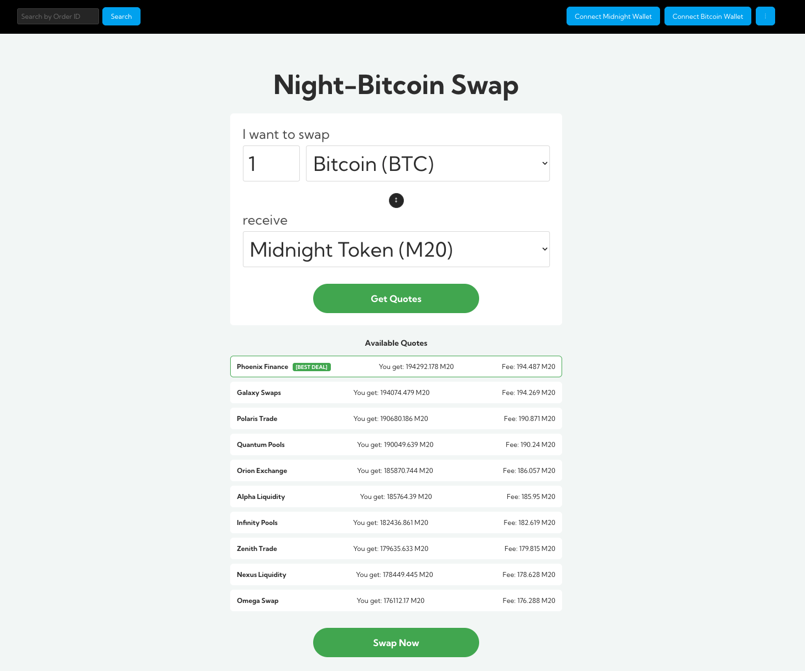
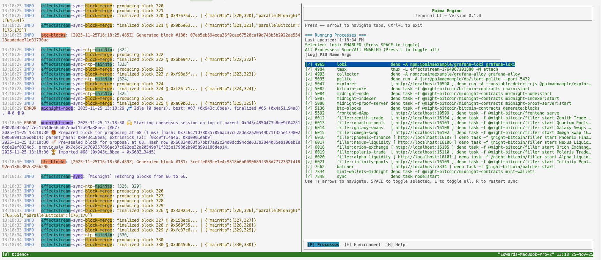
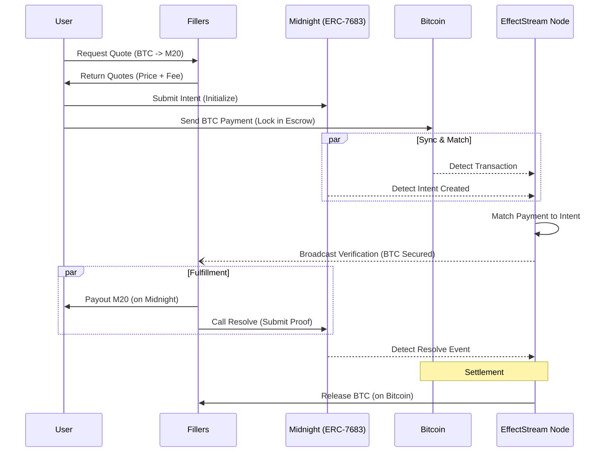

# Night-Bitcoin (Intents Swap)

-   **Location**: `/templates/night-bitcoin-v2`
-   **Highlights**: Bitcoin & Midnight Interoperability, ERC-7683 Cross-Chain Intents, Solver/Filler Architecture.

The `night-bitcoin` template demonstrates a cutting-edge pattern in Web3: **Intent-Based Cross-Chain Swaps**. It utilizes EffectStream to orchestrate trades between a UTXO-based chain (Bitcoin) and a ZK-privacy chain (Midnight) without a traditional bridge, relying instead on a network of "Fillers" (Solvers) and an intent standard.



### dApp Video:

<iframe src="https://drive.google.com/file/d/19rIhqAVBCfjxZrk25xnKU08ffVaCc7RZ/preview" width="640" height="480" allow="autoplay"></iframe>

## Quick Start

**Prerequisites**:
*   A Midnight Wallet supporting undeployed networks (e.g., Lace Midnight Preview).
*   A Bitcoin Wallet supporting Regtest (e.g., Sparrow Wallet).

```sh
# Clone the repository
git clone https://github.com/effectstream/effectstream.git
cd effectstream/templates/night-bitcoin

# Install packages
bun i

# Launch EffectStream Node (compiles contracts and starts the full local stack)
bun run dev
```

**Terminal:**



Once the `sync`process starts, open [http://localhost:10599](http://localhost:10599)

## Concepts

### Core Concept: Intent flow overview

Instead of executing a direct transaction to swap tokens, users sign an **Intent**-a message declaring *what* they want (e.g., "I offer 1 BTC to receive at least 1000 M20 on Midnight").

> Note Fillers and Solvers are the same in this example.

1.  **Request Quote**: The user requests quotes from off-chain Fillers.
2.  **Create Intent**: The user selects the best quote and creates an Intent on the Midnight chain (using the ERC-7683 standard contract).
3.  **Payment**: The user sends the source funds (BTC) to the verifier nodes/escrow.
4.  **Verification**: The verifier nodes monitor the blockchains. When it detects the Intent on Midnight *and* the Payment on Bitcoin, it matches them.
5.  **Filler Execution**: The Fillers read the Intent and provides the liquidity, sending the funds to the user.
6.  **Resolution**: The Verifier Nodes validates the trade and triggers the release of funds to the user and the Fillers.

### Core Concepts: EffectStream Mapping

* The Verifier Nodes -> is implemented an EffectStream State Machine.
* The Fillers -> is implemented as a EffectStream Batcher.
* ERC-7683 Contract -> Midnight Contract


Once the process starts, open [http://localhost:10599](http://localhost:10599).

### Background Concepts: The ERC-7683 Standard

This template leverages **ERC-7683**, a standard interface for cross-chain trade execution systems.

**The Problem**
Intent-based systems abstract away the complexity of bridges for users, but they often suffer from fragmented liquidity and isolated networks of "fillers" (solvers). Each protocol usually builds its own proprietary `order` format, making it difficult for fillers to support multiple chains and dApps efficiently.

**The Solution**
ERC-7683 establishes a framework for specifying cross-chain actions. By standardizing the `order` structure and the settlement interfaces, it allows diverse systems to share infrastructure.

**In Night-Bitcoin**
We utilize this standard to define the "Swap Intent" on the Midnight chain. Even though one side of the transaction occurs on Bitcoin (which is non-EVM), the **Midnight contract** acts as the `OriginSettler` defined in the spec. In this example, we take a simplified approach to the settlement interfaces and resolutions.

## Architecture Overview



## The Components in Action

### 1. On-Chain Logic

#### Midnight (Compact)
The template uses two main contracts located in `packages/shared/contracts/midnight-contracts`:
*   **`erc7683.compact`**: Implements the standard for Cross-Chain Intents. It stores the `Intent` struct containing details like `maxSpent`, `minReceived`, and other standard fields.
*   **`unshielded-erc20.compact`**: Openzepplin Standard ERC20 Unshielded "M20" token used for swapping against Bitcoin.

#### Bitcoin
There are no smart contracts on Bitcoin. Instead, the engine tracks specific addresses and transaction inputs/outputs using the Bitcoin RPC.

### 2. Chain Configuration (`localhostConfig.ts`)

The `localhostConfig` connects the engine to a local Bitcoin Regtest node and a local Midnight node.

#### Midnight Configuration

This block configures the connection to the local Midnight node, the Indexer sync protocol, and the primitives that monitor the public state of the ZK contracts.

```ts
// 1. Network Definition
.addNetwork({
  name: "midnight",
  type: ConfigNetworkType.MIDNIGHT,
  genesisHash: "0x0000...0001",
  networkId: 0, // 0 = Undeployed/Local
  nodeUrl: "http://127.0.0.1:9944",
})

// 2. Sync Protocol (via Indexer)
.addParallel(
  (networks) => networks.midnight,
  (network, deployments) => ({
    name: "parallelMidnight",
    type: ConfigSyncProtocolType.MIDNIGHT_PARALLEL,
    pollingInterval: 1000,
    indexer: "http://127.0.0.1:8088/api/v1/graphql",
    indexerWs: "ws://127.0.0.1:8088/api/v1/graphql/ws",
  })
)

// 3. Primitives (Contract State Listeners)
.addPrimitive(
  (syncProtocols) => syncProtocols.parallelMidnight,
  (network, deployments, syncProtocol) => ({
    name: "MidnightContractState-ERC7683",
    type: PrimitiveTypeMidnightGeneric,
    contractAddress: readMidnightContract("erc7683", "contract-erc7683.json").contractAddress,
    stateMachinePrefix: "midnightContractStateERC7683",
    contract: { ledger: Erc7683Contract.ledger },
  })
)
.addPrimitive(
  (syncProtocols) => syncProtocols.parallelMidnight,
  (network, deployments, syncProtocol) => ({
    name: "MidnightContractState-ERC20",
    type: PrimitiveTypeMidnightGeneric,
    contractAddress: readMidnightContract("unshielded-erc20", "contract-unshielded-erc20.json").contractAddress,
    stateMachinePrefix: "midnightContractStateERC20",
    contract: { ledger: UnshieldedErc20Contract.ledger },
  })
)
```

#### Bitcoin Configuration

This block configures the connection to the local Bitcoin Core node (Regtest), the RPC sync protocol, and the primitive that watches specific UTXOs.

```ts
// 1. Network Definition
.addNetwork({
  name: "bitcoin",
  type: ConfigNetworkType.BITCOIN,
  rpcUrl: "http://127.0.0.1:18443",
  rpcAuth: {
    username: "dev",
    password: "devpassword",
  },
  network: "regtest",
})

// 2. Sync Protocol (via RPC)
.addParallel(
  (networks) => networks.bitcoin,
  (network, deployments) => ({
    name: "parallelBitcoin",
    type: ConfigSyncProtocolType.BITCOIN_RPC_PARALLEL,
    rpcUrl: "http://127.0.0.1:18443",
    pollingInterval: 10_000,
    confirmationDepth: 0, // 0 for faster dev on regtest
  })
)

// 3. Primitive (Address Watcher)
.addPrimitive(
  (syncProtocols) => syncProtocols.parallelBitcoin,
  (network, deployments, syncProtocol) => ({
    name: "BitcoinAddress",
    type: PrimitiveTypeBitcoinAddress,
    startBlockHeight: 101,
    // The Escrow/System wallet address to watch for payments
    watchAddress: "bcrt1qfv6m6l5s6cgda09yr5nd8rnufkaz59d3aquq03",
    stateMachinePrefix: "bitcoin-transaction",
  })
)
```

### 3. The State Machine (`state-machine.ts`)

The logic is driven by three main `State Transition Functions`:
This implements a simplified the Verifier/Settlement layer.

#### `bitcoin-transaction`
Triggered when funds move on the watched `Bitcoin address`.
*   Records the transfer in the `transfers` database table.
*   Calls `checkAndTransferFunds` to see if this payment matches a known Intent from Midnight.

#### `midnightContractStateERC7683`
Triggered when the Midnight `Intent` contract state changes.
*   Decodes the `Intent` struct from the public ledger.
*   Records the intent in the `intents` database table.
*   Calls `checkAndTransferFunds` to see if the payment for this intent has already arrived.

#### `checkAndTransferFunds` (Internal Helper)
This is the core settlement logic, it is called if a new `Intent` is created or a new `BTC Payment` or `Midnight M20 Payment`.

1.  It queries the database to find a `transfers` record and an `intents` record that match (based on amounts and tokens).
2.  If matched, it updates the status to `Resolved`.
3.  Notifies the Fillers that the `Intent` has been matched and the `BTC Payment` has been secured.
4.  It triggers the settlement payouts (sending M20 to the User and BTC to the Filler).

> NOTE: In complete implementation step (3) would require the Filler to again check if the `Intent` is valid, and then provide liquidity and mark and `resolve` the intent, and then the `Verifier Nodes` would work as the `Settler` to release the funds to the filler.

### 4. Fillers (`packages/filler`)

The template includes a standalone service that simulates a market of Liquidity Providers. Unlike simple market makers, these Fillers are **active agents** that integrate an embedded **Batcher** to automate the settlement process.

*   **Location**: `packages/filler`.
*   **Orchestration**: The orchestrator launches multiple instances (Alpha Liquidity, Omega Swap, etc.) on different ports to simulate a competitive market.
*   **Embedded Batcher**: Each Filler initializes its own Batcher instance connected to both Bitcoin and Midnight adapters. This allows the Filler to programmatically sign and submit transactions to either chain without manual intervention.
*   **API Endpoints**:
    *   `POST /api/quote`: Used by the Frontend to request competitive exchange rates and fees before creating an Intent.
    *   `POST /api/notify-filler-intent-payment`: Used by the EffectStream Node (State Machine) to notify the Filler that a user's payment has been verified. Upon receiving this webhook, the Filler automatically queues a transaction via its internal Batcher to pay the user the requested tokens (M20 or BTC).

#### Embedded Batcher Setup
Each filler initializes its own EffectStream Batcher instance. This allows the filler to programmatically execute transactions on both Bitcoin and Midnight using its own unique wallet seeds.

```typescript
// packages/filler/index.ts

// 1. Build the Batcher setup with the filler's specific credentials
const batcherSetup = buildBatcherSetup({
  fillerName: FILLER_NAME,
  midnightSeed: FILLER_BATCHER_DEFAULTS.midnightSeed, // Unique seed per filler
  bitcoin: { ...FILLER_BATCHER_DEFAULTS.bitcoin },
  // ...
});

// 2. Initialize the Batcher with dual adapters
const batcher = createNewBatcher(batcherSetup.config, batcherSetup.storage);

batcher
  .addBlockchainAdapter("midnight", batcherSetup.adapters.midnight, { 
    criteriaType: "size", maxBatchSize: 1 // Execute immediately
  })
  .addBlockchainAdapter("bitcoin", batcherSetup.adapters.bitcoin, {
    criteriaType: "hybrid", timeWindowMs: 1000
  })
  .setDefaultTarget("midnight");
```

#### Quote Generation Endpoint
The filler provides a standard API for the frontend to fetch competitive rates.

```typescript
// packages/filler/index.ts

server.post("/api/quote", async (request, reply) => {
  const { orderId, fromToken, toToken, fromAmount } = request.body;

  // Calculate custom rate and fee
  const conversionRate = getConversion(fromAmount, fromToken, toToken);
  const fee = (basisPoints * conversionRate) / 10000;

  // Return the signed quote structure
  reply.send({
    orderId,
    filler: FILLER_NAME,
    toAmount: conversionRate - fee,
    fee,
    // ...
  });
});
```

#### Automated Settlement Execution
When the EffectStream Node verifies the user's payment, it notifies the filler that provided the quote. The filler then uses its embedded batcher to automatically send the counter-assets to the user.

```typescript
// packages/filler/index.ts

server.post("/api/notify-filler-intent-payment", async (request, reply) => {
  const { orderId, toAddress, amount, token } = request.body;
  
  // Programmatically trigger the Batcher to send funds
  if (token === "btc") {
    await batcher.batchInput({
      address: "filler-btc-wallet", 
      input: JSON.stringify({
         type: "transfer",
         toAddress: toAddress,
         amount: Math.floor(amount)
      }),
      target: "bitcoin" // Route to Bitcoin Adapter
    });
  } 
  else if (token === "m20") {
     await batcher.batchInput({
        address: "filler-midnight-wallet",
        addressType: AddressType.MIDNIGHT,
        input: JSON.stringify({
           type: "transfer",
           toAddress: toAddress,
           amount: Math.floor(amount)
        }),
        target: "midnight" // Route to Midnight Adapter
     });
  }
  
  reply.send({ status: "processing", orderId });
});
```

### 5. Database Schema

The database acts as the central clearinghouse state for the application. It persists the competitive quotes from fillers, tracks raw asset movements across Bitcoin and Midnight, and maintains the authoritative state of the ERC-7683 Intents.

*   **`intents`**: Stores ERC-7683 Intent data (Order ID, deadlines, assets involved).
*   **`transfers`**: Stores raw on-chain transfers detected (Chain ID, Amount, Token).
*   **`quotes`**: Stores the quotes provided by fillers for audit trails.

#### 1. `intents` Table

**Purpose**: Stores the authoritative state of every ERC-7683 Intent created on the Midnight chain. This table mirrors the `ResolvedCrossChainOrder` struct defined in the standard.


| Field | Type | Usage & Description |
| :--- | :--- | :--- |
| `order_id` | `TEXT` | **Unique Key**. The global identifier for the swap order, derived from the user's signature/intent hash. |
| `status` | `TEXT` | Tracks the lifecycle: `'0'` (Open/Initialized), `'3'` (Resolved/Closed). Updated by the State Machine upon settlement. |
| `user_address` | `TEXT` | The Midnight address of the user initiating the swap. |
| `max_spent_token` | `TEXT` | The asset the user is selling (e.g., "btc"). |
| `max_spent_amount` | `TEXT` | The amount the user must deposit to the escrow address (e.g., Satoshis). |
| `min_received_token` | `TEXT` | The asset the user expects to receive (e.g., "m20"). |
| `min_received_amount` | `TEXT` | The guaranteed amount the user will receive on the destination chain. |
| `origin_data` | `TEXT` | Additional data defined by the Origin chain (Midnight), often containing target wallet info for the Fillers. |
| `created_at` | `TIMESTAMP` | Timestamp of when the intent was created. |
| `origin_chain_id` | `TEXT` | The chain ID of the origin chain (e.g., "1" for Bitcoin, "9999" for Midnight). |
| `open_deadline` | `TEXT` | The deadline for the user to open the intent. |
| `fill_deadline` | `TEXT` | The deadline for the filler to fill the intent. |
| `max_spent_recipient` | `TEXT` | The recipient address of the user. |
| `max_spent_chain_id` | `TEXT` | The chain ID of the origin chain (e.g., "1" for Bitcoin, "9999" for Midnight). |
| `min_received_recipient` | `TEXT` | The recipient address of the user. |
| `min_received_chain_id` | `TEXT` | The chain ID of the destination chain (e.g., "9999" for Midnight). |
| `destination_chain_id` | `TEXT` | The chain ID of the destination chain (e.g., "9999" for Midnight). |
| `destination_settler` | `TEXT` | The address of the destination settler. |
| `resolved_by` | `TEXT` | Populated during settlement. Stores the ID of the Filler who successfully claimed and executed this order. |

---

#### 2. `transfers` Table

**Purpose**: A unified ledger of **raw asset movements** detected on *both* Bitcoin and Midnight. The State Machine scans this table to find payments that match open intents.

| Field | Type | Usage & Description |
| :--- | :--- | :--- |
| `id` | `SERIAL` | The unique identifier for the transfer. |
| `chain_id` | `TEXT` | Distinguishes the network source: `'1'` for Bitcoin, `'9999'` for Midnight. |
| `token` | `TEXT` | The asset symbol (e.g., "btc", "m20"). |
| `amount` | `NUMERIC` | The raw value transferred. |
| `created_at` | `TIMESTAMP` | Timestamp of when the transfer was created. |
| `to_address` | `TEXT` | The recipient address. For valid swaps, this must match the System/Escrow address monitored by EffectStream. |
| `from_address` | `TEXT` | The sender's address. |
| `used` | `BOOLEAN` | **Critical Field**. Acts as a semaphore. When the State Machine matches a transfer to an intent, it sets this to `TRUE` to prevent the same deposit from satisfying multiple orders. |

---

#### 3. `quotes` Table

**Purpose**: An audit trail of the off-chain negotiation phase. It records the offers provided by Fillers *before* the Intent was created on-chain.

| Field | Type | Usage & Description |
| :--- | :--- | :--- |
| `id` | `SERIAL` | The unique identifier for the quote. |
| `order_id` | `TEXT` | Links this quote to the finalized Intent in the `intents` table. |
| `filler` | `TEXT` | The name or ID of the Filler providing the quote (e.g., "Alpha Liquidity"). |
| `from_token` | `TEXT` | The asset the user is selling (e.g., "btc"). |
| `from_amount` | `NUMERIC` | The amount the user must deposit to the escrow address |
| `to_token` | `TEXT` | The asset the user expects to receive (e.g., "m20"). |
| `to_amount` | `NUMERIC` | The amount the Filler offered to pay the user (Price). |
| `fee` | `NUMERIC` | The service fee charged by the filler. |
| `created_at` | `TIMESTAMP` | Timestamp of when the quote was generated via the API. |

---

#### Settlement Logic Flow

The State Machine uses these tables to perform atomic settlement:

1.  **Ingestion**:
    *   `intents` is populated by the `midnightContractStateERC7683` primitive when a user submits an intent.
    *   `transfers` is populated by the `BitcoinAddress` primitive when BTC arrives.
2.  **Matching (State Machine)**:
    *   It queries for an **`intent`** where `status = '0'`.
    *   It queries for a **`transfer`** where `amount >= intent.max_spent_amount` AND `token == intent.max_spent_token` AND `used = FALSE`.
3.  **Resolution**:
    *   If a match is found, it locks the transfer (`UPDATE transfers SET used = TRUE`).
    *   It marks the intent as resolved (`UPDATE intents SET status = '3'`).
    *   It looks up the winning `quote` using the `order_id` to determine which Filler to pay.

### 6. API (`api.ts`)

The API layer aggregates data for the Frontend:
*   `POST /api/get-quotes`: Proxies requests to the active Filler services to get the best price for the user.
*   `GET /api/intents`: Returns the status of a specific Order ID.
*   `GET /api/faucet/btc` & `/api/faucet/dust`: Development endpoints to fund test wallets.

## Frontend Integration

The frontend (`packages/frontend/dApp`) is a React application that:
1.  Connects to a **Midnight Wallet** (Lace) to sign Intents.
2.  Connects to a **Bitcoin Wallet** (via manual address entry for this demo) to send payments.
3.  Interacts with the **Fillers** to fetch quotes.
4.  Monitors the **EffectStream API** to track the status of the swap.

```tsx
// Example: Creating an intent on Midnight
const intentConfig = {
  user: midnightWallet.addr,
  orderId: selectedQuote.orderId,
  maxSpent_token: "btc",
  minReceived_token: "m20",
  // ...
};
const intentResult = await interface.createIntent(
    midnightWallet.contract.erc7683, 
    midnightWallet.addr, 
    intentConfig
);
```