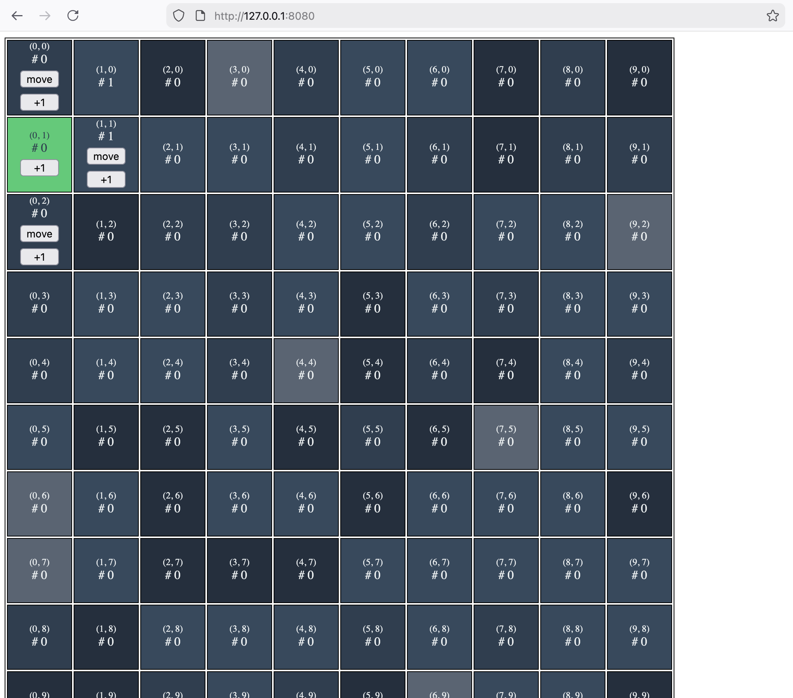
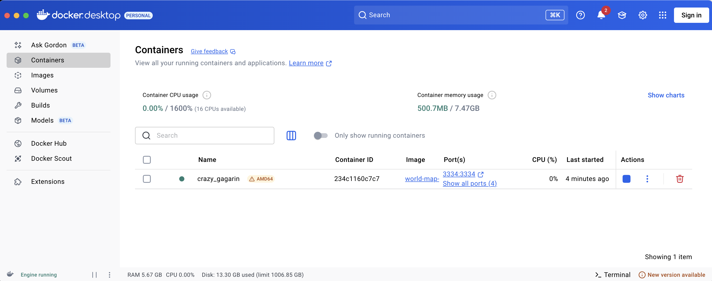

# World Map 2D (Open World Game)

* **Path**: `/templates/world-map-2d`
* **Highlights**: A 2D open-world exploration game showcasing spatial game state, movement mechanics, and world interaction using Effectstream's L2.

The `world-map-2d` template demonstrates how to build an open-world game where players can explore a 2D grid-based world. It's an excellent example for games requiring spatial state management, player movement, and location-based interactions, all processed deterministically through an Effectstream L2 contract on an EVM chain.

Screenshot of running application:



## Core Concept: Grid-Based Open World

The goal of this template is to demonstrate an open-world game where players move freely across a 10×10 grid and interact with specific locations. The game state tracks both individual player positions and aggregate world statistics.

*   **Player State**: Each player has an (x, y) position on the grid that updates as they move.
*   **World State**: A 10×10 grid where each cell tracks how many times it has been visited.
*   **Player Actions**: All actions (joining the world, moving, incrementing counters) are submitted to a `Effectstream L2 Contract` on an EVM chain.
*   **Backend Logic**: The state machine processes these inputs to update positions, validate movements, and maintain world statistics.

This template serves as a foundation for:
*   Tile-based exploration games
*   Location-based multiplayer experiences
*   Spatial puzzle games
*   Territory control mechanics

## Quick Start

```sh
# Install dependencies
deno install --allow-scripts && ./patch.sh

# Build EVM contracts
deno task build:evm

# Start the Effectstream Node
deno task dev
```

### Frontend Setup

In a separate terminal:

```sh
cd packages/frontend
npm install
node esbuild.js      # Build the frontend bundle
npx http-server .    # Serve on http://127.0.0.1:8080
```

Or use the Deno task:
```sh
deno task -f @world-map-2d/frontend dev
```

Then open http://127.0.0.1:8080 in your browser.

### Using Test Accounts

For development, import Hardhat's test account into MetaMask:

1. Open MetaMask → Click account icon → **Import Account**
2. Select **Private Key** and paste:
   ```
   0xac0974bec39a17e36ba4a6b4d238ff944bacb478cbed5efcae784d7bf4f2ff80
   ```
3. This gives you access to Account #0 with **10,000 ETH** on your local network
4. Make sure MetaMask is connected to **Localhost 8545** (Chain ID: 31337)

⚠️ **Never use this private key on a real network** - it's publicly known and only for local development.

## Docker Setup

You can run the entire stack (EVM node, Effectstream backend, and frontend) in a single Docker container:

### Building the Docker Image

```sh
# For macOS
DOCKER_DEFAULT_PLATFORM=linux/amd64 docker build -t world-map-2d-sample -f Dockerfile .

# For Linux
docker build -t world-map-2d-sample -f Dockerfile .
```

This will:
- Install all dependencies (Deno, Node.js, Foundry)
- Build the EVM contracts
- Build the frontend bundle
- Set up the launch script

### Running the Container

```sh
# For macOS
DOCKER_DEFAULT_PLATFORM=linux/amd64 docker run -p 8080:8080 -p 8545:8545 -p 9999:9999 -p 3334:3334 world-map-2d-sample

# For Linux
docker run -p 8080:8080 -p 8545:8545 -p 9999:9999 -p 3334:3334 world-map-2d-sample
```

The container exposes:
- **Port 8080**: Frontend (http://localhost:8080)
- **Port 8545**: Local EVM node (Hardhat)
- **Port 9999**: Effectstream backend API
- **Port 3334**: Explorer

Once the container is running, you'll see the Effectstream node start up and the frontend will be available at http://localhost:8080.



### Debugging Docker Issues

To inspect the running container:
```sh
# View logs
docker logs <container-id>

# Open a shell inside the container
docker exec -it <container-id> /bin/bash

# Verify files exist
docker run --rm world-map-2d-sample ls -la /app/.docker-scripts/
docker run --rm world-map-2d-sample ls -la /app/packages/frontend/
```

## The Components in Action

When you run `deno task dev` for this template, the [Process Orchestrator](../100-components/106-processes.md) sets up a complete local environment:
*   **Hardhat EVM Node**: A local EVM blockchain running on port 8545.
*   **Development Services**: The development database, log collector, TUI, and the Explorer.
*   **Effectstream Node**: Backend service on port 9999 to sync the chain and process game logic.
*   **Frontend**: A simple HTML/JavaScript interface on port 8080 for player interaction.

## On-Chain Logic

The world-map-2d template uses a `Effectstream L2 Contract` deployed on the local EVM chain. This contract acts as an input mailbox - players submit formatted strings representing their actions, and Effectstream processes these inputs to update game state.

The contract is deployed at `0x5FbDB2315678afecb367f032d93F642f64180aa3` (local Hardhat deployment).

```solidity
// Simplified example of what the PaimaL2Contract does
contract PaimaL2 {
    event PaimaGameInteraction(address indexed user, bytes input, uint256 indexed nonce);

    function submitInput(bytes calldata input) external payable {
        // Validates and stores the input
        emit PaimaGameInteraction(msg.sender, input, nonce);
    }
}
```

Effectstream monitors the `PaimaGameInteraction` event to receive player inputs.

## The State Machine (`state-machine.ts`)

The State Machine contains the core game logic. It uses **generator functions** with `yield*` for structured effects, following the new Effectstream architecture pattern.

### Grammar Definition

The input grammar is defined using TypeBox schemas in `packages/shared/data-types/src/grammar.ts`:

```typescript
export const grammar = {
  joinWorld: [],
  submitMove: [
    ["x", Type.Number({ minimum: 0, maximum: 9 })],
    ["y", Type.Number({ minimum: 0, maximum: 9 })],
  ],
  submitIncrement: [
    ["x", Type.Number({ minimum: 0, maximum: 9 })],
    ["y", Type.Number({ minimum: 0, maximum: 9 })],
  ],
} as const satisfies GrammarDefinition;
```

### State Transitions

#### `joinWorld`
Triggered when a player joins the world for the first time. Creates a user record and places them at the origin (0, 0).

```typescript
stm.addStateTransition("joinWorld", function* (data) {
  const { blockHeight, parsedInput, randomGenerator, signerAddress: user } = data;

  const result = yield* World.promise<SQLUpdate>(
    joinWorld(user!, blockHeight, { input: "joinWorld", ...parsedInput }, randomGenerator)
  );

  yield* printSQLQuery(result);
  yield* World.resolve(result[0], result[1]);
});
```

The `joinWorld` transition function in `packages/client/node/src/state-machine/v1/transition.ts`:
```typescript
export const joinWorld = async (
  player: WalletAddress,
  blockHeight: number,
  input: JoinWorldInput,
  randomnessGenerator: Prando
): Promise<SQLUpdate> => {
  return persistNewUser(player);
};

function persistNewUser(wallet: WalletAddress): SQLUpdate {
  const params = { wallet, x: 0, y: 0 };
  return [createGlobalUserState, params];
}
```

#### `submitMove`
Allows players to move to any valid position on the 10×10 grid.

```typescript
stm.addStateTransition("submitMove", function* (data) {
  const { blockHeight, parsedInput, randomGenerator, signerAddress: user } = data;

  const result = yield* World.promise<SQLUpdate>(
    submitMove(user!, blockHeight, { input: "submitMove", ...parsedInput }, randomGenerator)
  );

  yield* printSQLQuery(result);
  yield* World.resolve(result[0], result[1]);
});
```

The move transition function:
```typescript
export const submitMove = async (
  player: WalletAddress,
  blockHeight: number,
  input: SubmitMoveInput,
  randomnessGenerator: Prando
): Promise<SQLUpdate> => {
  return persistUserPosition(player, input.x, input.y);
};

function persistUserPosition(
  wallet: WalletAddress,
  x: number,
  y: number
): SQLUpdate {
  const params = { x, y, wallet };
  return [updateUserGlobalPosition, params];
}
```

Note: In this implementation, validation happens at the grammar level (TypeBox ensures `0 ≤ x ≤ 9` and `0 ≤ y ≤ 9` for the 10×10 grid). Additional validation could be added here if needed.

#### `submitIncrement`
Increments a counter at a specific world location, tracking how many times each cell has been visited.

```typescript
stm.addStateTransition("submitIncrement", function* (data) {
  const { blockHeight, parsedInput, randomGenerator, signerAddress: user } = data;

  const result = yield* World.promise<SQLUpdate>(
    submitIncrement(user!, blockHeight, { input: "submitIncrement", ...parsedInput }, randomGenerator)
  );

  yield* printSQLQuery(result);
  yield* World.resolve(result[0], result[1]);
});
```

The increment transition function:
```typescript
export const submitIncrement = async (
  player: WalletAddress,
  blockHeight: number,
  input: SubmitIncrementInput,
  randomnessGenerator: Prando
): Promise<SQLUpdate> => {
  return persistWorldCount(input.x, input.y);
};

function persistWorldCount(x: number, y: number): SQLUpdate {
  const params = { x, y };
  return [updateWorldStateCounter, params];
}
```

## Database Schema

The database has two main tables defined in `packages/client/database/src/migrations/database.sql`:

### `global_user_state`
Stores each player's current position in the world.

```sql
CREATE TABLE global_user_state (
  wallet TEXT NOT NULL PRIMARY KEY,
  x INTEGER NOT NULL,
  y INTEGER NOT NULL
);
```

### `global_world_state`
Tracks statistics for each cell in the 10×10 grid.

```sql
CREATE TABLE global_world_state (
  x INTEGER NOT NULL,
  y INTEGER NOT NULL,
  counter INTEGER NOT NULL DEFAULT 0,
  can_visit BOOLEAN NOT NULL DEFAULT TRUE,
  PRIMARY KEY (x, y)
);
```

The world state is pre-populated with all 100 cells (0-9 in both x and y) during initialization.

### Type-Safe Queries

The template uses **pgtyped** to generate TypeScript types from SQL queries. Query files are in `packages/client/database/src/sql/`:

**select.sql**:
```sql
/* @name getUserStats */
SELECT * FROM global_user_state
WHERE wallet = :wallet;

/* @name getAllWorldStats */
SELECT * FROM global_world_state
WHERE can_visit = TRUE;
```

**insert.sql**:
```sql
/* @name createGlobalUserState */
INSERT INTO global_user_state (wallet, x, y)
VALUES (:wallet!, :x!, :y!);

/* @name createGlobalWorldState */
INSERT INTO global_world_state (x, y, counter, can_visit)
VALUES (:x!, :y!, :counter!, :can_visit!);
```

**update.sql**:
```sql
/* @name updateUserGlobalPosition */
UPDATE global_user_state
SET x = :x!, y = :y!
WHERE wallet = :wallet!;

/* @name updateWorldStateCounter */
UPDATE global_world_state
SET counter = counter + 1
WHERE x = :x! AND y = :y!;
```

To regenerate types after modifying SQL files:
```sh
cd packages/client/database
npm install
npx pgtyped -c ./pgtypedconfig.json
```

## API Endpoints

The backend server runs on **port 9999** and provides REST endpoints defined in `packages/client/node/src/api.ts`.

All database queries are wrapped in `runPreparedQuery` from `@paimaexample/db`. This is required because PGlite (the in-memory database) only allows single-threaded access. The `runPreparedQuery` function uses a semaphore to coordinate access to the single database connection across multiple processes.

### GET `/user_stats?wallet=<address>`

Fetches the current position of a player.

**Query Parameters**:
| Parameter | Type   | Required | Description                    |
| :-------- | :----- | :------- | :----------------------------- |
| `wallet`  | string | Yes      | The wallet address of the user |

**Example Request**:
```bash
curl "http://localhost:9999/user_stats?wallet=0xf39Fd6e51aad88F6F4ce6aB8827279cffFb92266"
```

**Example Response**:
```json
{
  "wallet_address": "0xf39fd6e51aad88f6f4ce6ab8827279cffb92266",
  "x": 5,
  "y": 3
}
```

Returns `null` if the user hasn't joined the world yet.

**Implementation**:
```typescript
server.get("/user_stats", async (request, reply) => {
  const { wallet } = request.query as { wallet: string };
  if (!wallet) {
    return reply.code(400).send({ error: "wallet parameter required" });
  }

  try {
    const [userStats] = await runPreparedQuery(
      getUserStats.run({ wallet }, dbConn),
      "getUserStats"
    );
    return reply.send(userStats || null);
  } catch (error) {
    console.error("Error fetching user stats:", error);
    return reply.code(500).send({ error: "Internal server error" });
  }
});
```

### GET `/world_stats`

Fetches all world cell statistics (100 cells in the 10×10 grid).

**Example Request**:
```bash
curl "http://localhost:9999/world_stats"
```

**Example Response**:
```json
[
  { "x": 0, "y": 0, "counter": 5, "can_visit": true },
  { "x": 0, "y": 1, "counter": 2, "can_visit": true },
  { "x": 0, "y": 2, "counter": 0, "can_visit": true },
  ...
]
```

**Implementation**:
```typescript
server.get("/world_stats", async (request, reply) => {
  try {
    const worldStats = await runPreparedQuery(
      getAllWorldStats.run(undefined, dbConn),
      "getAllWorldStats"
    );
    return reply.send(worldStats);
  } catch (error) {
    console.error("Error fetching world stats:", error);
    return reply.code(500).send({ error: "Internal server error" });
  }
});
```

## Frontend Architecture

The frontend uses a simple HTML/JavaScript approach with wallet integration via `@paimaexample/wallets`.

### Wallet Middleware

The frontend includes a middleware layer (`paimaMiddleware.src.js`) that bridges the HTML interface to the Effectstream wallet API:

```javascript
import { PaimaEngineConfig, sendTransaction, walletLogin, WalletMode } from "@paimaexample/wallets";
import { hardhat } from "viem/chains";

const paimaEngineConfig = new PaimaEngineConfig(
  "world-map-2d",
  "mainEvmRPC",
  "0x5FbDB2315678afecb367f032d93F642f64180aa3",
  hardhat,
  undefined,
  undefined,
  false,
);

const endpoints = {
  async userWalletLogin({ mode, preferBatchedMode }) {
    const result = await walletLogin({
      mode: mode || WalletMode.EvmInjected,
      chain: paimaEngineConfig.paimaL2Chain,
      preferBatchedMode: preferBatchedMode ?? false,
    });
    if (!result.success) throw new Error("Wallet login failed");
    wallet = result.result;
    return wallet;
  },

  async joinWorld() {
    const result = await sendTransaction(wallet, ["joinWorld"], paimaEngineConfig);
    return result;
  },

  async submitMoves(x, y) {
    const result = await sendTransaction(wallet, ["submitMove", x, y], paimaEngineConfig);
    return result;
  },

  async submitIncrement(x, y) {
    const result = await sendTransaction(wallet, ["submitIncrement", x, y], paimaEngineConfig);
    return result;
  },
};

window.paimaMiddleware = endpoints;
```

This middleware is bundled using esbuild into `paimaMiddleware.js` which the HTML page loads.

### Building the Frontend

The frontend uses esbuild with Node.js polyfills for browser compatibility:

```javascript
import { nodeModulesPolyfillPlugin } from "esbuild-plugins-node-modules-polyfill";
import { build } from "esbuild";

build({
  entryPoints: ["./paimaMiddleware.src.js"],
  bundle: true,
  outfile: "paimaMiddleware.js",
  sourcemap: true,
  plugins: [
    nodeModulesPolyfillPlugin({
      globals: { process: true, Buffer: true },
    }),
  ],
});
```

## Architecture Highlights

### Generator Function Pattern

State transitions use **generator functions** with `yield*` for structured effects, following Effectstream's coroutine-based architecture:

```typescript
function* (data) {
  // 1. Call transition function (returns a Promise<SQLUpdate>)
  const result = yield* World.promise<SQLUpdate>(
    transitionFunction(...)
  );

  // 2. Apply the SQL update
  yield* World.resolve(result[0], result[1]);
}
```

This pattern ensures:
- **Deterministic execution**: All side effects are managed by the Effectstream runtime
- **Testability**: Transition functions return SQL update descriptions rather than executing queries directly
- **Simplicity**: Each transition returns a single update operation

### Separation of Concerns

The template follows a clean architecture:

1. **Grammar** (`packages/shared/data-types`): Input validation using TypeBox
2. **Transition Functions** (`packages/client/node/src/state-machine/v1/transition.ts`): Async functions that return SQL updates
3. **State Machine** (`packages/client/node/src/state-machine.ts`): Orchestrates transitions with Effectstream using generator functions
4. **Database** (`packages/client/database`): Type-safe queries with pgtyped
5. **API** (`packages/client/node/src/api.ts`): REST endpoints for the frontend
6. **Frontend** (`packages/frontend`): Simple HTML/JS interface

## Use Cases and Extensions

This template can be extended for various game types:

### Exploration Games
- Add items or collectibles at specific locations
- Implement fog of war (cells revealed as players visit them)
- Create quest markers and waypoints

### Territory Control
- Allow players to claim cells
- Implement resource gathering per cell
- Add building/construction mechanics

### Multiplayer Interactions
- Show other players in the same cell
- Implement chat or trading at shared locations
- Add PvP zones or safe zones

### Puzzle Games
- Create movement-based puzzles
- Implement pressure plates or switches
- Add teleportation mechanics between cells

## Troubleshooting

### Port Conflicts
If ports 8545, 9999, or 8080 are already in use:
```sh
# Check what's using the ports
lsof -i :8545
lsof -i :9999
lsof -i :8080

# Kill processes if needed
kill -9 <PID>
```

### Frontend Bundle Outdated
If you modify `paimaMiddleware.src.js`:
```sh
cd packages/frontend
node esbuild.js  # Regenerate paimaMiddleware.js
```

### Database Query Types Out of Sync
If you modify SQL files, regenerate types:
```sh
cd packages/client/database
npm install
npx pgtyped -c ./pgtypedconfig.json
```

## Learn More

- [Effectstream State Machine Guide](../200-state-machine/index.md)
- [Multi-Chain Primitives](../300-primitives/index.md)
- [Process Orchestrator](../100-components/106-processes.md)
- [Chess Template](./1203-chess.md) - For turn-based game patterns
- [EVM-Midnight Template](./1201-evm-midnight.md) - For multi-chain examples
