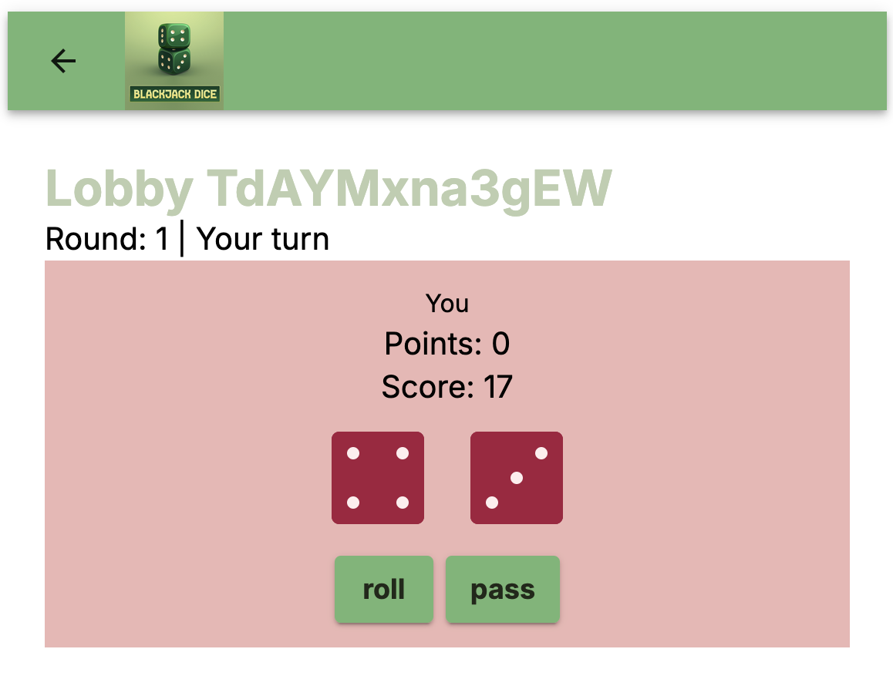

<!-- Generated from templates/dice/README.md by docs/site/scripts/sync-template-readmes.ts. Do not edit directly. -->

> Template: **[`templates/dice`](https://github.com/effectstream/effectstream/tree/main/templates/dice)**

Two players race to a total of 21 across a configurable number of rounds. On their turn a player
either rolls two dice or passes; when both have passed the round is scored and the next one starts.
Accounts are ERC-721 NFTs rather than raw wallets, so a single wallet can hold several independent
game identities, and lobbies, matches, rounds and moves all live in Postgres tables the state
machine writes.

The reason to read this template is the randomness. Nothing about a dice roll is ever persisted or
sent over the wire — only the player's binary decision is. The dice themselves are a pure function
of the block seed and the move list, recomputed identically by the node and by the browser. That is
the pattern worth copying for any game with hidden or generated content.



## What this template shows

**Rolls are derived, not recorded.** The Effectstream runtime seeds a `Prando` PRNG once per block
from that block's hash, hands it to every state transition as `data.randomGenerator`, and persists
the seed in the framework-owned `block_heights.seed` column. The dice come out of that generator in
[`packages/shared/game-logic/src/dice-logic.ts`](https://github.com/effectstream/effectstream/blob/main/templates/dice/packages/shared/game-logic/src/dice-logic.ts):

```ts
export function genDieRoll(randomnessGenerator: Prando): number {
  return randomnessGenerator.nextInt(1, 6);
}

export function genTwoDiceRoll(randomnessGenerator: Prando): [number, number] {
  return [genDieRoll(randomnessGenerator), genDieRoll(randomnessGenerator)];
}
```

The only thing written to the database for a move is the decision, in the `round_move` table:
`nft_id` and `roll_again`. There is no `dice` column anywhere in the schema. Scores are the *result*
of replaying the moves, not an independent record of them.

**Replay is the single scoring path.** `submittedMoves` in
[`packages/client/node/src/state-machine/v1/transition.ts`](https://github.com/effectstream/effectstream/blob/main/templates/dice/packages/client/node/src/state-machine/v1/transition.ts)
does not apply the new move directly. It appends the move to the round's move list and then drives
the shared tick loop until it runs out of moves, keeping only the final state:

```ts
let currentTick = 1;
const clonedState = { ...matchState, players: matchState.players.map(p => ({ ...p })) };

while (true) {
  const events = processTick(matchEnvironment, clonedState, newMoves, currentTick, randomGenerator);
  if (events === null) break;
  currentTick++;
}
```

`processTick` ([`packages/shared/game-logic/src/tick.ts`](https://github.com/effectstream/effectstream/blob/main/templates/dice/packages/shared/game-logic/src/tick.ts))
emits one `TickEvent` per move — `roll`, `turnEnd`, `applyPoints`, `roundEnd`, `matchEnd` — and
`applyEvent` folds each one into the match state. The state machine then writes the folded result.

**The same loop runs in the browser.** `packages/shared/game-logic` is aliased into the frontend
bundle by [`packages/frontend/esbuild.js`](https://github.com/effectstream/effectstream/blob/main/templates/dice/packages/frontend/esbuild.js), so
[`RoundExecutorWrapper`](https://github.com/effectstream/effectstream/blob/main/templates/dice/packages/frontend/src/pages/DiceGame/RoundExecutorWrapper.ts) replays a
round from the same `processTick` using the moves and the seed served by the API, and
[`DiceGame.tsx`](https://github.com/effectstream/effectstream/blob/main/templates/dice/packages/frontend/src/pages/DiceGame/DiceGame.tsx) animates the resulting
`TickEvent` stream. The client never asks the server what the dice were; it derives them.

**Why this is deterministic and replayable.** Every input to the roll is consensus data or database
state: the block hash that seeds the generator, the rows already committed, and the parsed input.
There is no `Math.random()`, no wall clock, no node-local state. Any node that processes the same
block in the same order produces the same dice, and any client holding the persisted seed and the
move list can reconstruct the whole round after the fact — which is exactly what the replay UI does.
The same generator is what makes lobby IDs (`randomGenerator.nextString(12)`) and the coin flip that
assigns turn order (`randomGenerator.next() < 0.5`) safe to compute inside a transition.

One rough edge worth knowing before you copy it: the client seeds its own generator with
`` new Prando(`${roundSeed}-${roundWithinMatch}`) `` while the node uses the block-level generator
directly. Both sides are deterministic, but they are not seeded identically, so the animated dice
are a stable replay rather than a bit-for-bit reproduction of the node's rolls. Deriving both sides
from the same seed expression is the fix.

## Effectstream features used

| Feature | Where | Used for |
| --- | --- | --- |
| `PaimaSTM` state machine (`@paimaexample/sm`) | [`packages/client/node/src/state-machine.ts`](https://github.com/effectstream/effectstream/blob/main/templates/dice/packages/client/node/src/state-machine.ts) | Seven transitions: mint, create/join/close lobby, moves, practice, zombie, stats |
| Concise grammar (`@paimaexample/concise` + TypeBox) | [`packages/shared/data-types/src/grammar.ts`](https://github.com/effectstream/effectstream/blob/main/templates/dice/packages/shared/data-types/src/grammar.ts) | Typed, validated input schemas shared by node and frontend |
| Coroutine effects (`@paimaexample/coroutine`) | [`packages/client/node/src/state-machine.ts`](https://github.com/effectstream/effectstream/blob/main/templates/dice/packages/client/node/src/state-machine.ts) | `World.resolve` for queries/writes, `World.promise` to call pure transition helpers |
| Seeded randomness (`Prando` from `@paimaexample/crypto`) | [`packages/shared/game-logic/src/dice-logic.ts`](https://github.com/effectstream/effectstream/blob/main/templates/dice/packages/shared/game-logic/src/dice-logic.ts) | Dice, lobby IDs, turn order |
| `PrimitiveTypeEVMPaimaL2` (today: `PrimitiveTypeEVMEffectstreamL2`) | [`packages/shared/data-types/src/localhostConfig.ts`](https://github.com/effectstream/effectstream/blob/main/templates/dice/packages/shared/data-types/src/localhostConfig.ts) | Reads game inputs from the L2 mailbox contract |
| `PrimitiveTypeEVMERC721` + `builtinGrammars.evmErc721` | [`localhostConfig.ts`](https://github.com/effectstream/effectstream/blob/main/templates/dice/packages/shared/data-types/src/localhostConfig.ts), [`grammar.ts`](https://github.com/effectstream/effectstream/blob/main/templates/dice/packages/shared/data-types/src/grammar.ts) | Turns ERC-721 `Transfer` events into `nftMint` inputs |
| NTP + EVM RPC sync protocols (`@paimaexample/config`) | [`packages/shared/data-types/src/localhostConfig.ts`](https://github.com/effectstream/effectstream/blob/main/templates/dice/packages/shared/data-types/src/localhostConfig.ts) | 1s NTP block clock as main chain, Hardhat synced in parallel |
| pgtyped queries + migrations (`@paimaexample/db`) | [`packages/client/database/`](https://github.com/effectstream/effectstream/tree/main/templates/dice/packages/client/database) | Type-safe SQL, two ordered migrations |
| Fastify API router (`StartConfigApiRouter`) | [`packages/client/node/src/api.ts`](https://github.com/effectstream/effectstream/blob/main/templates/dice/packages/client/node/src/api.ts) | Read model for the frontend, including the round seed |
| Orchestrator (`@paimaexample/orchestrator`) | [`packages/client/node/scripts/start.ts`](https://github.com/effectstream/effectstream/blob/main/templates/dice/packages/client/node/scripts/start.ts) | Boots Hardhat, contracts, PGlite, node, frontend, explorer |
| Wallet connect + `sendTransaction` (`@paimaexample/wallets`) | [`packages/frontend/effectstreamAPI.src.js`](https://github.com/effectstream/effectstream/blob/main/templates/dice/packages/frontend/effectstreamAPI.src.js) | Browser wallet login and input submission |

## Quick start

> [!WARNING]
> This template still depends on the unpublished `@paimaexample/*` packages and **cannot be installed as-is**. It is kept as a reference implementation until it is migrated to `@effectstream/*`. The walkthrough below still describes how it works.

Prerequisites beyond Bun: **Foundry** (`forge`, used by `build:forge`) and **Node.js** — the
frontend package installs and builds with npm and esbuild
([`packages/frontend/.nvmrc`](https://github.com/effectstream/effectstream/blob/main/templates/dice/packages/frontend/.nvmrc) pins `lts/iron`; the
[`Dockerfile`](https://github.com/effectstream/effectstream/tree/main/templates/dice/Dockerfile) installs Node 24).

```sh
bun install
./patch.sh            # dependency patch hook — currently a no-op
bun run build:evm     # forge + hardhat build of packages/shared/contracts/evm
bun run dev           # start the whole local stack
bun run check         # placeholder — @dice/node's check script only echoes
```

| Service | URL |
| --- | --- |
| Frontend | http://localhost:8080 |
| Node API | http://localhost:9999 |
| Explorer | http://localhost:10590 |
| Hardhat EVM RPC | http://localhost:8545 |

The same stack runs in one container; the [`Dockerfile`](https://github.com/effectstream/effectstream/tree/main/templates/dice/Dockerfile) exposes all four ports and
sets `EFFECTSTREAM_STDOUT=true` so logs go to stdout instead of the TUI:

```sh
DOCKER_DEFAULT_PLATFORM=linux/amd64 docker build -t dice-sample .
DOCKER_DEFAULT_PLATFORM=linux/amd64 docker run -p 8080:8080 -p 8545:8545 -p 9999:9999 -p 10590:10590 dice-sample
```

## Project structure

<!-- allow-missing: packages/node -->
This template predates the flat `packages/node` layout; it uses the older nested
`client` / `shared` / `frontend` split.

```
dice/
├── package.json                        # Bun workspace root
├── Dockerfile                          # single-container build of the whole stack
├── patch.sh                            # dependency patch hook (no-op)
├── docs/                               # screenshots used by this README
└── packages/
    ├── client/
    │   ├── database/                   # @dice/db — migrations, SQL, pgtyped output
    │   └── node/                       # @dice/node — runtime, state machine, API
    │       ├── scripts/start.ts        # orchestrator config used by `bun run dev`
    │       └── src/
    │           ├── main.ts             # entry point: init + start(...)
    │           ├── api.ts              # Fastify routes
    │           ├── state-machine.ts    # PaimaSTM wiring
    │           └── state-machine/v1/   # transition.ts — pure transition helpers
    ├── shared/
    │   ├── contracts/evm/              # @dice/evm-contracts — Solidity, Hardhat, Ignition
    │   ├── data-types/                 # @dice/data-types — grammar, types, node config
    │   └── game-logic/                 # @dice/game-logic — tick loop + dice, shared with frontend
    └── frontend/                       # @dice/frontend — React + MUI, esbuild bundle
        ├── effectstreamAPI.src.js      # wallet + API layer → public/effectstreamAPI.js
        └── src/pages/DiceGame/         # game screen, dice animation, round replay
```

## How it works

### Grammar

[`packages/shared/data-types/src/grammar.ts`](https://github.com/effectstream/effectstream/blob/main/templates/dice/packages/shared/data-types/src/grammar.ts) declares
seven inputs as TypeBox field lists. Four are player actions, one is a built-in chain event, and two
are scheduled inputs:

```ts
export const grammar = {
  nftMint: builtinGrammars.evmErc721,
  createdLobby: [
    ["creatorNftId", NftID],
    ["numOfRounds", Type.Number({ minimum: 1, maximum: 1000 })],
    ["roundLength", Type.Number({ minimum: 1, maximum: 10000 })],
    ["playTimePerPlayer", Type.Number({ minimum: 1, maximum: 10000 })],
    ["isHidden", Type.Optional(Type.Boolean())],
    ["isPractice", Type.Optional(Type.Boolean())],
  ],
  joinedLobby: [["nftId", NftID], ["lobbyID", LobbyID]],
  closedLobby: [["lobbyID", LobbyID]],
  submittedMoves: [/* nftId, lobbyID, matchWithinLobby, roundWithinMatch, rollAgain */],
  practiceMoves: [/* lobbyID, matchWithinLobby, roundWithinMatch */],
  zombieScheduledData: [["lobbyID", LobbyID]],
  userScheduledData: [["nftId", NftID], ["result", MatchResult]],
} as const satisfies GrammarDefinition;
```

`LobbyID` is a fixed 12-character string — the same width `randomGenerator.nextString(12)` produces
— so a malformed lobby ID is rejected by validation before any transition runs. The frontend
submits inputs by grammar key: `sendTransaction(wallet, ["submittedMoves", nftId, lobbyId, ...])`.

### State machine

[`state-machine.ts`](https://github.com/effectstream/effectstream/blob/main/templates/dice/packages/client/node/src/state-machine.ts) is the wiring layer. Each
transition reads whatever rows it needs through `World.resolve`, calls a plain async helper from
[`state-machine/v1/transition.ts`](https://github.com/effectstream/effectstream/blob/main/templates/dice/packages/client/node/src/state-machine/v1/transition.ts)
through `World.promise`, and applies the `SQLUpdate` tuples the helper returns:

```ts
stm.addStateTransition("submittedMoves", function* (data) {
  const { blockHeight, parsedInput, randomGenerator, signerAddress: user } = data;

  const lobby = yield* World.resolve(getLobbyById, { lobby_id: parsedInput.lobbyID });
  // ...players, round, moves, match...

  const results = yield* World.promise<SQLUpdate[]>(
    submittedMoves(user!, blockHeight, { input: "submittedMoves", ...parsedInput }, /* ... */)
  );

  for (const result of results) {
    yield* World.resolve(result[0], result[1]);
  }
});
```

Keeping the helpers pure — state in, list of writes out — is what lets the same
`processTick` run unchanged in the browser.

The flow of a match:

1. `nftMint` fires from the ERC-721 `Transfer` event. `mintNft` skips burns, inserts a zeroed
   `global_user_state` row for real mints, and upserts `nft_ownership` on every transfer, which is
   how the API maps a wallet to its NFTs.
2. `createdLobby` generates the lobby ID from the block generator and inserts the lobby plus its
   creator as the first player.
3. `joinedLobby` refuses a full lobby, a non-open lobby, or an NFT already seated. When the second
   player fills it, it flips the lobby to `active`, coin-flips turn order, and creates match 0 and
   round 0.
4. `submittedMoves` validates that the lobby is active, that the signer's NFT holds the current
   turn, and that `matchWithinLobby` / `roundWithinMatch` match the lobby's current pointers. It
   records the move, replays the round, writes the folded player state, marks the round executed,
   and either opens the next round or marks the lobby `finished`.
5. Scoring lives in `dice-logic.ts`: `calculateFinalScore` is `Math.abs(21 - totalRolled)`,
   `calculateRoundPoints` awards 1 point to the single closest player (0 to everyone on a tie), and
   `matchResults` declares the winner. Note that `matchResults` picks the player with the *lowest*
   total points, which contradicts the per-round award — a real inconsistency in this template, not
   a documentation slip.

Three transitions are deliberately incomplete and marked `TODO` in the source: `practiceMoves`
delegates to `submittedMoves` with a `null` round, which makes it a no-op; `zombieRound` only
advances the turn instead of forfeiting; and `closedLobby` never checks that the caller is the
creator. `userScheduledData` is fully implemented, but nothing schedules it yet — the match-end
branch of `submittedMoves` still carries a `TODO: Implement scheduling mechanism`.

### Contracts

[`packages/shared/contracts/evm/src/contracts/`](https://github.com/effectstream/effectstream/tree/main/templates/dice/packages/shared/contracts/evm/src/contracts)
holds thin subclasses of the framework's own Solidity, not reimplementations:

- `PaimaL2Contract` extends the base L2 mailbox — the contract players submit game inputs to.
- `AnnotatedMintNft` extends the base ERC-721 used for player accounts.
- `NativeNftSale` plus [`Proxy/NativeNftSaleProxy.sol`](https://github.com/effectstream/effectstream/blob/main/templates/dice/packages/shared/contracts/evm/src/contracts/Proxy/NativeNftSaleProxy.sol)
  sell those NFTs for native currency; the proxy is set as the NFT's minter.

Two deployment paths exist.
[`ignition/modules/deploy.ts`](https://github.com/effectstream/effectstream/blob/main/templates/dice/packages/shared/contracts/evm/ignition/modules/deploy.ts) defines
the `L2Contract` and `AccountNft` Ignition modules, and
[`deploy-simple.ts`](https://github.com/effectstream/effectstream/blob/main/templates/dice/packages/shared/contracts/evm/deploy-simple.ts) is a direct ethers script
that deploys the same four contracts against Hardhat and writes
`ignition/deployments/chain-31337/deployed_addresses.json`. Either way,
[`mod.ts`](https://github.com/effectstream/effectstream/blob/main/templates/dice/packages/shared/contracts/evm/mod.ts) reads that JSON at runtime, which is how
`localhostConfig.ts` resolves addresses without hardcoding them:

```ts
contractAddress: contractAddressesEvmMain().chain31337["L2Contract#PaimaL2Contract"],
```

The node config registers both primitives against the same EVM sync protocol — the L2 contract with
`paimaL2Grammar: grammar`, and the account NFT with `stateMachinePrefix: "nftMint"`, which routes
its `Transfer` events into the `nftMint` transition.

### API

[`api.ts`](https://github.com/effectstream/effectstream/blob/main/templates/dice/packages/client/node/src/api.ts) exports a `StartConfigApiRouter` that the runtime
mounts on port 9999. These are all of the routes it defines:

| Endpoint | Returns |
| --- | --- |
| `GET /lobby/:lobbyId` | Lobby row with a camelCased `players` array |
| `GET /lobby/:lobbyId/players` | Raw `lobby_player` rows |
| `GET /lobby/:lobbyId/rounds` | All `match_round` rows for the lobby |
| `GET /lobby/:lobbyId/moves` | All `round_move` rows for the lobby |
| `GET /lobby/:lobbyId/match/:matchId` | One `lobby_match` row |
| `GET /lobby/:lobbyId/match/:matchId/round/:roundId` | Round row **plus `roundSeed`** from `block_heights` |
| `GET /lobby/:lobbyId/match/:matchId/round/:roundId/moves` | Moves for that round |
| `GET /lobbies/open?page=&count=` | Paginated open, non-hidden lobbies |
| `GET /lobbies/active?page=&count=` | Paginated active lobbies |
| `GET /open_lobbies?page=&count=` | Redirect to `/lobbies/open` |
| `GET /user_lobbies?wallet=&page=&count=` | Lobbies for every NFT owned by a wallet |
| `GET /user/:nftId/lobbies?page=&count=` | Lobbies a given NFT plays in |
| `GET /user_lobbies_by_nft?nft_id=&page=&count=` | Redirect to `/user/:nftId/lobbies` |
| `GET /stats/:nftId` | `global_user_state` row, zeroed if absent |
| `GET /nfts?wallet=` | `{ nfts: number[] }` from `nft_ownership` |

The seed route is the one that matters for replay. It picks
`execution_block_height ?? starting_block_height`, looks that height up in `block_heights`, and
returns the seed alongside the round so the client can rebuild the generator.

Three helpers in [`effectstreamAPI.src.js`](https://github.com/effectstream/effectstream/blob/main/templates/dice/packages/frontend/effectstreamAPI.src.js) call routes
that do not exist on this server — `getUserStats` hits `/user_stats?wallet=`, `getRoundData` hits
`/lobby/:id/round/:n`, and `getMatchResult` hits `/lobby/:id/result`. They are leftovers; the
replay path (`getRoundExecutor`) uses the real routes above.

### Database

Schema lives in
[`packages/client/database/src/migrations/`](https://github.com/effectstream/effectstream/tree/main/templates/dice/packages/client/database/src/migrations) and is
applied in the order listed by
[`migration-order.ts`](https://github.com/effectstream/effectstream/blob/main/templates/dice/packages/client/database/src/migration-order.ts):

| Table | Purpose |
| --- | --- |
| `block_heights` | Framework-owned. Holds `seed` per block — the source the replay API reads. |
| `lobbies` | Lobby config and current pointers (`current_match`, `current_round`, `current_turn`, `current_proper_round`), state enum `open`/`active`/`finished`/`closed` |
| `lobby_match` | Matches within a lobby |
| `match_round` | Rounds within a match, with `starting_block_height` and nullable `execution_block_height` |
| `round_move` | One row per decision: `nft_id`, `roll_again`. No dice values. |
| `lobby_player` | Per-lobby seat: `turn`, `points`, `score` |
| `global_user_state` | Lifetime `wins` / `losses` / `ties` per NFT |
| `nft_ownership` | Added by `001-add-nft-ownership.sql`; maps `nft_id` to a lowercased wallet address |

Queries are written as SQL in
[`src/sql/`](https://github.com/effectstream/effectstream/tree/main/templates/dice/packages/client/database/src/sql) and compiled to typed functions by pgtyped. After
editing any `.sql` file, regenerate:

```sh
bun run --filter @dice/db pgtyped:update
```

## Configuration

Networks, sync protocols and primitives are declared in
[`packages/shared/data-types/src/localhostConfig.ts`](https://github.com/effectstream/effectstream/blob/main/templates/dice/packages/shared/data-types/src/localhostConfig.ts):
an NTP network with a 1000 ms block time as the main chain, and Hardhat added as a parallel
`EVM_RPC_PARALLEL` sync protocol with a 500 ms polling interval and confirmation depth 1. The
security namespace is `dice-node`.

| Variable | Set by | Effect |
| --- | --- | --- |
| `PAIMA_API_PORT` | `@dice/node`'s `dev` script (`9999`) | Port the Fastify API binds to |
| `NODE_ENV` | `dev` script (`development`) | Runtime environment |
| `EFFECTSTREAM_STDOUT` | [`Dockerfile`](https://github.com/effectstream/effectstream/tree/main/templates/dice/Dockerfile) | Disables tmux/TUI/collector and logs to stdout ([`scripts/start.ts`](https://github.com/effectstream/effectstream/blob/main/templates/dice/packages/client/node/scripts/start.ts)) |
| `RUN_IN_DOCKER` | [`Dockerfile`](https://github.com/effectstream/effectstream/tree/main/templates/dice/Dockerfile) | Marks the containerized run |

To point the template at a real network rather than the local stack you would change the
`addViemNetwork` call and the parallel sync protocol's `chainUri` and `startBlockHeight` in
`localhostConfig.ts`, deploy the contracts there so `deployed_addresses.json` carries the new
addresses, and update the frontend, which still hardcodes localhost values in two places:
[`src/services/constants.ts`](https://github.com/effectstream/effectstream/blob/main/templates/dice/packages/frontend/src/services/constants.ts) (`CHAIN_URI` and the
NFT/sale-proxy addresses) and
[`effectstreamAPI.src.js`](https://github.com/effectstream/effectstream/blob/main/templates/dice/packages/frontend/effectstreamAPI.src.js) (the L2 address
`0x5FbDB2315678afecb367f032d93F642f64180aa3`, the `hardhat` viem chain, and the
`http://localhost:9999` API base).

## Testing

This template ships **no automated tests**. It is excluded from the shared runner — see the
commented-out entry in [`../run-template-tests.ts`](https://github.com/effectstream/effectstream/blob/main/templates/run-template-tests.ts) — and `bun run check`
resolves to `@dice/node`'s placeholder script, which only echoes. Verification is manual: run
`bun run dev`, mint an account NFT from the UI, create a lobby, join it from a second Hardhat
account, and check that the dice the frontend animates end at the same scores the API reports for
the lobby.

## Where to go next

- [Randomness](https://effectstream.github.io/docs/home/components/randomness) — the block-seed and
  `Prando` model this template is built on.
- [State machine](https://effectstream.github.io/docs/home/components/state-machine) — how
  transitions, effects and scheduled inputs fit together.
- [Grammar](https://effectstream.github.io/docs/home/components/grammar) — the concise input
  encoding behind `grammar.ts`.
- [Primitives](https://effectstream.github.io/docs/home/components/primitives) — the L2 and ERC-721
  primitives wired up in `localhostConfig.ts`.
- [Chess](https://effectstream.github.io/docs/home/templates/chess) — the same lobby / turn / zombie
  structure, already migrated to `@effectstream/*` and to the flat package layout.
