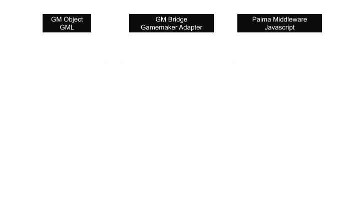
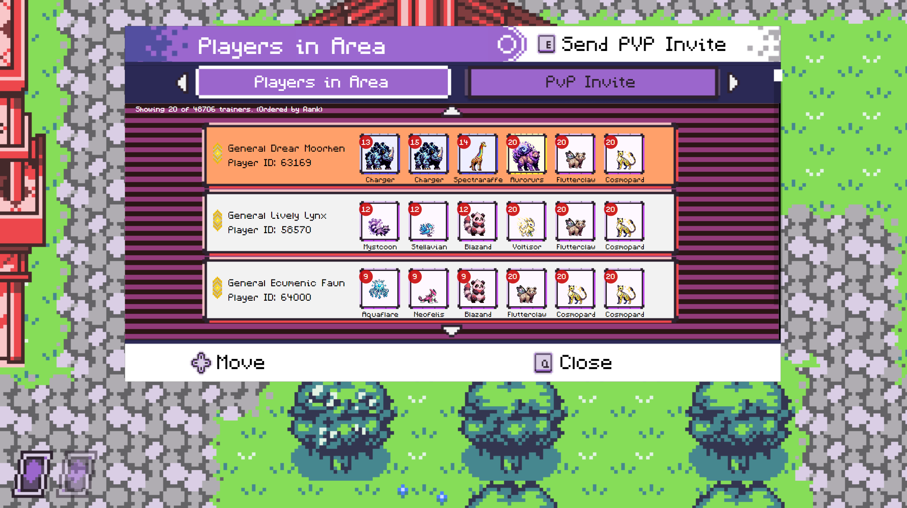
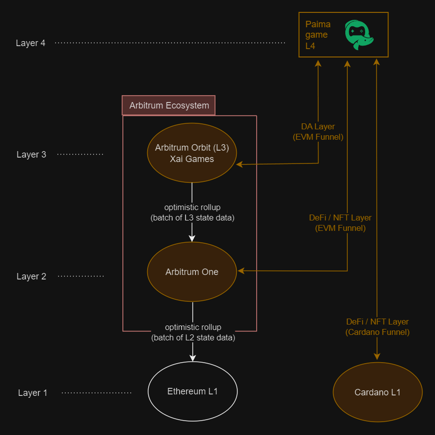
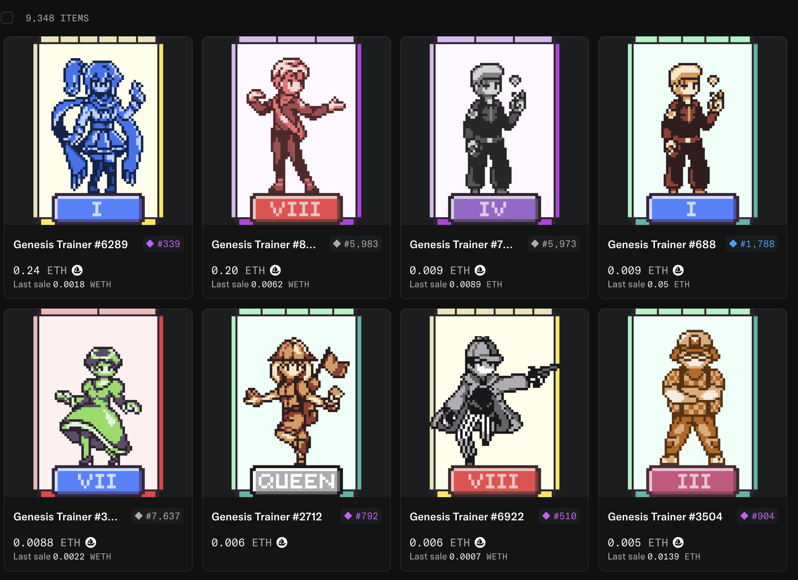
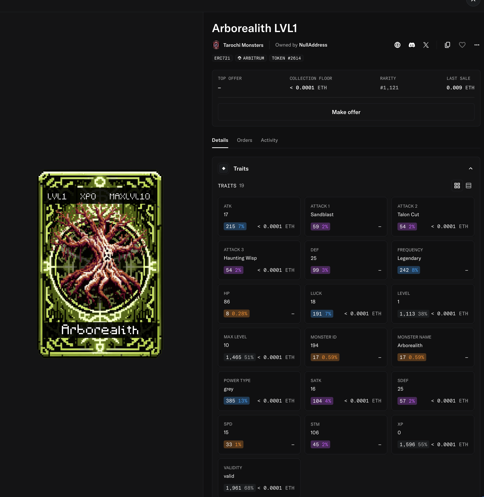
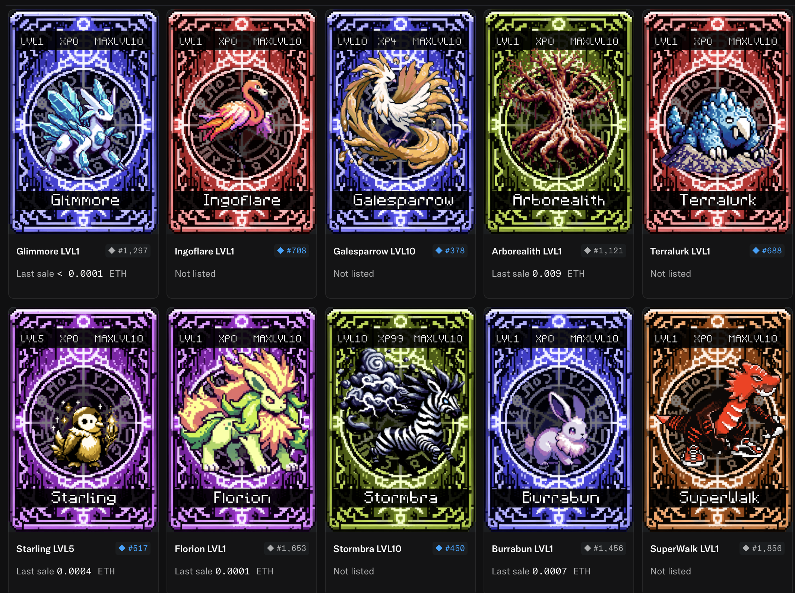

# Tarochi (Game)

**Tarochi** is an online decentralized, on-chain, autonomous, Web3 game developed entirely with `EffectStream`.
> **Decentralized**: The game runs on a decentralized network of nodes, and is not owned or controlled by a single entity.  
> **On-chain**: The game is built on top of the blockchain, and all game data is stored on the blockchain.  
> **Autonomous**: The game is self-governed and self-sustaining, without the need for external intervention.  
> **Web3**: The game is built on top of blockchains, wallets, smart-contracts and other Web3 technologies.  

> NOTE This is a guide on how the game was designed and built using EffectStream.

<iframe src="https://drive.google.com/file/d/1--jE8nVOyhrPqh5IWmahys2aCrKn23aI/preview" width="640" height="480" allow="autoplay"></iframe>

This guide is intended as a practical example of how a complex, fully on-chain game can be developed using `EffectStream`.

# Game Design

We will not deep-dive into the game loop design, but rather focus on important architectural and economic decisions you need to make for a decentralized blockchain game.

<iframe width="560" height="315" src="https://www.youtube.com/embed/Rug2xtaq-7c?si=lBGH0HN0QC-dcdWC" title="YouTube video player" frameborder="0" allow="accelerometer; autoplay; clipboard-write; encrypted-media; gyroscope; picture-in-picture; web-share" referrerpolicy="strict-origin-when-cross-origin" allowfullscreen></iframe>

## Game Engine: GameMaker & Web3 Integration

Tarochi was built using **[GameMaker](https://gamemaker.io/)**, a beginner-to-advanced friendly tool for creating 2D experiences. While renowned for its intuitive interface, GameMaker's reliance on its proprietary GameMaker Language (GML) has historically made it difficult to integrate with the JavaScript-heavy world of Web3.

To bridge this gap, Tarochi used a custom adapter connecting its GML code to JavaScript. This enabled the use of EffectStream's state machine framework for on-chain game logic while leveraging GameMaker for UI and multi-platform support (desktop, mobile, consoles, and browsers).

:::note Case study, not a shipped template
This page documents how an existing game was built. There is **no GameMaker template in this repository** — the adapter described below is Tarochi's own. For templates you can start from, see the [templates section](./1201-evm-midnight.md).
:::

<iframe width="100%" height="440" src="https://www.youtube.com/embed/ePhIU1Hla-g?si=OTpnPs_MsNBS-sjZ" title="YouTube video player" frameborder="0" allow="accelerometer; autoplay; clipboard-write; encrypted-media; gyroscope; picture-in-picture; web-share" referrerpolicy="strict-origin-when-cross-origin" allowfullscreen></iframe>

### Connecting GameMaker with JavaScript

Nearly all Web3 tools are written in or compatible with JavaScript, primarily because crypto wallets are most commonly used as browser extensions. GameMaker's ability to compile games to HTML5 makes it a viable choice for web-based dApps.

Tarochi's adapter allows GML code to call JavaScript functions and receive callbacks from them. This enables a GameMaker application to handle everything from wallet connections to direct interactions with EffectStream and other Web3 libraries.



This adapter is not limited to Web3. In Tarochi, the same concept was used to build menus and overlays using the popular frontend framework Vue.js, demonstrating the flexibility of this approach.



## Architecture & Tokenomics

Tarochi's architecture is a multi-layered stack designed for massive scalability, allowing it to handle over **1 million transactions in less than 100 hours** post-launch. Transactions are fast and cheap enough for the team to subsidize gas fees for all players.

The stack is layered as follows:
*   **L1: Ethereum** (Primary settlement layer)
*   **L2: Arbitrum** (For liquidity and DEX interactions)
*   **L3: Xai** (For fast, low-cost data availability and game actions)
*   **L4: Tarochi** (The game's sovereign rollup, built with EffectStream)
*   **L1: Cardano** (DEX interactions)

EffectStream allows Tarochi to be a non-EVM application, enabling a more complex and dynamic world while maintaining decentralization. It achieves this by simultaneously monitoring multiple chains (Arbitrum, Xai, and Cardano), leveraging the low costs of Xai for gameplay while tapping into the liquidity of Arbitrum and Cardano for its tokens and NFTs.



### The Role of TGOLD

**TGOLD** is the native token for the Tarochi L4 autonomous world and is used for in-game economic activities, such as purchasing items. While TGOLD powers the L4's economy, it is made tradable on Arbitrum One through a custom DEX.

Trades made on the Arbitrum DEX are reflected directly in the Tarochi L4 without requiring a traditional bridge. This is possible because EffectStream monitors both chains. However, this architecture means TGOLD cannot be traded in standard AMMs like Uniswap, as they are not aware of the L4 connection.

### In-Game Assets

*   **ERC1155 `Gold` (TGOLD)**: The primary in-game currency, convertible to its on-chain representation on Arbitrum.
*   **ERC721 `Trainer` Assets**: Limited supply NFTs that provide in-game benefits if held in the player's wallet.
*   **ERC721 `Monsters`**: Can be minted on-chain or captured in-game and are convertible between their on-chain and in-game forms.
*   **`Items`**: These exist only within the L4 game state and are not on-chain assets.

### General Asset Rules:
*   Common monsters are unlimited.
*   Rare+ monsters are limited by time.
*   Monsters are "sacrificed" to increase their max level.
*   Gold is consumed when used in a store.
*   A limited amount of new Gold was minted.
*   Trainers are limited.

### Asset, Gold Exchanges and DEX:
*   Gold, Trainers, and Monsters were available to mint on EVM and partially on Cardano.
*   NFT marketplaces like OpenSea and Jpg.store were used for Monster and Trainer exchanges.
*   The EffectStream DEX on Arbitrum was used for trading Gold.

## Contracts

*   **`EffectStream L2`**: This contract is extensively used for submitting game inputs. It runs on the XAI network for its fast block time and low gas fees.
*   **`IInverseAppProjectedNft`**: Standard ERC721, with the ability to represent L4 assets as NFTs on L1.
*   **`IInverseAppProjected1155`**: Standard ERC1155, with the ability to represent L4 fungible/semi-fungible assets on L1.
*   **`IOrderbookDex`**: TGold DEX Contract.
*   **`ERC721`**: Trainer NFT Contract on Arbitrum and Cardano.

## Frontend & Wallets

To interact with the `EffectStream L2` contract, the game used a browser EVM Wallet and sent transactions to the batcher. 
Players could connect their real EVM, Cardano or other wallets to mint monsters, use trainer effects, and perform other actions requiring a signature.

## State Machine

The Tarochi `State Machine` is a set of triggers that react to on-chain events, such as a Monster mint or Gold transfer, but primarily to inputs submitted via the `EffectStream L2` Contract. Each keyword in the `grammar` is implemented as a `State Transition Function`.

For example:
*   `useItem = @c|item|argument?`: This STF first checks if the user has the item and is in a valid state to use it (e.g., not in battle). If all rules pass, it deducts the item and applies its effects.
*   `fastTravel = @f|x|y`: This STF checks if the user can fast travel, verifies the target coordinates, moves the player to the new map, and updates any zone-specific effects.

## Grammar
> Important: This is EffectStream V1 Grammar, so it's slightly different from the new EffectStream V2 Grammar, but it represents the same concepts.
```ts
join                    = @j|referrer?
setReferrer             = @k|referrer
rename                  = @rn|*name|fee_wallet
moveToArea              = @m|x|y
fastTravel              = @f|x|y
battleCommand           = @b|battleType|round|action|action_data?
switchMonsters          = @x|swap_commands
startPVEBattle          = @e|npc_trainer_global_id
startPVPBattle          = @p|*player|battle_type?
healCenter              = @h|
useItem                 = @c|item|argument?
purchaseItem            = @r|item|count?|fee_wallet
barter                  = @t|give|amount|receive
excavate                = @z|use_item
claim                   = g|
redeem                  = @w|blockHeight
merge                   = @q|monster_target|monsters
mergeTGold              = @qt|monster_target|fee_wallet
nop                     = n|
arenaBattle             = @n|arena_id
internalCommands        = @a|cmd|id?|args?
buyCaptureItem          = @i|*player
scheduleRandomEncounter = w|*player|x|y
scheduleDaily           = d|tick
scheduleHourly          = h|tick
scheduleQuarterHour     = q|tick
scheduleNoAction        = x|blockHeight|battleType|round|wallet_a|wallet_b
scheduleStatusEffect    = s|*player|item_id|monster_id?
sendGold                = @s|to_player|amount|signature|fee_wallet
lockGold                = @l|amount
sendMonster             = @u|to_player|monster_id|signature|fee_wallet
appMonsterLock          = @d|monster_id|fee_wallet
monster_lock            = monster_lock|payload
monster_burn            = monster_burn|payload
monster_transfer        = monster_transfer|address|nft_id|data?
delegate                = &wd|from?|to?|from_signature|to_signature
migrate                 = &wm|from?|to?|from_signature|to_signature
cancelDelegations       = &wc|to?
createEventTeam         = @ev|event_id
interactEventTeam       = @ei|action|*team_id|data?
event_step              = event_step|event_id|step
event_end               = event_end|event_id
createGuild             = @gc|name|social_link|fee_wallet
interactGuild           = @gi|action|*guild_id|data?
buyForGuild             = @gs|action|*guild_id|fee_wallet
gold_mint               = gold_mint|payload
gold_burn               = gold_burn|operator|from|ids|values
acceptDaily             = @da|*daily_id
forSaleDaily            = @ds|*daily_id|price
cancelDaily             = @dc|*daily_id
purchaseDaily           = @dp|*daily_id|fee_wallet
scheduleDailyQuestEnd   = dq|*daily_id
masterDaily             = @dm|action|payload
giveItem                = i|message|item_id|signature|wallets
dex_order_created       = dex_order_created|payload
dex_order_cancelled     = dex_order_cancelled|payload
dex_order_filled        = dex_order_filled|payload
updateCardanoLink       = @co|token|address
```
## Concepts about how the Game Works.

### Players & Actions

* Each time a new `wallet address` sends a transaction, we created a new `player` in the game state.
* Each `player` has a main state either: "CITY", "WILD" or "BATTLE".
  * This allowed to quickly determine the subset of valid commands. E.g., in `BATTLE` state, only battle-actions where valid.  
* The game was represented by a matrix, where each `map` was a coordinate (x, y)
  * `player` could send a transaction to move to a new coordinate, and the game engine checked if it was valid - then applied the move.
* If a `players` is in the `WILD` state, each 10[s] it was checked if it encountered a monster by random, and if so, it entered a `BATTLE` state.
* Battles had `turns` and on each turn the `player` could choose an action to perform, these actions where added to the game state with it's effects.
* Monsters had multiple `attributes`, `power` and `level`
* Special cards called `Trainers` where limited in supply and had unique effects.

### Trainers

Trainers had unique attributes and rarity.



### Monsters
Monster had multiple `attributes` as `ATK`, `SATK`, `DEF`, `SDEF`, `SPD`, `HP` and `xp`/`level`.
Some unique `attacks`



### Monster Store
Monster could be sold and bought in the store.




## Development Processes

For the development of Tarochi, the following processes need to be run:
*   EVM Main Chain with fast block times (emulating XAI) + RPC
*   EVM Parallel Chain (emulating Arbitrum) + RPC
*   Cardano Parallel Chain
*   Game, Tokens and InverseProjected Smart Contracts.
*   Database (Postgres)
*   Batcher (to allow users to submit transactions to the EffectStream L2 contract without paying for gas or having a wallet)
