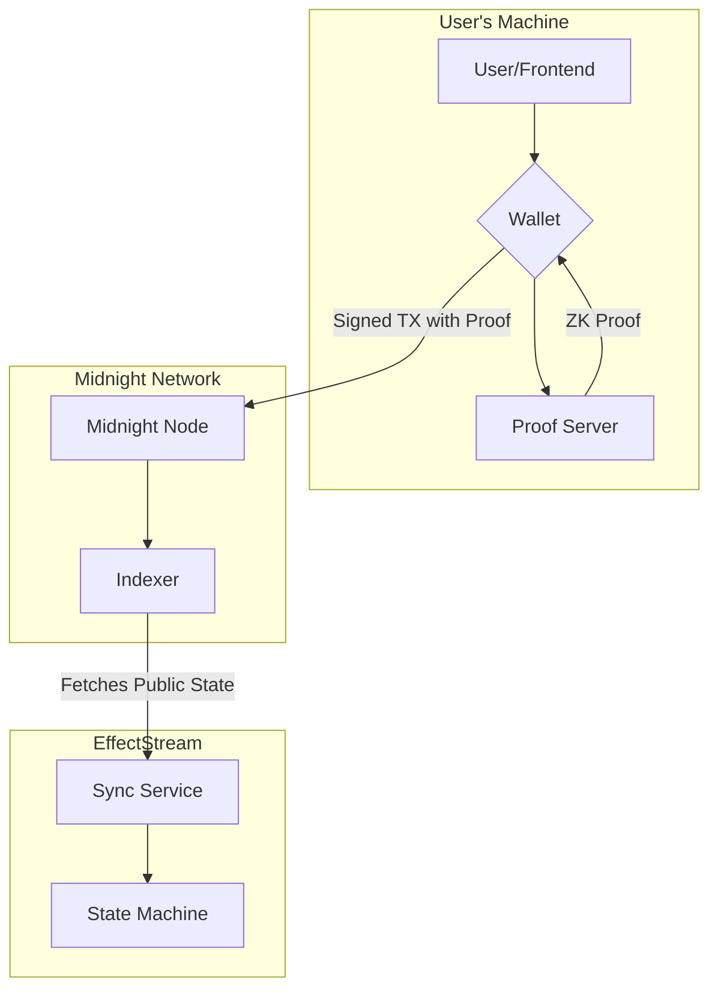

# Midnight

Midnight is a privacy-focused ZK (Zero-Knowledge) blockchain. EffectStream integrates with Midnight to read public state changes resulting from private circuit execution.

Some key points about Midnight:
*   **Private State**: Keep user data and application logic confidential.
*   **Confidential Transactions**: Execute transactions without revealing their details on-chain.
*   **Verifiable Computation**: Run complex logic off-chain and prove its correct execution on-chain without revealing the inputs.

### How Midnight Works: An Overview

Midnight allows to keep the user's private and public data in the blockchain. The key components are, for understanding how it works:

*   **User & Wallet**: Interacts with the dApp. The wallet manages keys and signs transactions, but sensitive data never leaves the user's device.
*   **Proof Server**: A (local or remote) service that generates the ZK proofs required for transactions.
*   **Node**: The core blockchain client that validates transactions by verifying their ZK proofs and maintains the public ledger.
*   **Indexer**: A service that tracks the public blockchain data, making it easily queryable for dApps.
*   **Smart Contracts (Compact)**: Contracts are written in Compact, a language designed for ZK. They define private logic (circuits) and can expose a **public `ledger` state**.
*  **ledger**: The public state of the contract. It is the state that is exposed to the EffectStream.

### EffectStream & Midnight Integration

EffectStream acts as a powerful deterministic off-chain indexer and state machine that **monitors the public state** of Midnight contracts. It does not handle private data or proof generation. Instead, it observes the *results* of private computations that are made public on the Midnight ledger.

This allows you to build complex dApps that combine the privacy of Midnight with the multi-chain data aggregation and deterministic logic of EffectStream.



## 1. Configuration (Read)

### Network Definition
Define the connection to the Midnight node.

```ts
.buildNetworks(builder =>
  builder.addNetwork({
    name: "midnight",
    type: ConfigNetworkType.MIDNIGHT,
    // Canonical network identifier string: "undeployed", "devnet",
    // "testnet", "preview", … — not a number.
    networkId: "undeployed",
    nodeUrl: "http://127.0.0.1:9944",
  })
)
```

### Sync Protocol
The protocol type `MIDNIGHT_PARALLEL` connects to the Midnight Indexer (GraphQL) to fetch state updates.

```ts
.addParallel(
  (networks) => networks.midnight,
  (network, deployments) => ({
    name: "parallelMidnight",
    type: ConfigSyncProtocolType.MIDNIGHT_PARALLEL,
    startBlockHeight: 1,
    pollingInterval: 1000,
    indexer: "http://127.0.0.1:8088/api/v1/graphql",
  })
)
```

### Contract Development

*   **Language**: Compact (a TypeScript-inspired DSL for ZK).
*   **Compilation**: `bun run --cwd packages/contracts-midnight build`

A Midnight contract defines private state transitions (`circuits`) and can choose to expose certain data publicly in its `ledger`. EffectStream can only see what is in the public `ledger`.

**Example (`main.rs`):**
```rust
pragma language_version >= 0.18.0;

import CompactStandardLibrary;

// This is the public state that EffectStream's primitive will monitor.
export ledger round: Counter;

// This is a private state transition. When executed, it generates a ZK proof.
// Its effect is made visible to EffectStream by the change it causes to the public `round` state.
export circuit increment(): [] {
  round.increment(1);
}
```

### Primitives
*   **`PrimitiveTypeMidnightGeneric`**: Monitors the public `ledger` export of a Compact contract. Whenever a circuit modifies this public state, the primitive triggers.

```ts
import { PrimitiveTypeMidnightGeneric } from "@effectstream/sm/builtin";
import * as MyContract from "@my-project/midnight-contract/contract";

.addPrimitive(
  (syncProtocols) => syncProtocols.parallelMidnight,
  (network, deployments, syncProtocol) => ({
    name: "MidnightGameState",
    type: PrimitiveTypeMidnightGeneric,
    contractAddress: "...",
    contract: { ledger: MyContract.ledger }, // The ledger definition from Compact compilation
    stateMachinePrefix: "midnight-state-change",
  })
)
```

In addition to contract state, four ledger-level primitives surface raw zswap
activity (no contract address needed) — each emits a state-machine input under
its `stateMachinePrefix`. Together they answer the offer-liveness questions a
swap protocol needs (is a coin spent? does a UTXO exist? is a Merkle root real
and recent?), which is how the ZSwap Offerfile Kernel behind the `zswap-da`
frontend uses them:

*   **`PrimitiveTypeMidnightNullifierAndCommitment`**: emits each shielded coin **nullifier** as it is consumed (a spend) and each coin **commitment** as it is created. Both arrive in the same indexer response, so tracking both adds no extra indexer load; the optional `capture` config (`"nullifiers" | "commitments" | "both"`, default `"both"`) filters which kinds are emitted. Payload is a discriminated union on `kind`: `{ kind: "nullifier", nullifier, txHash, eventId, logicalSegment, contract? }` or `{ kind: "commitment", commitment, mtIndex, txHash, eventId, logicalSegment, contract? }` (`mtIndex` is the commitment's zswap Merkle-tree index as a decimal string).
*   **`PrimitiveTypeMidnightUnshieldedSpend`**: emits each **unshielded UTXO spend** as `{ owner, intentHash, outputIndex, value, tokenType, txHash }`.
*   **`PrimitiveTypeMidnightUnshieldedCreate`**: emits each **unshielded UTXO creation** (regular **and** system transactions — rewards/bridge mint UTXOs) with the same payload shape. The existence counterpart of `UnshieldedSpend`.

Unshielded UTXOs have no nullifier or commitment analog, so the canonical identity of a spend or create is the `(intentHash, outputIndex)` pair of the UTXO's creating intent — `intentHash` is the intent that **created** the UTXO, not the one spending it. `owner` is a Bech32m address, `value` a u128 as a decimal string, and `tokenType` a hex-encoded serialized token type; both amounts are public, which is what makes them observable here at all.
*   **`PrimitiveTypeMidnightZswapRoot`**: emits the zswap coin-commitment Merkle tree **root** as it advances (the last `RegularTransaction.zswapMerkleTreeRoot` of each block) as `{ root, txHash }`.

```ts
import {
  PrimitiveTypeMidnightUnshieldedCreate,
  PrimitiveTypeMidnightZswapRoot,
} from "@effectstream/sm/builtin";

.addPrimitive(
  (syncProtocols) => syncProtocols.parallelMidnight,
  () => ({
    name: "Midnight-ZswapRoot",
    type: PrimitiveTypeMidnightZswapRoot,
    startBlockHeight: 1,
    stateMachinePrefix: "midnight-zswap-root",
    networkId: midnightNetworkConfig.id,
  }),
)
```

#### Token mints — resolving a token id to its minting contract

:::warning Upgrading from `0.101.1`

`0.101.1` shipped this primitive with a single opaque `payload` field. The payload is
now **flat named fields**, so an existing integration needs two edits:

1. **Grammar entry** — replace `[["payload", Type.Any()]]` with
   `builtinGrammars.midnightTokenMint`. The primitive now emits seven values where it
   used to emit one, so a one-field grammar entry no longer matches the input.
2. **Handler** — read the fields directly instead of unwrapping the blob:
   `const { rawTokenType, kind } = data.parsedInput` rather than
   `const { payload } = data.parsedInput; payload.rawTokenType`. Watch for handlers
   written defensively as `String(payload?.rawTokenType ?? "")` — those keep running
   and quietly write empty strings.

Anything reading `effectstream.primitive_accounting.payload` in SQL is affected the same
way: the fields moved up one level, so `payload->'payload'->>'rawTokenType'` becomes
`payload->>'rawTokenType'`.

Also note that upgrading creates the registry table described below for existing
integrations, since `persist` defaults to `true`. Set `persist: false` to keep the old
behavior of recording mints without a table.

:::

*   **`PrimitiveTypeMidnightTokenMint`**: emits each custom token **mint** performed by a
    contract call — shielded and unshielded — as
    `{ contractAddress, domainSep, rawTokenType, kind, amount, txHash, entryPoint }`.
    `rawTokenType` is the wallet-visible token id ("color"), derived on chain as
    `rawTokenType(domainSep, contractAddress)`; `kind` is `"shielded"` or `"unshielded"`,
    and `amount` is a decimal **string** because a `u64` mint can exceed
    `Number.MAX_SAFE_INTEGER`. The mint nonce is not part of token identity (it only
    randomizes coin commitments) and is never public for shielded mints, so it is not
    reported.

Unlike the primitives above, this one also keeps the registry for you. Configuring it
creates `primitives.midnight_token_mint_view_<name>` and keeps it up to date: one row per
`(token_type, kind)` carrying the minting `contract_address` and `domain_sep`, an
accumulating `total_minted`, and the `tx_hash`/`block_height` of the first mint. This is
the mapping a wallet cannot give you — it resolves a token id you can see in a balance
back to the contract that created it. See
[Primitive Tables](../100-components/109-database.md#primitive-tables) for how `<name>` is
derived from the primitive's `name`.

```ts
import { PrimitiveTypeMidnightTokenMint } from "@effectstream/sm/builtin";

.addPrimitive(
  (syncProtocols) => syncProtocols.parallelMidnight,
  () => ({
    name: "Midnight-TokenMint",
    type: PrimitiveTypeMidnightTokenMint,
    startBlockHeight: 1,
    // Optional: also run an STF for every mint. The registry table is filled
    // either way — pass `undefined` if you only want the table.
    stateMachinePrefix: "midnight-token-mint",
    networkId: midnightNetworkConfig.id,
  }),
)
```

Two config knobs are specific to this primitive:

*   `persist` (default `true`) — set it to `false` to skip creating the registry table on a
    fresh database. Mint events are still recorded, so you can consolidate them yourself
    in an STF.
*   `stateMachinePrefix` — independent of `persist`. Setting it emits one state-machine
    input per mint **in addition to** maintaining the table; the grammar is exported as
    `builtinGrammars.midnightTokenMint`, so your handler reads the payload's named fields
    directly:

```ts
import { builtinGrammars } from "@effectstream/sm/grammar";

export const grammar = {
  "midnight-token-mint": builtinGrammars.midnightTokenMint,
} as const satisfies GrammarDefinition;

stm.addStateTransition("midnight-token-mint", function* (data) {
  const { rawTokenType, kind, contractAddress, amount } = data.parsedInput;
  // ... your own logic; the registry table is maintained regardless
});
```

## 2. Batcher Adapters (Write)

Writing to Midnight involves proving and submitting ZK circuits. EffectStream provides the `MidnightAdapter` to handle this complexity.

### Standard Midnight Adapter
The `MidnightAdapter` manages the ZK proof generation (via a proof server) and transaction submission.

```ts
import { MidnightAdapter } from "@effectstream/batcher-sdk";

const midnightAdapter = new MidnightAdapter(
  contractAddress,
  walletSeed, // a single seed, or an array of seeds for higher throughput
  {
    indexer: "http://127.0.0.1:8088/api/v1/graphql",
    indexerWS: "ws://127.0.0.1:8088/api/v1/graphql/ws",
    node: "http://127.0.0.1:9944",
    proofServer: "http://localhost:6300",
    zkConfigPath: "path/to/zk/config",
    contractName: "contract-round-value", // Compact contract name
    privateStateStoreName: "my-app-store",
  },
  new MyContract.Contract(witnesses),
  witnesses,
  contractInfo,
  "parallelMidnight", // the sync protocol this adapter writes for
);
```

The config's required fields are `indexer`, `indexerWS`, `node`, `proofServer`, `zkConfigPath`, `contractName`, and `privateStateStoreName`. Optional fields cover timeouts (`contractJoinTimeoutSeconds`, `walletFundingTimeoutSeconds`, `callTxTimeoutSeconds`), `privateStateId`, `walletNetworkId`, and `maxSlotsPerWallet`. A final optional constructor argument sets `maxBatchSize` (default `10000`).

The adapter uses `MidnightBatchBuilderLogic` to format inputs into circuit arguments compatible with the Compact runtime.

## 3. Browser Wallets (Connect)

Use `WalletMode.Midnight` to connect to Midnight wallets (like Lace).

```typescript
import { walletLogin, WalletMode } from "@effectstream/wallets";

const result = await walletLogin({
  mode: WalletMode.Midnight,
});

if (result.success) {
  const wallet = result.result;
  console.log("Connected to Midnight:", wallet.walletAddress);
}
```

## 4. Cryptography (Verify)

You can validate Midnight addresses (`mn_...`) and specific Midnight-related cryptographic primitives using the `CryptoManager`.

### Signing Messages
```typescript
import { signMessage } from "@effectstream/wallets";

const signature = await signMessage(wallet, "Hello Midnight");
```

### Verifying Signatures
```typescript
import { CryptoManager } from "@effectstream/crypto";
import { AddressType } from "@effectstream/utils";

const crypto = CryptoManager.getCryptoManager(AddressType.MIDNIGHT);

// Validates 'mn_...' addresses for testnet/devnet/undeployed
const isValidAddress = crypto.verifyAddress(midnightAddress);

const isValidSig = await crypto.verifySignature(
  midnightAddress,
  "Hello Midnight",
  signature
);
```

## 5. Orchestration

Use `launchMidnight` from `@effectstream/orchestrator/launch-midnight` to launch the full stack:
*   Midnight Node
*   GraphQL Indexer
*   Proof Server
*   Contract Deployment

```ts
// in start.dev.ts
import path from "node:path";
import { launchMidnight } from "@effectstream/orchestrator/launch-midnight";

const root = import.meta.dirname!;

export default {
  processes: [
    ...launchMidnight(
      "@my-project/midnight-contracts",
      { cwd: path.join(root, "packages/contracts-midnight") },
      { env: { MIDNIGHT_STORAGE_PASSWORD: "YourPasswordMy1!" } },
    ),
  ],
} satisfies OrchestratorConfig;
```

> NOTE: To use this launcher you need to implement some scripts in your project's `package.json`. A working implementation is provided in the `template generator`, `templates` or `e2e tests`.

```json
{
  "name": "@e2e/midnight-contracts",
  "scripts": {
    "midnight-node:start": "CFG_PRESET=dev bun ./node_modules/.bin/npm-midnight-node --dev --rpc-port 9944 --state-pruning archive --blocks-pruning archive --public-addr /ip4/127.0.0.1 --unsafe-rpc-external",
    "midnight-node:wait": "wait-on tcp:9944",
    "midnight-indexer:start": "RUST_BACKTRACE=1 LEDGER_NETWORK_ID=\"Undeployed\" SUBSTRATE_NODE_WS_URL=\"ws://localhost:9944\" APP__INFRA__SECRET=$(openssl rand -hex 32 | tr 'a-f' 'A-F') FEATURES_WALLET_ENABLED=\"true\" APP__INFRA__NODE__URL=\"ws://localhost:9944\" bun ./node_modules/.bin/npm-midnight-indexer --binary --clean",
    "midnight-indexer:wait": "wait-on tcp:8088",
    "midnight-proof-server:start": "LEDGER_NETWORK_ID=\"Undeployed\" RUST_BACKTRACE=full SUBSTRATE_NODE_WS_URL=\"ws://localhost:9944\" bun ./node_modules/.bin/npm-midnight-proof-server",
    "midnight-proof-server:wait": "wait-on tcp:6300",
    "midnight-contract:clean": "rm -rf midnight-level-db contract-eip-20.json contract-counter.json",
    "midnight-contract:deploy": "bun run midnight-contract:clean && bun run contract-eip20:deploy && bun run contract-counter:deploy",
    "contract-counter:deploy": "bun ./contract-counter-deploy.ts",
    "contract-eip20:deploy": "bun ./contract-eip-20-deploy.ts"
  }
}