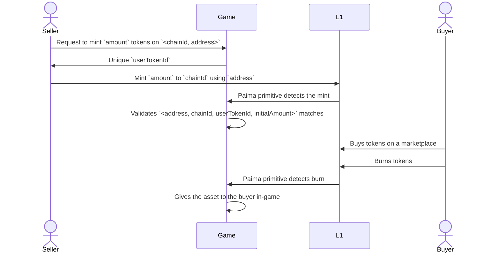
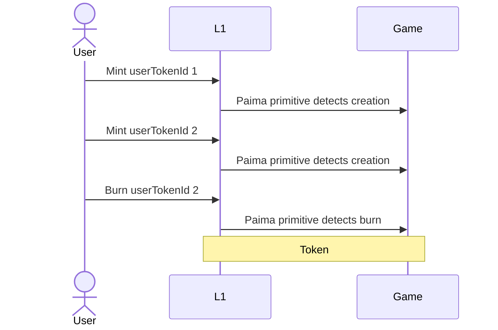
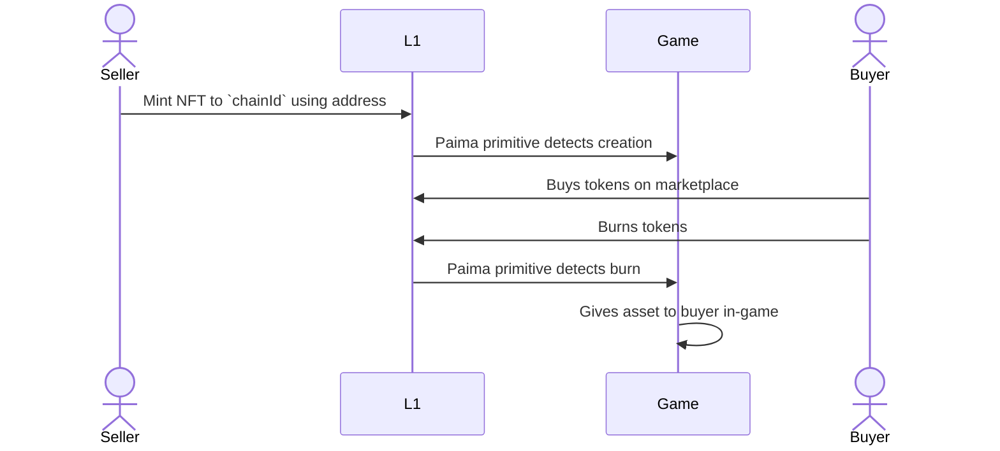
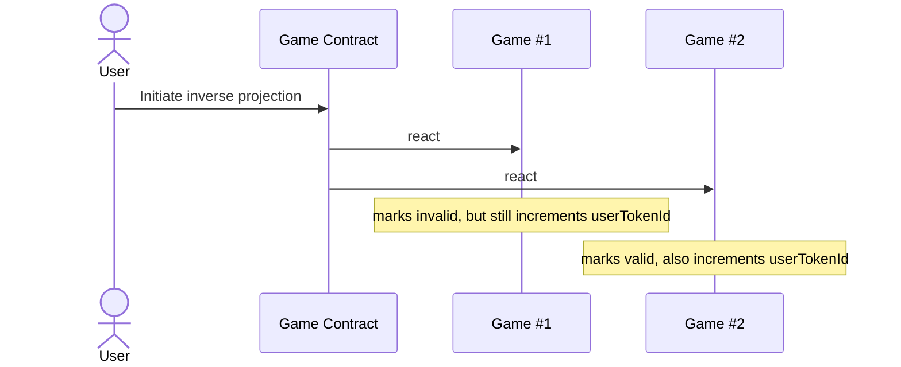

# PRC-5 — Paima Inverse Projection Interface for ERC-1155

## Use case

List your in-game stackable items — gold, materials, potions — as ERC-1155 tokens on any L1, with live metadata from your game.

## Summary

Many in-game items aren't unique — crafting materials, gold, potions, ticket counts. ERC-721 (and PRC-3) treats every token as one-of-a-kind. PRC-5 mirrors PRC-3's mechanism using ERC-1155 so the same item type can have any amount, with batch operations and metadata that describe quantities.

The game stays the source of truth; the L1 ERC-1155 token is a tradeable claim on game state whose metadata is fetched dynamically from the game's RPC.

## Specification

Every PRC-5 compliant contract MUST implement `IInverseProjected1155`, which extends `IERC1155MetadataURI` and an agnostic version of [ERC-4906](https://eips.ethereum.org/EIPS/eip-4906) (`IERC4906Agnostic`).

```solidity
interface IUri {
    /// URI for token type `id`. If `{id}` is present, clients substitute the actual type ID.
    function uri(uint256 id) external view returns (string memory);
}

interface IInverseProjected1155 is IERC1155MetadataURI, IERC4906Agnostic {
    event SetBaseExtension(string oldBaseExtension, string newBaseExtension);
    event SetBaseURI(string oldUri, string newUri);

    /// Burn `value` of `id` from sender. Reverts on insufficient balance.
    function burn(uint256 id, uint256 value) external;

    /// Burn batch — same semantics, multiple ids/values at once.
    function burnBatch(uint256[] memory ids, uint256[] memory values) external;

    /// Owner-only setters. Emit the corresponding event.
    function setBaseURI(string memory _URI) external;
    function setBaseExtension(string memory _newBaseExtension) external;

    /// Variant: caller provides their own RPC base.
    function uri(uint256 id, string memory customBaseUri) external view returns (string memory);

    /// Variant: caller provides an on-chain source implementing IUri.
    function uri(uint256 id, IUri customUriInterface) external view returns (string memory);
}

interface IERC4906Agnostic {
    event MetadataUpdate(uint256 _tokenId);
    event BatchMetadataUpdate(uint256 _fromTokenId, uint256 _toTokenId);
}
```

### Base URI shape

```
https://{rpcBase}/inverseProjection/{standard}/{purpose}/
```

With `standard = "prc5"`, e.g. `https://rpc.mygame.com/inverseProjection/prc5/gold/`.

Token identifiers MUST start with a CAIP-2 `chainIdentifier`. For Ethereum mainnet: `eip155:1`, giving `https://rpc.mygame.com/inverseProjection/prc5/gold/eip155:1/...`.

## Initialisation modes

### 1. App-Layer Initiated

The user first asks the game to register a projection for `<chainId, address, amount>`. The game returns a unique `userTokenId` and records the `initialAmount`. The user then mints on the L1 referencing that id.



Interface for app-initiated projection:

```solidity
interface IInverseAppProjected1155 is IInverseProjected1155 {
    event Minted(
        uint256 indexed tokenId,
        address indexed minter,
        uint256 indexed userTokenId,
        uint256 value
    );

    /// Last `userTokenId` issued for a user (0 if never). Useful for checking sync or producing the next id.
    function currentNonce(address user) external view returns (uint256);

    /// Mint `value` of a freshly-allocated token to msg.sender. Reverts if msg.sender is a contract not
    /// implementing IERC1155Receiver-onERC1155Received. Emits `Minted`.
    function mint(uint256 value, bytes memory data, bytes memory verificationData) external returns (uint256);
    function mint(uint256 value, bytes memory data) external returns (uint256);
}
```

The recommended `tokenURI` is `{baseURI}{userAddress}/{userTokenId}/{initialAmount}`, e.g.:

```
https://rpc.mygame.com/inverseProjection/prc5/gold/eip155:1/0x1946.../1/1000
```

#### Partial-initialisation handling

When the user signs the app-layer transaction but never completes the L1 mint (or vice versa), the on-chain `amount` can disagree with the game-side `initialAmount`. Applications SHOULD ask the user to sign both transactions before submitting either, and SHOULD treat the resulting state as the canonical reconciliation point:

- If the L1 `amount` &lt; game-side `initialAmount`, the game unlocks the difference back to the user.
- If a burn event arrives for a `userTokenId` the game never issued, the game MAY treat it as already-handled (but must be careful with out-of-order burns).



#### Endpoint error cases

1. Token ids the game hasn't issued yet → **404** (don't serve dummy data).
2. Invalid mints (see [Mint Validity](#mint-validity)) → **404**.

### 2. Base-Layer Initiated

The user mints directly on the L1, supplying `initialData` describing the projection. The contract's own monotonic `tokenId` is the identifier (`{chainIdentifier}/{tokenId}.json`).



```solidity
interface IInverseBaseProjected1155 is IInverseProjected1155 {
    event Minted(uint256 indexed tokenId, uint256 value, string initialData);

    /// Mint `value` of a freshly-allocated token to msg.sender, emitting `initialData` for the game to consume.
    function mint(uint256 value, bytes memory data, string calldata initialData) external returns (uint256);
}
```

#### Endpoint error cases

1. Token ids the game hasn't seen yet → **404** (the game-node lags the L1 by some delay).
2. Invalid `initialData` (definition is app-specific) → **404**.

## Mint validity

Marketplace features like collection offers and floor-sweeping work only if invalid mints are visibly marked. PRC-5 requires every token to carry a `validity` attribute:

```json
{ "attributes": [{ "trait_type": "validity", "value": "valid" }] }
```

- `valid` — game-state matches the mint claim.
- `invalid` — mint exists but isn't honoured by *this version* of the game.

### Tracking invalid mints

Regardless of which initialisation path is used, the state transition that processes an inverse projection MUST NOT fail for any reason other than signature mismatch. A mint that's invalid for one variant of the game must still increment that variant's `userTokenId` counter — otherwise, parallel variants assign different ids to the same valid mint and interoperability breaks.



## Rationale

PRC-5 mirrors PRC-3's design decisions:

- **No IPFS metadata** — `tokenURI` returns the game's live RPC response.
- **`tokenURI` overloads** — callers may pass a custom RPC base or an on-chain `IUri` to avoid trusting the project's hosted node.
- **ERC-4906 events callable by anyone** — anybody can force marketplaces to refresh their caches when the game advances.
- **`chainIdentifier` enforced on-chain** — a contract deployed on chain A cannot pretend to mint tokens for chain B.

Key differences from vanilla ERC-1155:

- `mint` is callable by anyone, anytime — supply is unbounded by design.
- `verificationData` is supported on app-initiated mints when the app layer is verifiable (e.g. a ZK rollup).

### Trade-offs

- **App-initiated** — no L1 finality wait, batch-friendly, supports verifiable game state. Costs more gas and requires coordinated signing.
- **Base-initiated** — no app-layer transaction needed, lower gas. Must wait for L1 finality and may need to reject mints that became invalid in the interim.

## Reference implementation

All contracts and interfaces live in the EffectStream codebase: [packages/chains/evm-contracts/src/contracts/token](https://github.com/effectstream/effectstream/tree/main/packages/chains/evm-contracts/src/contracts/token).

## Security considerations

- **Honest RPC** — same assumption as PRC-3 and most existing dApps. Users with stronger requirements can run their own node and supply their own RPC via the `tokenURI` overloads.
- **App-layer finality** — if the app layer can roll back, mint metadata can change or become invalid. Marketplaces can be forced to refresh via the ERC-4906 events (callable by anyone).

