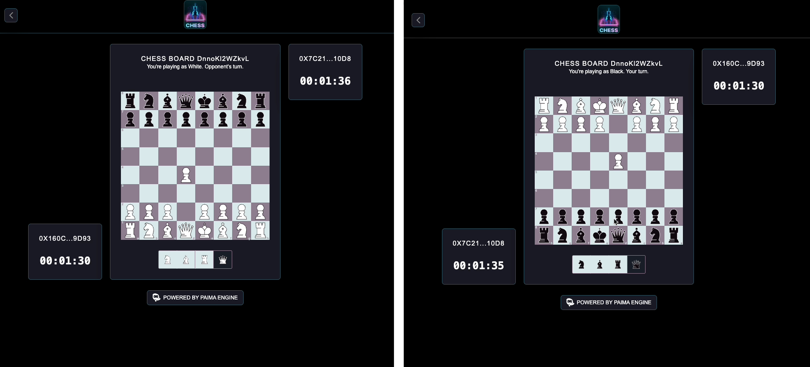

# Chess

> A complete turn-based chess game on an EVM chain: lobbies, matchmaking, move validation, chess clocks and ELO, driven by scheduled state transitions.

Chess is the template to read when you want a *whole* game rather than a single mechanic. Two players create or join a lobby, alternate PGN moves, and the state machine validates every move, runs both clocks, decides checkmate/stalemate/timeout and settles ELO — all deterministically, from inputs read off an EVM `EffectstreamL2` contract. A practice mode plays a local minimax bot instead of a second human.



Nothing about the game lives on-chain beyond the raw input bytes. The contract is a mailbox; the rules, the clocks and the ratings are ordinary TypeScript in `packages/node/`, which is what makes the whole thing cheap, fast and replayable.

## What this template shows

**Timed gameplay built out of scheduled inputs.** A chess clock is a deadline, and Effectstream has exactly one primitive for deadlines: an input scheduled at a future block height. Every time the state machine opens a round it also schedules a `z` ("zombie") input for the moment the mover runs out of time, in `packages/node/state-machine.ts`:

```ts
yield* World.resolve(newScheduledHeightData, {
  from_address: "0x0",
  from_address_type: AddressType.NONE,
  future_block_height: blockHeight + roundTime,
  input_data: JSON.stringify(["z", lobbyId]),
});
```

If the player moves in time, the same file *cancels* that pending deadline before opening the next round — the mirror-image call that most examples never show:

```ts
yield* World.resolve(removeScheduledBlockData, {
  block_height: zombieBlock,
  input_data: JSON.stringify(["z", lobby.lobby_id]),
});
```

If they do not, the `z` transition fires on schedule and plays a forced move for them, so a match can never stall on an absent opponent. The same schedule/cancel pattern drives the bot (`sb`, scheduled one block ahead in practice mode) and the post-match rating update (`u`, scheduled one block after `finalizeMatch`).

**The clock is the main chain.** `packages/node/config.dev.ts` makes an NTP network — not the EVM chain — the main sync protocol, at one block per second:

```ts
.addNetwork({
  name: "ntp",
  type: ConfigNetworkType.NTP,
  startTime: new Date().getTime(),
  blockTimeMS: 1000,
})
```

EVM is attached as a *parallel* protocol supplying the player inputs. That split is what makes `round_length` and `play_time_per_player` meaningful: they are counted in main-chain blocks, so a "60-second" time control is 60 blocks of wall clock, independent of how fast the EVM chain produces blocks.

**Guard-first transitions.** Each transition re-reads the lobby and returns early on anything illegal, rather than trusting the sender. `joinLobby` is three lines of guards before it does any work:

```ts
if (!lobby) return;
if (lobby.player_two || lobby.lobby_state !== "open" || lobby.lobby_creator === player) return;
```

`submitMoves` additionally checks membership, the round number and `isValidMove(lobby.latest_match_state, parsedInput.pgnMove)` — the chess rules themselves — before it records anything. A transition that returns early has written nothing, which is the cheapest possible way to reject a bad input.

## Effectstream features used

| Feature | Where | Used for |
| --- | --- | --- |
| `@effectstream/sm` state machine (`Stm`) | `packages/node/state-machine.ts` | Seven transitions covering the lobby lifecycle, moves, timeouts, bot turns and stats |
| Typed grammar (`@effectstream/concise` + TypeBox) | `packages/node/grammar.ts` | Validated, self-describing on-chain input format |
| `PrimitiveTypeEVMEffectstreamL2` | `packages/node/config.dev.ts`, `packages/node/config.mainnet.ts` | Reading player inputs out of the L2 contract |
| NTP main sync protocol (`ConfigSyncProtocolType.NTP_MAIN`) | `packages/node/config.dev.ts` | One-second wall-clock blocks — the unit the chess clocks count in |
| Parallel EVM sync (`ConfigSyncProtocolType.EVM_RPC_PARALLEL`) | `packages/node/config.dev.ts` | Attaching the EVM chain alongside the time-based main chain |
| Scheduled inputs (`newScheduledHeightData`, `removeScheduledBlockData`) | `packages/node/state-machine.ts` | Move deadlines (`z`), bot turns (`sb`), rating updates (`u`) |
| Deterministic randomness (`randomGenerator`) | `packages/node/state-machine.ts` | Lobby IDs via `randomGenerator.nextString(12)` |
| World effect system (`@effectstream/coroutine`) | `packages/node/state-machine.ts` | `yield* World.resolve(...)` for every database read and write |
| Migrations + pgtyped queries (`@effectstream/db`) | `packages/database/` | Typed SQL over lobbies, rounds, moves, results and stats |
| Custom API router (`StartConfigApiRouter`) | `packages/node/api.ts` | Eleven Fastify read endpoints for the frontend |
| Batcher (`@effectstream/batcher-sdk`) | `packages/batcher/` | Gasless input submission through `EffectstreamL2DefaultAdapter` |
| Wallet connection (`@effectstream/wallets`) | `packages/frontend/client/src/PaimaEngineConfig.ts` | Connecting a wallet and posting inputs via the batcher |
| Orchestrator (`@effectstream/orchestrator`) | `start.dev.ts` | Bringing up PGlite, Hardhat, the sync node, the batcher and the frontend |

## Quick start

Prerequisites:

- [Bun](https://bun.sh)
- [Foundry](https://www.getfoundry.sh/) — `forge` must be on your `PATH`. The orchestrator checks for it before starting and stops with an install hint if it is missing, because the TypeScript contract bindings are generated from Forge artifacts.

No Docker or external Postgres is needed: the local stack runs an embedded PGlite database.

```sh
bun install
bun run dev
```

`bun run dev` runs `bunx orchestrator start`, which reads `start.dev.ts` (declared as `effectstream.default` in `package.json`) and brings up the whole stack in dependency order: PGlite, a Hardhat node, contract compilation and Ignition deployment, then the sync node, the batcher and the frontend.

| Service | URL |
| --- | --- |
| Frontend (the dApp) | http://localhost:10599 |
| Sync node API | http://localhost:9999 |
| API documentation (OpenAPI) | http://localhost:9999/documentation |
| Batcher | http://localhost:3334 |
| Hardhat EVM node | http://localhost:8545 (and 8546) |
| PGlite (Postgres wire protocol) | `localhost:5432` |
| Orchestrator API | http://localhost:4747 |

Other root scripts:

```sh
bun run build:evm       # compile + deploy the EVM contracts and regenerate bindings
bun run build:pgtypes   # regenerate pgtyped types from packages/database/sql/
bun run start:mainnet   # run the sync node against config.mainnet.ts
```

## Project structure

```
chess-v2/
├── start.dev.ts           orchestrator process graph for the local stack
├── docs/chess.png         screenshot used by this README
└── packages/
    ├── node/              @chess-v2/node — config, grammar, state machine, API, chess rules, bot
    ├── database/          @chess-v2/database — migration and pgtyped queries
    ├── contracts-evm/     @chess-v2/contracts-evm — MyEffectstreamL2.sol, Hardhat/Forge, Ignition
    ├── batcher/           @chess-v2/batcher — EffectstreamL2 batcher (dev and mainnet entry points)
    ├── frontend/          @chess-v2/frontend — React + Vite + MUI client, Fastify static server
    └── tests/             @chess-v2/tests — end-to-end suite driven by the orchestrator
```

Inside `packages/node/`:

| File | Purpose |
| --- | --- |
| `grammar.ts` | The seven input commands and their TypeBox field types |
| `config.dev.ts` | Local networks, sync protocols and the L2 primitive |
| `config.mainnet.ts` | The same wiring, driven by environment variables |
| `state-machine.ts` | All state transitions plus the scheduling helpers |
| `api.ts` | The Fastify read API |
| `chess-helpers.ts` | Move validation, clocks, match results, ELO change |
| `chess-ai.ts` | Minimax bot (`calculateBestMove`), depth set by `bot_difficulty` |
| `main.dev.ts` / `main.mainnet.ts` | Entry points that call `start(...)` from `@effectstream/runtime` |

## How it works

### Grammar

`packages/node/grammar.ts` declares every command the game accepts. Player-facing commands are spelled out; the three engine-scheduled ones are single letters to keep the scheduled payloads small.

```ts
export const grammar = {
  createdLobby: [
    ["numOfRounds", Type.Number()],
    ["roundLength", Type.Number()],
    ["playTimePerPlayer", Type.Number()],
    ["isHidden", Type.Boolean({ default: false })],
    ["isPractice", Type.Boolean({ default: false })],
    ["botDifficulty", Type.Number()],
    ["playerOneIsWhite", Type.Boolean({ default: true })],
  ],
  joinLobby: [["lobbyID", Type.String()]],
  closeLobby: [["lobbyID", Type.String()]],
  submitMoves: [
    ["lobbyID", Type.String()],
    ["roundNumber", Type.Number()],
    ["pgnMove", Type.String()],
  ],
  z: [["lobbyID", Type.String()]],
  u: [["user", Type.String()], ["result", Type.String()], ["ratingChange", Type.Number()]],
  sb: [["lobbyID", Type.String()], ["roundNumber", Type.Number()]],
} as const satisfies GrammarDefinition;
```

| Command | Origin | Meaning |
| --- | --- | --- |
| `createdLobby` | Player | Create a lobby: rounds, time controls, visibility, practice mode, bot difficulty, colour |
| `joinLobby` | Player | Join an open lobby by ID and start the match |
| `closeLobby` | Player (creator) | Close a still-open lobby |
| `submitMoves` | Player | Submit one PGN move for the current round |
| `z` | Scheduled | Zombie round — the mover's clock expired |
| `sb` | Scheduled | Scheduled bot move (practice mode) |
| `u` | Scheduled | Stats and rating update, one block after the match ends |

On the wire an input is a JSON array, exactly as `packages/tests/stm/create-lobby.test.ts` builds it:

```ts
const input = JSON.stringify(["createdLobby", 3, 50, 50, false, true, 0, true]);
```

### State machine

`packages/node/state-machine.ts` builds one `Stm` over the grammar and registers a transition per command. A match walks through them like this.

**`createdLobby`** mints a lobby ID from the deterministic RNG, inserts the lobby with the standard opening FEN, and clamps the time controls so a caller cannot ask for an unbounded game:

```ts
const lobby_id = randomGenerator.nextString(12);

yield* World.resolve(createLobby, {
  lobby_id,
  num_of_rounds: Math.min(Math.floor(parsedInput.numOfRounds), 10),
  round_length: Math.min(Math.floor(parsedInput.roundLength), 100),
  play_time_per_player: Math.min(Math.floor(parsedInput.playTimePerPlayer), 100),
  ...
  lobby_state: "open",
  latest_match_state: new Chess().fen(),
});
```

In practice mode it immediately activates the lobby against the pseudo-wallet `"0x0"`, and if the human chose black it schedules the bot's opening move.

**`joinLobby`** and **`closeLobby`** both re-read the lobby and bail on anything inconsistent (already full, not open, wrong caller). `joinLobby` then calls `activateLobby`, which sets `player_two`, seeds the timer with `play_time_per_player` for each side and opens round 1.

**`submitMoves`** is the gameplay path. It checks lobby state, membership, that the round exists and is current, and that the move is legal, records the move, then hands off to `executeRound`:

```ts
if (!round) return;
if (parsedInput.roundNumber !== lobby.current_round) return;
if (!isValidMove(lobby.latest_match_state, parsedInput.pgnMove)) return;

yield* World.resolve(newMatchMove, { new_move: { ... } });

yield* executeRound(blockHeight, lobby, parsedInput.pgnMove, round);
```

`executeRound` applies the move to the FEN, marks the round executed, cancels the pending `z` deadline, recomputes both clocks with `updateTimer`, and then either finalises or opens the next round:

```ts
const timer = updateTimer(roundData, blockHeight, lobby.player_one_iswhite);
const hasTimeout = timer.player_one_blocks_left === 0 || timer.player_two_blocks_left === 0;
const isFinal = lobby.num_of_rounds && lobby.current_round >= lobby.num_of_rounds;

if (gameOver(newFen) || isFinal || hasTimeout) {
  yield* finalizeMatch(blockHeight, lobby, timer, newFen);
} else {
  yield* createNewRound(lobby.lobby_id, lobby.current_round, newFen, timer, lobby.round_length, blockHeight);
}
```

**`z`** fires when nobody moved in time. Rather than freezing the board it plays a depth-0 bot move on the absent player's behalf and executes the round normally; if no move is available it executes an empty round, which will trip the timeout check.

**`sb`** is the practice-mode bot. It runs `calculateBestMove(lobby.latest_match_state, lobby.bot_difficulty)` — the minimax search in `chess-ai.ts`, where `bot_difficulty` *is* the search depth — revalidates the result and records it as a move from wallet `"0x0"`.

**`finalizeMatch` → `u`** closes the match, writes `final_match_state`, computes the ELO delta with `calculateRatingChange`, and then schedules one `u` per player rather than updating stats inline:

```ts
yield* scheduleStatsUpdate(matchEnv.user1.wallet, results[0], ratingChange, blockHeight + 1);
yield* scheduleStatsUpdate(matchEnv.user2.wallet, results[1], -ratingChange, blockHeight + 1);
```

Practice matches return before any of this — the bot does not affect ratings.

### Contracts

The only Solidity in the template subclasses the framework contract, in `packages/contracts-evm/src/contracts/MyEffectstreamL2.sol`:

```solidity
import {EffectstreamL2Contract} from "@effectstream/evm-contracts/src/contracts/EffectstreamL2Contract.sol";

contract MyEffectstreamL2 is EffectstreamL2Contract {
    constructor(address _owner, uint256 _fee) EffectstreamL2Contract(_owner, _fee) {}
}
```

Players call its `effectstreamSubmitGameInput(bytes)` function with the hex-encoded JSON array; the sync node picks the emitted event up through the `PrimitiveTypeEVMEffectstreamL2` primitive configured in `packages/node/config.dev.ts`:

```ts
.addPrimitive(
  (syncProtocols) => syncProtocols.mainEvmRPC,
  (network, deployments, syncProtocol) => ({
    name: "Chess_EffectstreamL2",
    type: PrimitiveTypeEVMEffectstreamL2,
    startBlockHeight: 0,
    contractAddress:
      contractAddressesEvmMain().chain31337["EffectstreamL2Module#MyEffectstreamL2"],
    paimaL2Grammar: grammar,
  }),
)
```

Deployment is Hardhat Ignition (`packages/contracts-evm/ignition/modules/effectstreamL2.ts`, driven by `packages/contracts-evm/deploy.ts`), and the deployed addresses are re-exported as typed bindings that both the node config and the batcher import.

The batcher never has to be told the address: `packages/batcher/effectstream-l2.ts` looks it up from those bindings by chain ID and module name, then wraps it in the SDK's adapter.

```ts
export function createEffectstreamL2Adapter(env: EffectstreamL2Env) {
  const contractAddress = getContractAddress(env.chainId, env.contractModule);
  return new EffectstreamL2DefaultAdapter(
    contractAddress,
    env.privateKey,
    env.fee,
    env.syncProtocolName,
  );
}
```

`packages/batcher/batcher.dev.ts` configures it for Hardhat (chain `31337`, zero fee, a one-second time window, `confirmationLevel: "wait-effectstream-processed"`) on port 3334.

### API

`packages/node/api.ts` exports a `StartConfigApiRouter` that registers eleven read endpoints. All are `GET`; none of them write — writes only ever arrive through the contract.

| Endpoint | Query parameters | Returns |
| --- | --- | --- |
| `/api/lobby_state` | `lobbyID` | The lobby plus `round_start_height` and `remaining_blocks` per colour |
| `/api/open_lobbies` | `wallet`, `count`, `page` | Paginated open lobbies |
| `/api/search_open_lobbies` | `wallet`, `searchQuery`, `count`, `page` | Paginated open lobbies matching a search |
| `/api/user_lobbies` | `wallet`, `count`, `page` | Paginated lobbies involving a wallet |
| `/api/user_stats` | `wallet` | `{ stats, rank }` — record, rating and leaderboard position |
| `/api/match_winner` | `lobbyID` | The `final_match_state` row, or `null` |
| `/api/round_status` | `lobbyID`, `round` | One round and its moves |
| `/api/round_executor` | `lobbyID`, `round` | Lobby + round + moves, for replaying a single round |
| `/api/match_executor` | `lobbyID` | Lobby + all rounds + all moves + seeds, for replaying a match |
| `/api/random_lobby` | — | A random lobby, or `null` |
| `/api/random_active_lobby` | — | A random in-progress lobby, or `null` |

`count` defaults to 10 and `page` to 0 on the paginated routes. A handler is a thin wrapper around a pgtyped query:

```ts
server.get("/api/open_lobbies", async (request, reply) => {
  const { wallet, count, page } = request.query as { wallet: string; count: string; page: string };
  const lobbies = await getPaginatedOpenLobbies.run(
    { wallet: wallet.toLowerCase(), count: Number(count || 10), page: Number(page || 0) },
    dbConn,
  );
  reply.send({ lobbies });
});
```

`/api/lobby_state` is the one with real logic: it joins the latest round against `getLatestProcessedBlockHeight()` and runs `updateTimer` so the client gets live remaining time rather than the value stored at the start of the round.

### Database

The schema is a single migration, `packages/database/migrations/000-init.sql`; the queries live in `packages/database/sql/` (`select.sql`, `insert.sql`, `update.sql`) with pgtyped-generated types beside them, regenerated by `bun run build:pgtypes`.

| Table | Holds |
| --- | --- |
| `lobbies` | One row per game: settings, players, current round, latest FEN, `lobby_state` |
| `rounds` | One row per round: FEN at its start, both clocks, start and execution block heights |
| `match_moves` | Every PGN move, by lobby, round and wallet |
| `final_match_state` | The settled result: colours, per-player result and elapsed time, final position |
| `global_user_state` | Per-wallet wins/losses/ties and ELO rating (indexed on `rating`) |

```sql
CREATE TYPE lobby_status AS ENUM ('open', 'active', 'finished', 'closed');

CREATE TABLE lobbies (
  lobby_id TEXT PRIMARY KEY,
  num_of_rounds INTEGER NOT NULL,
  round_length INTEGER NOT NULL,
  play_time_per_player INTEGER NOT NULL,
  current_round INTEGER NOT NULL DEFAULT 0,
  created_at TIMESTAMP NOT NULL,
  creation_block_height INTEGER NOT NULL,
  hidden BOOLEAN NOT NULL DEFAULT false,
  practice BOOLEAN NOT NULL DEFAULT false,
  bot_difficulty INTEGER NOT NULL DEFAULT 0,
  lobby_creator TEXT NOT NULL,
  player_one_iswhite BOOLEAN NOT NULL,
  player_two TEXT,
  lobby_state lobby_status NOT NULL,
  latest_match_state TEXT NOT NULL
);
```

`lobbies.current_round` is never written by the state machine. A trigger keeps it in step with the rounds table, so inserting a round is the single act that advances the game:

```sql
CREATE TRIGGER update_current_round
AFTER INSERT ON rounds
FOR EACH ROW
EXECUTE FUNCTION update_lobby_round();
```

## Configuration

The template ships two environments. Dev needs no configuration at all.

| | Dev | Mainnet |
| --- | --- | --- |
| EVM chain | Hardhat (31337) | Arbitrum One (42161) |
| Node config | `packages/node/config.dev.ts` | `packages/node/config.mainnet.ts` |
| Node entry point | `packages/node/main.dev.ts` | `packages/node/main.mainnet.ts` |
| Batcher entry point | `packages/batcher/batcher.dev.ts` | `packages/batcher/batcher.mainnet.ts` |
| Start command | `bun run dev` | `bun run start:mainnet` (node) plus the batcher, run separately |

Mainnet environment variables, as read by those two files:

| Variable | Read by | Required | Default | Description |
| --- | --- | --- | --- | --- |
| `EVM_RPC_URL` | `config.mainnet.ts` | Yes | — | EVM RPC endpoint. The node throws at startup if unset. |
| `EFFECTSTREAM_L2_ADDRESS` | `config.mainnet.ts`, `batcher.mainnet.ts` | Yes | — | Deployed `MyEffectstreamL2` address. Both processes throw if unset. |
| `EVM_PRIVATE_KEY` | `batcher.mainnet.ts` | Yes | — | Key the batcher signs submissions with. |
| `EVM_START_BLOCK` | `config.mainnet.ts` | No | `0` | Block height to begin syncing from. Set it — syncing Arbitrum from block 0 is not practical. |
| `EVM_CHAIN_ID` | `config.mainnet.ts` | No | `1` | Chain ID for the EVM network definition. Set it to `42161` for Arbitrum One. |
| `BATCHER_PORT` | `batcher.dev.ts`, `batcher.mainnet.ts` | No | `3334` | Batcher HTTP port. |

Two details worth knowing before you deploy:

- `batcher.mainnet.ts` hard-codes `chainId: 42161`, and `packages/batcher/effectstream-l2.ts` resolves the contract address from the generated bindings under `chain42161` — so a mainnet batcher needs an Ignition deployment recorded for that chain, not just the environment variable.
- Mainnet sync is deliberately more conservative than dev: `confirmationDepth: 12`, `pollingInterval: 2000` and `stepSize: 100`, versus depth 1 and 500 ms locally.

The frontend reads `VITE_EFFECTSTREAM_NODE_URL` and `VITE_BATCHER_URL` (`packages/frontend/client/src/config.ts`), defaulting to `http://localhost:9999` and `http://localhost:3334`.

## Testing

```sh
bun run test
```

`packages/tests/run-tests.ts` starts its own orchestrator stack from `packages/tests/start.test.ts` — PGlite, Hardhat, contracts, the sync node and the batcher, but no frontend server — waits for the orchestrator on port 4747 and the sync node's `/health`, runs three phases, and tears everything down again.

| Phase | Files | Covers |
| --- | --- | --- |
| A — infrastructure | `packages/tests/infra/chain-ready.test.ts`, `packages/tests/infra/deploy.test.ts` | The Hardhat node answers `eth_chainId` with `0x7a69` (31337), and the generated bindings expose a valid `chain31337` L2 address |
| B — state machine and API | `packages/tests/stm/create-lobby.test.ts`, `join-lobby.test.ts`, `submit-move.test.ts`, `api.test.ts` | Real transactions to `effectstreamSubmitGameInput`, asserted against the database, then live API responses |
| C — frontend | `packages/tests/frontend/build-smoke.test.ts` | The Vite build succeeds |

The Phase B tests are worth reading on their own: they submit inputs with `viem` exactly as a client would, then poll Postgres for the rows the state machine should have written — an end-to-end assertion over the contract, the sync node and the state machine at once.

## Where to go next

- [State Machine](https://effectstream.github.io/docs/home/components/state-machine) — transitions, determinism and the World effect system used throughout `state-machine.ts`.
- [Grammar](https://effectstream.github.io/docs/home/components/grammar) — the input format, TypeBox schemas and the reserved `&`-prefixed system commands.
- [EffectStream L2 Contract](https://effectstream.github.io/docs/home/components/l2-contract) — what `effectstreamSubmitGameInput` does, fees, and batched input handling.
- [Randomness](https://effectstream.github.io/docs/home/components/randomness) — why `randomGenerator` exists and the ordering rules that keep it deterministic.
- [Batcher overview](https://effectstream.github.io/docs/home/components/batcher/overview) — adapters, batching criteria and confirmation levels, as configured in `packages/batcher/`.

Sibling templates: [`minimal`](https://github.com/effectstream/effectstream/tree/main/templates/minimal) is the same shape with one grammar action and one transition — read it first if this template is too much at once. [`hex-battle`](https://github.com/effectstream/effectstream/tree/main/templates/hex-battle) is the other full game in the repository, with simultaneous hidden moves instead of alternating ones.
